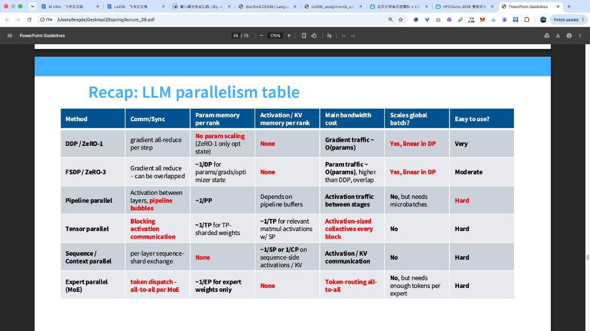
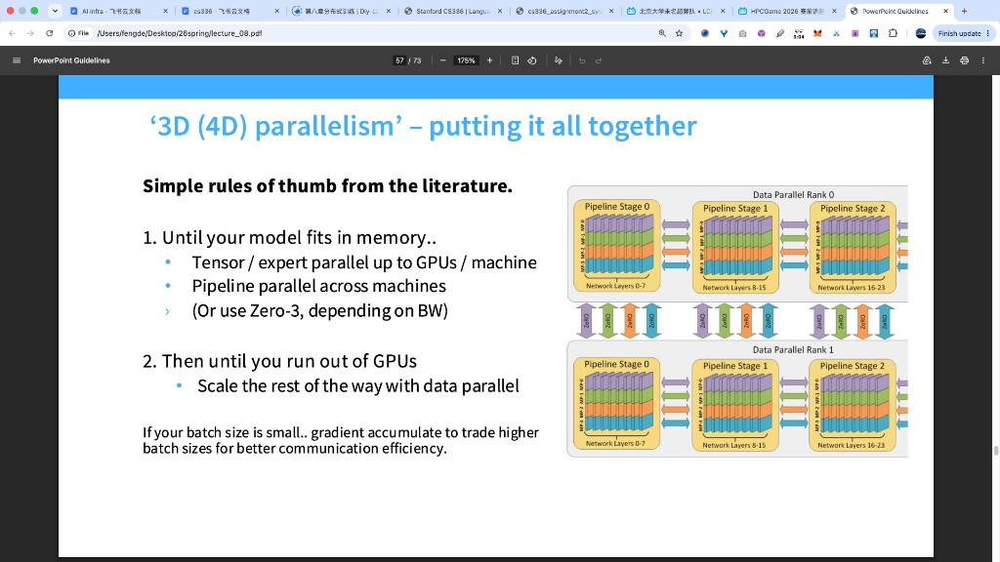
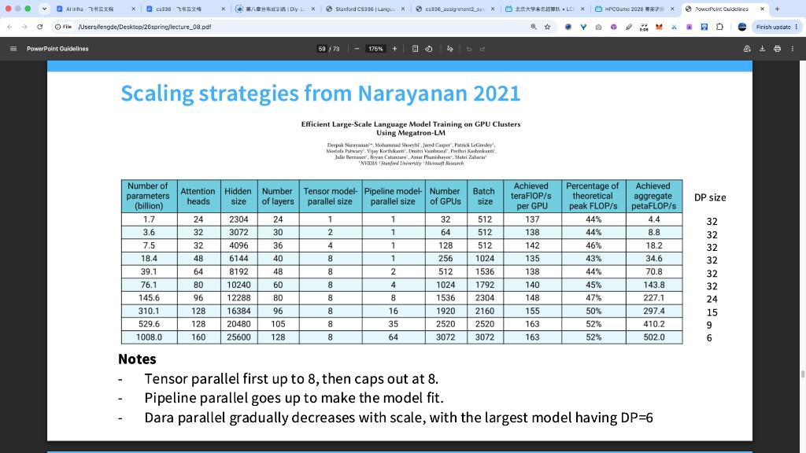

# Recap：LLM 并行策略总表怎么读

> 讲义页标题：*Recap: LLM parallelism table*。  
> 一张表把六种切法摆在一起。本文按列说明表头在问什么，再按行把每一种策略讲清楚，并接到你们已经写过的 DP / FSDP / Pipeline / TP 笔记。



相关展开：

- 数据并行临界点：[reports/data-parallel-calculations.md](../reports/data-parallel-calculations.md)
- 张量并行计算：[reports/tensor-parallel-calculations.md](../reports/tensor-parallel-calculations.md)
- Pipeline / TP 切法与通信量里的「8」：[misc-why-pipeline-parallelism.md](./misc-why-pipeline-parallelism.md)
- FSDP / ZeRO 直觉：[misc-zero-explained.md](./misc-zero-explained.md)

---

## 1. 先读懂表头：每一列在问什么

表的每一行是一种并行方法；每一列是同一种「体检指标」。读表时先固定列的含义，再看各行填了什么。

| 列名 | 在问什么 |
|------|----------|
| **Method** | 这种并行主要切哪一根轴（batch / 层 / 矩阵宽 / 序列 / 专家） |
| **Comm / Sync** | 卡和卡之间同步什么、同步有多「挡计算」 |
| **Param memory per rank** | 每张卡上的 **参数（及常见的梯度 / 优化器状态）** 能不能随并行度变小 |
| **Activation / KV memory per rank** | 每张卡上的 **激活、KV cache** 能不能随并行度变小 |
| **Main bandwidth cost** | 带宽主要被什么流量吃掉（梯度？权重？激活？token 路由？） |
| **Scales global batch?** | 加机器时，能不能近似线性地加大全局 batch、从而提高吞吐 |
| **Easy to use?** | 工程上好不好接进现有训练框架 |

表中红字多半是「这一格和其他行反差最大、最容易记错」的点。下面按方法逐行展开。

文中符号约定：$DP,PP,TP,SP,CP,EP$ 分别是数据 / 流水线 / 张量 / 序列 / 上下文 / 专家并行度；$b,s,h$ 仍是 batch、序列长、隐藏维。

---

## 2. DDP / ZeRO-1

**切什么：** 切 batch。每张卡跑完整模型的一份拷贝，各自看到全局 batch 的一部分样本。

**Comm / Sync：** 每步对梯度做 **all-reduce**（各卡局部梯度 → 全局平均梯度）。ZeRO-1 在此基础上再把 **优化器状态** 切开存放。

**Param memory per rank：** 表上写 *No param scaling (ZeRO-1 only opt state)*。  
意思是：

- 朴素 DDP：参数仍是每卡一份完整模型，**参数显存不随 $DP$ 变小**；  
- ZeRO-1：参数往往仍完整（或接近完整），主要省的是 Adam 的 $m,v$ 等优化器状态（约按 $1/DP$）。

**Activation / KV：** *None*（相对「靠这种并行去切激活」而言）——DDP / ZeRO-1 **不靠切激活省显存**；每卡仍为自己那份 micro-batch 存激活。

**Main bandwidth cost：** 梯度流量，量级 $\sim O(\mathrm{params})$。梯度张量有多大，all-reduce 就围着它转（见 data-parallel 笔记里的 $S\sim 6DD_{\mathrm{FF}}$ 那种算法）。

**Scales global batch?：** **Yes, linear in DP**——加卡通常同步加大全局 $B$（每卡样本数大致固定），吞吐可以随 $DP$ 近似线性涨；但会撞上通信临界点与噪声尺度两堵墙（见 data-parallel 附录）。

**Easy to use?：** Very——框架里最常见、改动最小的多卡方式。

---

## 3. FSDP / ZeRO-3

**切什么：** 在数据并行的外壳下，把 **参数、梯度、优化器状态** 都切开；算某一层前再 all-gather 出临时完整权重。

**Comm / Sync：** 表写 *Gradient all reduce – can be overlapped*。实际还有按层的 **参数 all-gather** 与 **梯度 reduce-scatter**；好实现里这些可以和计算重叠。

**Param memory per rank：** $\sim 1/DP$——参数 / 梯度 / 优化器状态都按数据并行度摊薄。这是相对 DDP / ZeRO-1 最大的显存收益。

**Activation / KV：** 同样标 *None*——FSDP 主攻 **参数侧** 显存，激活仍按每卡自己的 batch 来；要再砍激活得靠 checkpoint、序列并行等。

**Main bandwidth cost：** *Param traffic $\sim O(\mathrm{params})$, higher than DDP*——除了梯度，还要反复搬权重分片。通信量通常 **高于** 纯 DDP 的梯度 all-reduce；靠 overlap 把一部分藏进计算。

**Scales global batch?：** 仍是 Yes, linear in DP——外层仍是数据并行语义。

**Easy to use?：** Moderate——比 DDP 多一层包装与调度，但生态已经比较成熟。

和 Pipeline 对比时记住：FSDP 省显存靠「权重切开、用时 gather」；跨慢网时 gather 很痛。Pipeline 省显存靠「层根本分住在不同卡」，跨机只传激活（见 pipeline 笔记 §2–§3）。

---

## 4. Pipeline parallel

**切什么：** 切 **模型深度**——每张卡（每个 stage）只放连续几层。

**Comm / Sync：** 相邻 stage 之间传 **激活**（前向）和 **激活梯度**（反向）；表上红字强调还有 **pipeline bubbles**（气泡）：调度填不满时，部分 stage 在空等，伤害吞吐。

**Param memory per rank：** $\sim 1/PP$——每卡只存 $1/N_{\mathrm{PP}}$ 的层，参数显存随 pipeline 并行度下降（8 层 4 stage 时每卡 2 层，见 pipeline 笔记 §1）。

**Activation / KV：** *Depends on pipeline buffers*——为了减小气泡，会打成多个 microbatch 在流水线里重叠；缓冲区里会同时挂着多份激活，激活显存与调度、microbatch 数有关。

**Main bandwidth cost：** *Activation traffic between stages*——点对点，体积量级 $\sim bsh$ 每个 microbatch（相对 TP 的层内集体通信通常更轻）。

**Scales global batch?：** *No, but needs microbatches*——Pipeline **不是**靠「全局 $B$ 随卡数线性涨」来扩展；它需要足够多的 microbatch 去填满流水线、压气泡。全局 batch 往往拆成 microbatch，语义和 DP 的「加卡加 $B$」不同。

**Easy to use?：** Hard——要改模型切段、调度、气泡与数值对齐，基础设施负担大。

---

## 5. Tensor parallel

**切什么：** 切 **一层内部的大矩阵**（列切 / 行切），每卡持有子矩阵；Attention 里常按头切开 QKV（见 pipeline 笔记 §6–§7）。

**Comm / Sync：** 表上红字 *Blocking activation communication*——Megatron 风格下，子层出口（或反向入口）的 **all-reduce 必须做完**，下一拍计算才用得上完整激活 / 梯度。相对「可 overlap 的 FSDP gather」，这里的同步更常挡在关键路径上。

**Param memory per rank：** $\sim 1/TP$ for TP-sharded weights——被切开的大权重按 $TP$ 摊薄。

**Activation / KV：** $\sim 1/TP$ for relevant matmul activations **with SP**——纯 TP 时中间宽激活可以切开；再叠 **序列并行（SP）** 时，与序列相关的激活 / 部分 KV 也可按序列维再摊。表把「带 SP」写进这一格，提醒：激活侧缩放常靠 TP+SP 组合，不单靠 TP。

**Main bandwidth cost：** *Activation-sized collectives every block*——每个 Transformer block 里，对约 $bsh$ 大小的张量做多次 all-reduce。讲义另一页把它定量成每层大约

$$
8\,bsh\,\frac{n_{\mathrm{devices}}-1}{n_{\mathrm{devices}}},
$$

其中 $8=4\times 2$（一层 4 次 all-reduce × 环形算法因子 2），**不是 8 台机器**（见 [misc-why-pipeline-parallelism.md §8](./misc-why-pipeline-parallelism.md)）。

**Scales global batch?：** No——加 TP 卡是在切模型宽度，全局 $B$ 不必、也不是主要靠变大来换扩展。

**Easy to use?：** Hard——要按 Megatron 约定改 Linear / Attention 的切分与通信，通常绑在节点内高速互联上。

---

## 6. Sequence / Context parallel

**切什么：** 切 **序列维**（token 轴）。长上下文时，$s$ 很大，激活与 KV 按 $s$ 涨；把序列切到多卡上，每卡只负责一段 token。

**Comm / Sync：** *per-layer sequence-shard exchange*——各层前后要把序列分片交换 / 拼齐，好让注意力等算子拿到所需的 Key/Value 或上下文窗口。

**Param memory per rank：** *None*——权重通常仍完整（或由别的并行去切）；SP/CP **主攻激活与 KV，不靠切参数**。

**Activation / KV memory per rank：** $\sim 1/SP$ 或 $1/CP$——序列侧激活、KV 按序列并行度摊薄。长 context 时这一列往往比参数列更致命，所以表把这里标红。

**Main bandwidth cost：** Activation / KV communication——传的是序列分片上的激活与 KV，不是整模梯度。

**Scales global batch?：** No——扩展目标是更长的 $s$，或在固定长上下文下摊薄激活，不是加大全局 $B$。

**Easy to use?：** Hard——与注意力实现、KV 布局、位置编码强耦合。

粗分：Sequence parallel 常和 TP 搭配，切层内与序列相关的激活；Context parallel 更强调超长上下文下整段 context 的分片与交换。表把二者放同一行，抓住「都按序列轴砍激活 / KV」即可。

---

## 7. Expert parallel（MoE）

**切什么：** 切 **专家（expert）**——MoE 层里不同专家的权重放到不同卡上；token 经 router 决定去哪些专家。

**Comm / Sync：** 表上红字 *token dispatch – all-to-all per MoE*——每层 MoE 都要把 token 按路由结果 **all-to-all** 发到持有对应专家的卡，算完再送回。这是 MoE 的主同步形态。

**Param memory per rank：** $\sim 1/EP$ for **expert weights only**——只有专家参数按 $EP$ 切开；共享的主干（attention、非专家 FFN 等）仍可能整份存在，或由 TP/PP/DP 去切。

**Activation / KV：** *None*（就「靠 EP 切激活」而言）——EP 主攻专家权重存放；激活流量体现在 all-to-all 的 token 搬运里，而不是像 SP 那样按序列常驻切 KV。

**Main bandwidth cost：** *Token-routing all-to-all*——带宽花在 token 调度上，量级随「有多少 token 被发到别的专家卡」涨。

**Scales global batch?：** *No, but needs enough tokens per expert*——加 EP 不是为了线性加大全局 $B$；但每个专家仍需要足够多的 token，否则专家算力空转、负载不均。全局 batch / 序列里要有足够 token 总量去「喂饱」专家。

**Easy to use?：** Hard——路由、负载均衡、all-to-all、与其它并行维度组合都复杂。

---

## 8. 把六行放在同一张「决策地图」上

按「你缺的是什么」来读表，比死记每一格更有用：

| 你卡在什么上 | 表上更相关的行 | 你换到的东西 | 你多付出的代价 |
|--------------|----------------|--------------|----------------|
| 单卡放不下 **整模参数**，但还能复制模型做多卡 | 先 FSDP / ZeRO-3；或 Pipeline | 参数按 $1/DP$ 或 $1/PP$ 降 | FSDP：权重流量；Pipeline：气泡 + 激活点对点 |
| 节点内带宽很高，一层里的矩阵太大 | Tensor parallel | 大权重 $\sim 1/TP$，层内激活也可切开 | 每 block 多次 **blocking** 激活 all-reduce（系数里的 8） |
| 全局 batch 还能加大，想涨吞吐 | DDP / ZeRO / FSDP | 吞吐随 $DP$ 近似线性 | 梯度（+FSDP 时参数）通信；受 $1+B\cdot W/C$ 与噪声尺度限制 |
| 上下文很长，**激活 / KV** 爆 | Sequence / Context parallel | 序列侧显存 $\sim 1/SP$（$1/CP$） | 每层序列分片交换 |
| 模型是 MoE，专家参数极多 | Expert parallel | 专家权重 $\sim 1/EP$ | 每层 token all-to-all；要够多 token 喂专家 |

工程上常见叠法（与 pipeline 笔记 §3 一致）可以读成：

```text
节点内高速网：TP（± SP）
节点间较慢网：Pipeline
再外层：DP / ZeRO / FSDP（切数据、再摊优化器或参数）
若是 MoE：再加 EP（专家）与 token all-to-all
```

---

## 9. 对照表：六行各切哪根轴（收束）

| Method | 主切轴 | 参数显存 | 激活 / KV | 通信主角 | 加卡是否主打「加大全局 $B$」 |
|--------|--------|----------|-----------|----------|------------------------------|
| DDP / ZeRO-1 | batch | 参数基本不降（ZeRO-1 降 opt） | 不靠此降 | 梯度 all-reduce | 是 |
| FSDP / ZeRO-3 | batch + 参数分片 | $\sim 1/DP$ | 不靠此降 | 参数 gather + 梯度 | 是 |
| Pipeline | 层（深度） | $\sim 1/PP$ | 视 buffer / microbatch | 激活点对点 + 气泡 | 否（要 microbatch） |
| Tensor parallel | 矩阵宽 / 头 | $\sim 1/TP$ | 可 $\sim 1/TP$（常+SP） | 每 block 激活集体通信 | 否 |
| Sequence / Context | 序列 | 不靠此降 | $\sim 1/SP$ 或 $1/CP$ | 序列分片交换 | 否 |
| Expert parallel | 专家 | 专家 $\sim 1/EP$ | 不靠此降 | token all-to-all | 否（要够 token/专家） |

读完这页 PPT，应能做到：指出任意一格红字在强调什么反差，并说出「这种并行省的是参数还是激活、通信搬的是梯度/权重/激活/token 里的哪一种」。更细的公式与切分因果，再回到文首列出的专题笔记即可。

---

## 10. 下一页：把它们叠成「3D（4D）并行」

总表把六种方法拆开比；讲义下一页给出 **怎么叠在一起用** 的经验顺序，标题是 *‘3D (4D) parallelism’ – putting it all together*。



「3D」通常指 **TP × PP × DP** 三维；再算上 ZeRO / FSDP、Expert parallel 等，口语里会说「4D」。图上画的是嵌套关系：**最外 DP，中间 PP，最里 TP（图上写作 MP）**。

---

### 10.1 两条经验法则（先记顺序）

讲义把决策收成两步：

**第一步：Until your model fits in memory…（先让模型装得进显存）**

1. **Tensor / expert parallel** 用到 **单机（一个 node）内的 GPU 数为止**；  
2. **Pipeline parallel** 用在 **机与机之间**；  
3. 视带宽情况，可再加 **ZeRO-3**（图上 DP 副本之间的彩色竖条）。

**第二步：Then until you run out of GPUs…（显存已经够了，还剩卡）**

4. 剩下的卡用 **Data parallel** 铺开。

页脚补充：若全局 batch 偏小，用 **gradient accumulation（梯度累积）** 把有效 $B$ 做大，换更好的通信效率（与 data-parallel 笔记里「加大 $B$ 抬高临界点」同一逻辑）。

为什么是这个顺序，而不是「先 DP 再 TP」？因为：

- **TP** 通信最密（每 block 多次激活 all-reduce），必须吃 **节点内 NVLink**；  
- **PP** 通信较稀（stage 边界点对点传激活），扛得住 **跨节点** 较慢的网，同时按层切开继续省参数显存；  
- **DP** 在模型已经「放得下」之后，用多份数据副本换吞吐；再加卡主要是加 DP，而不是继续加深本已很贵的 TP。

---

### 10.2 怎么读这张嵌套图

图里左右两大灰框是两个 **Data Parallel Rank**（DP rank 0 与 DP rank 1）：同一套「已切好的模型流水线」复制两份，各吃不同数据。

**每一份 DP 副本内部**，模型按深度切成三个 **Pipeline Stage**（黄框）：

| Pipeline Stage | 图上负责的层 |
|----------------|--------------|
| Stage 0 | Network Layers 0–7 |
| Stage 1 | Network Layers 8–15 |
| Stage 2 | Network Layers 16–23 |

黄框之间的横箭头是前向 / 反向时，**激活（及激活梯度）在 stage 之间点对点传递**。

**每一个 Pipeline Stage 内部**，又竖着叠了四个色块：**MP-0 … MP-3**（Model / Tensor Parallel ranks）。  
意思是：Stage 0 里的层 0–7，并不是在一张卡上算完整矩阵，而是 **同一层的矩阵被切到 4 张卡上**（列切 / 行切、按头切 QKV，见 pipeline 笔记 §6–§7）。Stage 1、Stage 2 同样各有一组 MP-0…3。

左右两个 DP 副本之间，对应色块用竖箭头标了 **ZeRO**：在「相同 pipeline stage、相同 MP 角色」的副本之间，对参数分片 / 梯度 / 优化器状态做 ZeRO 式同步。这就是外层 DP 与 ZeRO-3 的咬合方式——**不是**再把层切一遍，而是让两份数据并行副本共享切开的优化器与参数状态。

嵌套从外到内读一遍：

```text
DP rank（不同数据）
  └─ Pipeline stages（不同层段，跨机常见）
       └─ MP / TP ranks（同一层内的子矩阵，机内常见）
  与另一 DP rank 之间：ZeRO 同步对应分片
```

数一下图上的卡数直觉（仅示意）：  
每个 DP 副本有 $3$ 个 stage × 每 stage $4$ 个 MP $=12$ 张卡；两个 DP 副本 → 约 $24$ 张卡。真实任务里 $PP$、$TP$、$DP$ 的具体数字按节点 GPU 数与模型大小定，结构相同。

---

### 10.3 为什么「里 TP、中 PP、外 DP」——和总表对上

| 嵌套位置 | 策略 | 通信长什么样 | 放哪 |
|----------|------|--------------|------|
| 最里 | TP（图上 MP） | 每 block 激活级集体通信，blocking，量大 | **单机内**，NVLink |
| 中间 | PP | stage 边界 $bsh$ 量级点对点；有气泡 | **跨机** 常见 |
| 最外 | DP + 可选 ZeRO | 梯度 / 参数分片同步，可按步或按层 overlap | 集群尺度拉吞吐 |
| （MoE 时） | Expert parallel | 常与 TP 一起放在「装得下模型」那一步 | 视专家布局，多在高速域 |

这与 §8 决策地图、以及 pipeline 笔记里「节点内 TP、节点间 Pipeline」是同一句话的图解版。

**ZeRO-3 为什么写在「Until model fits」里、且 depends on BW：**  
PP+TP 之后若单卡参数仍紧，可用 ZeRO-3 再切参数；但它引入参数 gather 流量，**带宽不够时**可能比「再加一点 PP」更亏，所以讲义写成可选、看 BW。

---

### 10.4 第二步「用尽剩余 GPU」在干什么

当 $TP$（单机打满）+ $PP$（跨机把层铺开）之后，**一份**模型副本已经能跑起来，显存问题基本解决。集群里若还有很多卡，继续加深 $TP$ 会让 all-reduce 更贵，继续加 $PP$ 会加长流水线、气泡更难填。更干净的用法是：

> 再复制若干份完整的「TP×PP 流水线」，每份吃不同数据 → **加大 $DP$**。

这样加卡主要换 **数据吞吐**，通信形态仍是副本之间的梯度 / ZeRO 同步，而不是把层内 TP 通信再翻倍。

若每步全局 $B$ 仍然偏小（DP 副本多了以后每卡样本更少，或总 $B$ 本身不大），页脚的 **gradient accumulate** 用多步局部梯度攒成更大的有效 batch，再更新一次参数：计算变多、同步次数相对变少，通信效率更好——与 $N_{\mathrm{DP}}\ge 1+B\cdot W/C$ 里抬高 $B$ 是同一类药方。

---

### 10.5 用一张清单做完「怎么选」

面对一张待训大模型、一堆机器，按讲义顺序自问：

1. **单机几张卡？** → 先把 **TP（及可选 EP）** 开到单机 GPU 数（或略小，留余量）。  
2. **模型仍然放不下 / 还要跨机切层？** → 加 **PP**，stage 放在不同机器上。  
3. **还紧、且机间 / 机内带宽够？** → 考虑 **ZeRO-3**。  
4. **模型已能跑、还剩卡？** → 加 **DP** 复制整条 TP×PP 流水线。  
5. **有效 batch 仍小、通信偏贵？** → **梯度累积** 抬高有效 $B$。

读完图应能指着任意一块色条说出：它属于 DP / PP / MP 哪一层、和邻居交换的是激活还是 ZeRO 状态。总表（§1–§9）负责「每种方法单独是什么」；本页负责「它们在真实集群里谁包着谁、谁先谁后」。

---

## 11. Narayanan 2021 表里的 TP=8、DP=6 到底是几个什么？

讲义页 *Scaling strategies from Narayanan 2021*（Megatron-LM 大规模训练论文里的配置表）用具体数字落实上一节的「先 TP、再 PP、最后 DP」。



### 11.1 三个「size」各自在数什么

表里每一行是一种模型规模的一种并行配置。和并行直接相关的三列是：

| 列名（讲义） | 符号 | 含义（人话） |
|--------------|------|--------------|
| Tensor model-parallel size | $TP$ | **同一层里的大矩阵**被切到几张卡上（列切 / 行切 / 按头切） |
| Pipeline model-parallel size | $PP$ | 模型深度被切成几个 **pipeline stage**（每段连续若干层） |
| Data parallel（表右侧 DP size） | $DP$ | 上面整套「已切好的 TP×PP 流水线」被 **复制几份**，各吃不同数据 |

三者与总 GPU 数的关系是乘积（表里每一行都满足）：

$$
\#\mathrm{GPUs} = TP \times PP \times DP.
$$

所以：

- **$TP=8$** 表示：张量并行度是 8——**每一层**（在每个 pipeline stage 内部）有 **8 张卡**一起算切开的子矩阵；  
- **$DP=6$** 表示：数据并行度是 6——世界上同时跑着 **6 份** 完整的「TP×PP 模型副本」，每份看全局 batch 里不同的样本。

它们 **不是**「总共 8 张卡」或「总共 6 张卡」。总卡数还要再乘上 $PP$。

### 11.2 用最大的一行把数字抠开：1008B，$TP=8$，$PP=64$，$DP=6$

表最后一行：

| 参数量 | $TP$ | $PP$ | $\#\mathrm{GPUs}$ | $DP$ |
|--------|------|------|-------------------|------|
| 1008B | **8** | 64 | 3072 | **6** |

验算：$8\times 64\times 6=3072$，与「Number of GPUs」一致。

想象成三层嵌套（与 §10 的图同一结构）：

```text
6 份数据并行副本（DP = 6）
  每一份内部：
    64 个 pipeline stage（PP = 64）——层按深度切开
      每一个 stage 内部：
        8 张卡做张量并行（TP = 8）——层内矩阵切开
```

更具体一点：

1. **拿一份 DP 副本**：它要放下整颗约 1T 参数的模型。  
2. 模型被切成 **64 段** pipeline（例如很多层分成 64 组，每组住在不同的 stage 机器上）。  
3. **每一个 stage 里**，该段网络的大矩阵再由 **8 张卡** 做 Megatron 式 TP（单机 8 卡很常见，所以 $TP$ 封顶在 8）。  
4. 这样「一份完整流水线」占用 $TP\times PP=8\times 64=512$ 张卡。  
5. 集群里同时摆 **6 份** 这样的流水线（$DP=6$），各算各的数据，步末（或 ZeRO 下按分片）同步梯度 → 总卡 $512\times 6=3072$。

因此：

| 你问的数字 | 在这一行里的意思 |
|------------|------------------|
| **8** | 每个 stage 内，**8 卡一起切一张层内的矩阵**（TP 维） |
| **6** | 整条 512 卡的 TP×PP 流水线，**复制 6 份做数据并行**（DP 维） |
| 64 | 深度方向 **64 个 stage**（PP 维） |
| 3072 | 全部卡 $=8\times 64\times 6$ |

### 11.3 再举一个小例子：表第一行，1.7B

| 参数量 | $TP$ | $PP$ | GPUs | $DP$ |
|--------|------|------|------|------|
| 1.7B | 1 | 1 | 32 | 32 |

$1\times 1\times 32=32$。

读法：

- $TP=1$：层内 **不切** 矩阵，每层完整落在一张卡的计算里；  
- $PP=1$：深度方向 **只有一个 stage**，等于没有流水线切分；  
- $DP=32$：就是 **32 路纯数据并行**——32 张卡各持一份完整小模型，各吃 $1/32$ 的 batch。

模型还小，装进单卡没问题，所以 TP、PP 都停在 1，卡全部用来加 DP。

### 11.4 再看一行「TP 已经封顶、开始加 PP」：39.1B

| 参数量 | $TP$ | $PP$ | GPUs | $DP$ |
|--------|------|------|------|------|
| 39.1B | 8 | 2 | 512 | 32 |

$8\times 2\times 32=512$。

读法：

- 单机侧先把 **TP 拉满到 8**（讲义笔记：*Tensor parallel first up to 8, then caps out at 8*）；  
- 模型更大，单靠 TP=8 仍紧，再加 **$PP=2$**（两段流水线）；  
- 一份模型占 $8\times 2=16$ 卡；再 **$DP=32$** 份副本 → $16\times 32=512$ 卡。

和 1008B 那一行对比：大模型继续涨时，**$TP$ 仍钉在 8**（节点内 GPU 数的上限），**$PP$ 从 2 涨到 64** 负责「把模型装下」，**$DP$ 从 32 降到 6**——因为总卡里越来越多被 PP 吃掉，留给「复制整条流水线」的份数变少（讲义：*Data parallel gradually decreases… largest has DP=6*）。

### 11.5 和「公式里的 8」不要混

| 出现位置 | 这个 8 是什么 |
|----------|----------------|
| 本表 **Tensor model-parallel size = 8** | **并行度**：$TP=8$，8 张卡切同一层矩阵 |
| 通信量公式 $8\,bsh(n-1)/n$ 里的 8 | **系数**：$4$ 次 all-reduce $\times$ 环形因子 $2$（见 §8 / pipeline 笔记 §8） |

两个 8 数字碰巧相同，含义完全不同。本表的 8 会随硬件变成 4 或 8；通信量公式里的 8 在「一层 4 次 all-reduce + 环形」的记账方式下是固定系数。

### 11.6 一句话收束

- **TP 维（如 8）**：一层（一个 stage）里有多少张卡在切矩阵。  
- **PP 维（如 64）**：深度上切成多少段流水线。  
- **DP 维（如 6）**：这样的整条流水线复制多少份做数据并行。  
- **总卡数** 永远是三者相乘；看表时先用 $\#\mathrm{GPUs}\stackrel{?}{=}TP\times PP\times DP$ 核对，再解释每一维在干什么。
