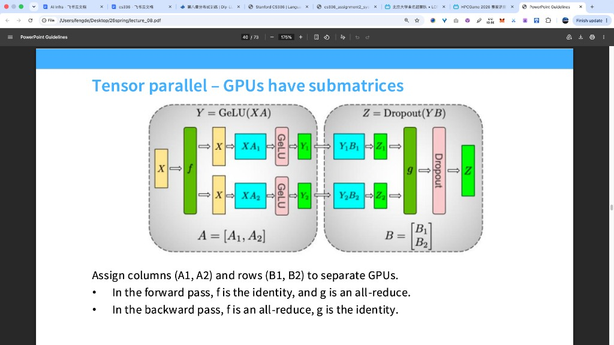
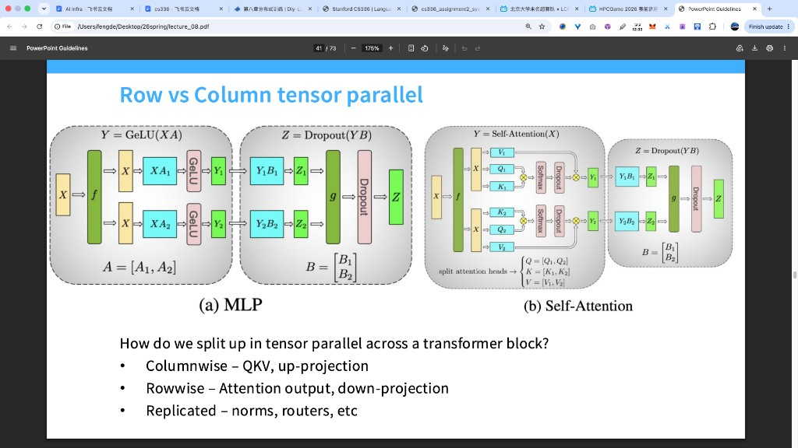

# 为什么还要做 Pipeline Parallelism？

> 讲义原话大意：Pipeline 相对 DDP 省显存；相对 FSDP 通信形态更好（只传激活、且是点对点）。因此常把 pipeline 放在较慢的链路上（尤其跨节点），用来换「按层切分」带来的显存扩展。
>
> 本文只把这三句话拆开讲清楚。假定你已经知道：DDP = 每卡一份完整模型、切 batch；FSDP ≈ 参数也切开、用时再 gather。

---

## 0. Pipeline 在切什么？

三种并行切的轴不一样：

| 策略 | 切什么 | 每张卡上大致有什么 |
|------|--------|-------------------|
| **DDP**（数据并行） | 切 **batch** | **完整**模型权重 |
| **TP**（张量并行） | 切 **一层内部的矩阵宽/高** | 每层都有，但是分片 |
| **Pipeline**（流水线并行） | 切 **层**（模型深度） | 只负责连续的几层 |

设模型有 $L$ 层，pipeline 并行度 $N_{\mathrm{PP}}$。常见画法是把层均分到 $N_{\mathrm{PP}}$ 个 **stage**：

```text
样本 x
  → stage0（层 1…L/N_PP）→ 激活
  → stage1（下一截层）    → 激活
  → …
  → stage 最后            → 输出 / loss
```

前向时，激活沿 stage 链往后传；反向时，激活的梯度沿链往回传。  
相邻两个 stage 之间，通信就是：**把边界上的那份激活（或激活梯度）发给下一台（或上一台）**。

后面「相对 DDP 省显存」「相对 FSDP 通信更好伺候」「为何常放跨节点」，都从这个切法推出来。

---

## 1. 相对 DDP：Pipeline 更省显存

先固定一个具体场面，再谈「每张卡上到底躺着几层」。

设定：

- 前馈网络一共 **8 层**（层 0 到层 7）；
- 每层参数量都是 $P$；
- 一共 **4 张 GPU**。

### 四卡 DDP 时，每张卡存什么？

数据并行的分工是：四张卡各自拿到总 batch 里的不同样本，但 **模型结构在每张卡上完整出现一遍**。

因此：

| GPU | 这张卡显存里的层 |
|-----|------------------|
| GPU 0 | 层 0, 1, 2, 3, 4, 5, 6, 7（全部 8 层） |
| GPU 1 | 层 0, 1, 2, 3, 4, 5, 6, 7（全部 8 层） |
| GPU 2 | 层 0, 1, 2, 3, 4, 5, 6, 7（全部 8 层） |
| GPU 3 | 层 0, 1, 2, 3, 4, 5, 6, 7（全部 8 层） |

每张卡上的参数量是 $8P$。  
四张卡加起来是 $4\times 8P$，因为同一套 8 层在四张卡上各有一份拷贝。

每张卡通常还为自己这份完整模型准备梯度，以及 Adam 一类优化器状态（体积往往比参数本身更大）。这些也按「完整 8 层」来配。

### 四卡 Pipeline 时，每张卡存什么？

流水线并行的分工是：把 8 层 **按深度切开**，每张卡只负责连续的一段，叫做一个 stage。

均分时，每张卡分到 $8/4=2$ 层：

| GPU（stage） | 这张卡显存里的层 | 这张卡参数量 |
|--------------|------------------|--------------|
| GPU 0（stage 0） | 层 0, 1 | $2P$ |
| GPU 1（stage 1） | 层 2, 3 | $2P$ |
| GPU 2（stage 2） | 层 4, 5 | $2P$ |
| GPU 3（stage 3） | 层 6, 7 | $2P$ |

读表时抓住一件事：

- **GPU 0 上驻留的是层 0 和层 1 的权重**；层 2 到层 7 的权重分别驻留在 GPU 1、2、3 上。  
- 完整的 8 层模型，是四张卡上的四段 **接成一条链** 才齐：stage0 → stage1 → stage2 → stage3。

前向时：样本先在 GPU 0 上走过层 0、1，把边界激活发给 GPU 1；GPU 1 再走层 2、3；如此传到 GPU 3。  
反向时：激活梯度沿 GPU 3 → 2 → 1 → 0 传回去；每张卡只更新 **自己那两层** 的参数和优化器状态。

### 并排对照（同一模型、同一四张卡）

| | 每张卡存几层 | 每张卡参数量 | 四张卡合起来怎么理解 |
|--|--------------|--------------|----------------------|
| DDP | **每张都是 8 层** | $8P$ | 四份相同的完整模型，各算各的 batch |
| Pipeline | **每张 2 层** | $2P$ | 四段拼成一份完整模型，样本按层顺序过卡 |

所以讲义说 *Pipelines save memory (compared to DDP)*，在这个例子里就是具体数字：

$$
\text{单卡参数：DDP 为 } 8P,\quad \text{Pipeline 为 } 2P.
$$

单卡参数量变成原来的 $2P/8P=1/4$，也就是按 pipeline 并行度 $N_{\mathrm{PP}}=4$ 除了一遍。  
优化器状态通常也只为「本卡这两层」准备，体积同样按大约 $1/4$ 下来。

（Pipeline 训练里还会为 micro-batch 存激活，调度也会影响激活显存和吞吐。那是另一本账。这里只把「参数按层住在哪张卡上」说清楚。）

---

## 2. 相对 FSDP：Pipeline 的通信往往更好伺候

FSDP 也能省显存（参数切开）。那为什么还要 pipeline？讲义比的是 **通信形态**，不是「谁绝对更省」。

### FSDP 在通信什么？

FSDP（接近 ZeRO-3）的典型节奏是：

- 算某一层之前：**all-gather** 把该层完整权重临时拼出来；
- 用完可以丢掉完整权重；
- 梯度侧常见 **reduce-scatter**。

通信量跟 **参数分片 / 层权重** 绑定，而且是 **集合通信**（一群卡一起参加 all-gather / reduce-scatter）。  
层多、模型宽时，这类通信又大又密。跨节点、带宽一般时，代价很痛。

### Pipeline 在通信什么？

相邻 stage 之间，前向传的是 **边界激活**，形状由数据决定，不是由「整层有多少参数」决定。讲义写成：

$$
b \times s \times h
$$

| 符号 | 含义 |
|------|------|
| $b$ | 这一次传过边界的 batch（常是 micro-batch） |
| $s$ | 序列长度 |
| $h$ | 隐藏维（激活最后一维） |

反向则传同形状量级的 **激活梯度**。

再两点性质：

1. **体积只取决于激活，不取决于该 stage 有多少参数。**  
   某一 stage 里塞了特别宽的 FFN，参数可以很大；边界上仍是一份 $b\times s\times h$ 的激活。
2. **点对点（point-to-point）。**  
   stage $i$ 只需和 stage $i\pm 1$ 说话，不必拉齐全部 $N_{\mathrm{PP}}$ 张卡做一次大集合通信。

数量级感（不必死记）：XL 档 $h=2560$，若 $b=2$、$s=2048$，一份边界激活大约

$$
2\cdot 2048\cdot 2560\cdot 2\ \text{字节（FP16）}\approx 20\ \mathrm{MB}.
$$

同一档一个 FFN 升维矩阵大约 $D\cdot D_{\mathrm{FF}}\cdot 2 \approx 50\ \mathrm{MB}$ 量级；FSDP 还要按层、反复 all-gather。Pipeline 跨过一次边界常常就是「几十 MB 点对点」；FSDP 则是「按层、多卡集合地搬权重」。慢网上，两种痛感差很多。

这就是讲义说的：

> Pipelines can have good communication properties (compared to FSDP) — it depends only on activations ($b \times s \times h$) and is point to point.

### 对照表（只抓通信差异）

| | FSDP（典型） | Pipeline（边界上） |
|--|--------------|---------------------|
| 传什么 | 权重分片 / 梯度分片（all-gather、reduce-scatter） | 激活或激活梯度 |
| 大小由什么定 | 参数量、层宽 | $b,s,h$ |
| 通信模式 | 集合通信（多卡一起） | 点对点（邻接 stage） |
| 慢网上更怕什么 | 大块、频繁的 gather/scatter | 相对更小、且只邻接传 |

FSDP 省显存靠「权重切开、用时再拼」；拼的过程本身就是重通信。  
Pipeline 省显存靠「层根本不放在同一张卡上」；卡与卡之间只传递边界激活（及反向时的激活梯度）。

二者都能减单卡权重显存，但机制不同：FSDP 是「权重仍逻辑上属于大家，用时 gather」；pipeline 是「这几层的权重只住在这个 stage 上，邻居只要激活」。讲义在通信上更看好后者，尤其是链路已经偏慢的时候。

---

## 3. 为什么常说：Pipeline 放在跨节点（较慢的链路）？

讲义收束句：

> Generally, we will use pipelines on slower network links (i.e. inter-node) as a way to get better memory-wise scaling.

把 §1、§2 收成部署习惯。推理顺序是：

1. 模型太大，单卡 / 单机放不下整模 → 需要某种「切模型」来扩显存（DDP 做不到这一点）。  
2. FSDP 能切参数，但跨节点要反复集合通信权重 → 慢链路上很贵。  
3. Pipeline 也能切模型（按层），跨节点主要传 $b\times s\times h$ 的点对点激活 → 慢链路上更扛得住。  
4. 因此：需要显存扩展、又落在较慢链路上时，优先用 pipeline 承担「跨节点切层」这一角色。

**节点内**（NVLink 一类，带宽高、延迟低）  
常见：张量并行、以及吃得起的 FSDP / 集合通信——「大消息 + 多卡同步」在这里相对可承受。

**节点之间**（以太网 / InfiniBand，相对更慢）  
若跨节点仍频繁 all-gather 大块权重，系统容易通信主导。  
Pipeline 跨节点时：

- 仍然能靠「每机只放一截层」做 **显存扩展**（memory-wise scaling）——这是相对 DDP 的那条；
- 跨节点流量主要是 $b\times s\times h$ 量级的点对点激活，而不是整层权重的集合通信——这是相对 FSDP 的那条。

所以工程上的常见叠法是：

```text
节点内：TP / 高速集合通信（吃满 NVLink）
节点间：Pipeline（用「切层」换显存，通信保持激活点对点）
再在外层：必要时加 DDP / ZeRO（切数据或再切优化器状态）
```

一句话：**慢链路上既要用切分换显存，又传不起 FSDP 那种权重 gather 时，用 pipeline 按层切模型：单卡只留一截层，跨节点只邻接传递激活。**

---

## 4. 三句话对照（读完应能复述）

1. **vs DDP（显存）**  
   DDP 每卡整模；pipeline 每卡只存 $1/N_{\mathrm{PP}}$ 的层 → 单卡参数（及对应优化器状态）下降。

2. **vs FSDP（通信）**  
   FSDP 为省显存要反复集合通信权重；pipeline 边界只点对点传激活，体积 $\sim b\times s\times h$。

3. **放哪**  
   跨节点链路较慢 → 适合用 pipeline 做显存向的扩展，而把重集合通信留在节点内高速互联上。

---

## 5. 有意没展开的（避免一次塞太多）

下面这些真实存在，但不妨碍理解「为什么要做 pipeline」：

- **流水线气泡（bubble）**：调度不满时部分 stage 空等，伤害吞吐；
- **micro-batch 数量与深度的权衡**：气泡比例、激活显存与 $b$ 的选择；
- **与 checkpoint / 再计算的配合**。

把「为何引入」先钉死：省显存（相对 DDP）+ 通信好伺候（相对 FSDP）+ 适合慢网扩显存。调度细节是下一层问题。

---

## 6. 讲义插页：Tensor Parallel —— 每张 GPU 上是权重的子矩阵

§3 的叠法里写了「节点内用 TP」。下面把讲义那一页 *Tensor parallel – GPUs have submatrices* 从左到右走一遍。看完应能回答三件事：

1. 一张卡上到底存的是整块 $A$、$B$，还是半块；  
2. 前向在哪一步必须和其他卡说话；  
3. 反向时说话的位置为什么和前向对调。



### 6.1 先看单卡完整计算时，这一层在算什么

图里画的是 Transformer 里常见的两段线性变换（FFN 的简化版；讲义用 GeLU + Dropout 示意）：

$$
Y = \mathrm{GeLU}(XA),
\qquad
Z = \mathrm{Dropout}(YB).
$$

| 符号 | 角色 | 形状直觉 |
|------|------|----------|
| $X$ | 输入激活 | 行是 token / batch，列是隐藏维 |
| $A$ | 第一块权重（升维一侧） | 左乘 $X$ 后变「更宽」 |
| $Y$ | 中间激活 | 已经过 GeLU |
| $B$ | 第二块权重（压回一侧） | 把宽的 $Y$ 乘回去 |
| $Z$ | 这一层输出 | 再过 Dropout |

两张 GPU 要一起算这两式。做法是：**把 $A$ 和 $B$ 切成子矩阵，每张卡只存自己那一块**，同时让数学上仍然等于上面的完整 $Y$、$Z$。

#### GeLU 和 Dropout 分别是什么？它们和「按行 / 按列切」是什么关系？

**GeLU（Gaussian Error Linear Unit）** 是一种 **逐元素** 激活函数：张量里每个位置 $u$ 独立变成 $\mathrm{GeLU}(u)$（常见近似是 $u\cdot\sigma(1.702u)$，细节不必死记）。它和 ReLU、SiLU 一样，**输出的第 $j$ 列只依赖输入的第 $j$ 列**，列与列之间不相混合。

因此才有后面反复用到的等式：

$$
\mathrm{GeLU}(X[A_1\mid A_2]) = [\mathrm{GeLU}(XA_1)\mid \mathrm{GeLU}(XA_2)].
$$

**Dropout** 是训练时的正则：以概率 $p$ 把一些位置置零，其余位置通常再除以 $1-p$ 做缩放；推理时常关闭。它同样是 **逐元素**（每个激活位置独立掷硬币），但 **本页图里 Dropout 画在 $g$（all-reduce）之后**：先把 $Z_1+Z_2$ 加成完整张量，再对这份完整结果做 Dropout。也就是说，图上的 Dropout 作用在 **已经求和完的 $YB$** 上。

**和切分的关系，要分开看，避免记反：**

| | 它决定了「按列 / 按行切」吗？ | 真正起的作用 |
|--|------------------------------|--------------|
| **矩阵乘本身** | 是主因 | $A$ 按列切、$B$ 按行切，来自分块乘法恒等式，为的是显存切开且少通信（§6.2–6.3、§7.2） |
| **GeLU** | 是 **列切能成立的重要条件** | 因为它逐元素，列切后的 $XA_1$ 可以在本地直接做 GeLU，激活继续保持切开；若中间非线性把各列混在一起，列切后就无法在本地独立算出对应的 $Y_1$ |
| **Dropout（本图位置）** | **不是** 行切 / 列切的原因 | 它发生在 all-reduce **之后**；行切 $B$ 是为了 $YB=Y_1B_1+Y_2B_2$，与 Dropout 无关。换成本地逐元素的其它收尾，切法仍一样 |

一句话：**按列切 $A$、按行切 $B$，首先是线性层怎么分块的问题；GeLU 的逐元素性让「列切 + 本地激活」接得上；本图的 Dropout 只是求和之后的正则，不决定切哪一刀。**

---

### 6.2 左半框：把 $A$ 按列切开（column parallel）

完整权重写成左右两块并排：

$$
A = [A_1 \mid A_2].
$$

约定：

| GPU | 它存的权重 | 它本地算出来的中间结果 |
|-----|------------|------------------------|
| GPU 1 | $A_1$（$A$ 的左半列块） | $Y_1 = \mathrm{GeLU}(X A_1)$ |
| GPU 2 | $A_2$（$A$ 的右半列块） | $Y_2 = \mathrm{GeLU}(X A_2)$ |

输入 $X$ 在两张卡上都要能用到完整的一份。图里进左框之前经过方块 $f$。讲义写明：

> Forward: $f$ = identity.

意思是：前向走到这里时，$f$ 就是「把同一份 $X$ 放到两张卡上」，然后各卡在本地做矩阵乘。这一步的通信角色是 identity。

因为 GeLU 是逐元素的，对 $Y$ 的每一列独立作用，所以

$$
Y = \mathrm{GeLU}(XA) = \mathrm{GeLU}\bigl(X[A_1\mid A_2]\bigr) = [\mathrm{GeLU}(XA_1) \mid \mathrm{GeLU}(XA_2)] = [Y_1 \mid Y_2].
$$

读成人话：

- 完整的中间结果 $Y$，在列方向上可以拆成 $Y_1$ 和 $Y_2$；  
- GPU 1 手里是 $Y$ 的左半宽，GPU 2 手里是右半宽；  
- 两张卡各自算完自己那一半，左半框内部就已经做完了。

到这里为止：**每张卡只存半个 $A$，只产出半个 $Y$。**

---

### 6.3 右半框：把 $B$ 按行切开（row parallel），再在出口求和

第二块权重按上下切开：

$$
B =
\begin{bmatrix}
B_1 \\
B_2
\end{bmatrix}.
$$

| GPU | 它存的权重 | 它本地用的输入 | 它本地乘积 |
|-----|------------|----------------|------------|
| GPU 1 | $B_1$（$B$ 的上半行块） | $Y_1$（正好接住左半框的输出宽） | $Z_1 = Y_1 B_1$ |
| GPU 2 | $B_2$（$B$ 的下半行块） | $Y_2$ | $Z_2 = Y_2 B_2$ |

完整乘积有分块恒等式：

$$
YB
=
[Y_1 \mid Y_2]
\begin{bmatrix}
B_1 \\
B_2
\end{bmatrix}
=
Y_1 B_1 + Y_2 B_2
=
Z_1 + Z_2.
$$

因此每张卡算出的 $Z_1$、$Z_2$ 都是形状与最终 $Z$ 相同的 **部分和**。要把它们合成完整结果，图里经过方块 $g$。讲义写明：

> Forward: $g$ = all-reduce.

也就是：前向在右框出口做一次 **对 $Z_1$ 与 $Z_2$ 求和的 all-reduce**，之后两张卡都拿到完整的

$$
Z_{\mathrm{pre}} = Z_1 + Z_2 = YB,
$$

再做 Dropout，得到最终的 $Z$。

$Y_1$ 与 $B_1$ 能直接对接，是因为左框按 **列** 切 $A$、右框按 **行** 切 $B$，切开的宽维互相对齐：$Y_1$ 的列数等于 $B_1$ 的行数。完整的 $Y$ 留在切开状态就能进入第二段乘法。这就是 Megatron 风格「先列并行、后行并行」配对的用意——**中间激活保持切开，整层 FFN 前向只在出口付一次 all-reduce。**

到这里，前向图像可以收成一条时间线：

```text
完整 X 到两张卡（f = identity）
    → GPU1: Y1=GeLU(X A1),  GPU2: Y2=GeLU(X A2)     （此步只在本地 matmul + GeLU）
    → GPU1: Z1=Y1 B1,        GPU2: Z2=Y2 B2
    → all-reduce: Z_pre = Z1+Z2                         （g = all-reduce）
    → Dropout → Z
```

---

### 6.4 底部那四行：前向 / 反向里，$f$ 和 $g$ 谁在通信

讲义把通信角色写得很对称：

| 阶段 | 方块 $f$（左框入口） | 方块 $g$（右框出口） |
|------|----------------------|----------------------|
| **前向** | identity（同一份 $X$ 留在各卡，本地开乘） | **all-reduce**（把 $Z_1+Z_2$ 加成完整输出） |
| **反向** | **all-reduce**（把各卡对 $X$ 的梯度贡献加总） | identity（完整 $Z$ 的梯度在各卡上直接往回传） |

下面把反向为什么是这样，按梯度流再写一遍。

**从 $Z$ 往回走。**  
前向在 $g$ 处做了求和 $Z_{\mathrm{pre}}=Z_1+Z_2$。损失对 $Z_{\mathrm{pre}}$ 的梯度记为 $dZ$。求和的反向是：每一路加数都收到同一份 $dZ$。所以

$$
dZ_1 = dZ,
\qquad
dZ_2 = dZ.
$$

两张卡各自已经有完整的 $dZ$，本地就能做

$$
dB_1 = Y_1^\top\, dZ,
\qquad
dY_1 = dZ\, B_1^\top
$$

（GPU 2 同理）。右框出口的 $g$ 在反向里保持 identity——讲义写 *Backward: $g$ = identity*；各卡带着同一份 $dZ$ 继续往回乘即可。
**再往回进左框。**  
GPU 1 从 $dY_1$ 反过 GeLU，再乘 $A_1^\top$，得到自己对输入的一份贡献 $dX^{(1)}$；GPU 2 得到 $dX^{(2)}$。完整输入梯度是两路之和：

$$
dX = dX^{(1)} + dX^{(2)}.
$$

这一步必须跨卡求和，所以落在左框入口的 $f$ 上：

> Backward: $f$ = all-reduce.

和你们作业里 FFN 张量并行的结论一致：前向一次 all-reduce（汇总输出），反向一次 all-reduce（汇总 $dx$）；位置正好对调在「列并行入口 / 行并行出口」两端。详见 [reports/tensor-parallel-calculations.md](../reports/tensor-parallel-calculations.md)。

---

### 6.5 和 §1 的 Pipeline 对照：同是「每卡一块」，切的轴不同

用同一句人话钉死差异：

| | Pipeline（前文 §1） | Tensor Parallel（本页） |
|--|---------------------|-------------------------|
| 切什么 | **层**：GPU0 存层 0–1，GPU1 存层 2–3，… | **一层里的矩阵**：$A$ 的列块、$B$ 的行块 |
| 一张卡上有什么 | 完整的几层，层内矩阵是整块 | 每一层都参与，但 $A$、$B$ 只有子矩阵 |
| 卡间主要传什么 | 边界激活 $b\times s\times h$（点对点） | 本页前向出口 / 反向入口的 **all-reduce** |
| 常放在哪 | 跨节点（较慢链路） | 节点内（NVLink 一类高速链路） |

§3 里「节点内 TP、节点间 Pipeline」和这页图是配套的：TP 要在层内做 all-reduce，吃带宽；Pipeline 跨机只递激活，吃得起慢一点的网。

---

### 6.6 读完本页应留下的画面

两张 GPU 合写一个 FFN 时：

1. **GPU 1 存 $A_1$ 与 $B_1$，GPU 2 存 $A_2$ 与 $B_2$**——每张卡上是子矩阵，整块 $A$、$B$ 被切开存放。  
2. **前向**：同一份 $X$ 在两卡上本地算 $Y_1,Y_2$，再本地算 $Z_1,Z_2$，最后 all-reduce 成完整 $Z$。  
3. **反向**：完整 $dZ$ 在两卡上本地回传；对 $X$ 的梯度在入口再 all-reduce 一次。  
4. 中间 $Y_1$ 直接接 $B_1$，省掉「先拼完整 $Y$」的那次通信——这就是图上左列并行、右行并行画在一起的原因。

---

## 7. 下一页：整层 Transformer 里，谁按列切、谁按行切、谁整份复制

上一页用 MLP 细图画了「先列后行」。讲义下一页把 **Self-Attention** 画进同一套规矩，底部用三行字做总清单：

- **Columnwise**（按列切）
- **Rowwise**（按行切）
- **Replicated**（每张卡整份都留着）

要回答的是：一层 Transformer block 里，每个矩阵沿哪一刀切、哪些索性整份复制，才能既省显存又少通信。下面先认词，再分 MLP、Attention、Replicated 三块把 **为什么** 讲完。



对权重 $W\in\mathbb{R}^{d_{\mathrm{in}}\times d_{\mathrm{out}}}$，左乘输入得到输出：

- **Columnwise**：沿 **输出维** 竖切，$W=[W_1\mid W_2\mid\cdots]$。每卡拿完整输入，乘自己的列块，得到输出的一段宽度（或若干头）。
- **Rowwise**：沿 **输入维** 横切，$W$ 分成上下行块。每卡用对应的一段输入，乘自己的行块，得到一份与最终输出同形的 **部分和**；各卡部分和经 all-reduce 相加，才是完整结果。
- **Replicated**：每张 TP 卡各存一份 **完整** 参数，本地就算完。

---

### 7.2 图 (a) MLP：为什么 up-proj 用 columnwise、down-proj 用 rowwise

左图仍是

$$
Y=\mathrm{GeLU}(XA),\qquad Z=\mathrm{Dropout}(YB).
$$

讲义底部写 Columnwise: up-proj、Rowwise: down-proj，意思就是 $A$ 按列切、$B$ 按行切。原因要从目标推出来。（GeLU / Dropout 各是什么、和切分的关系，见 §6.1；这里只用到「GeLU 逐元素」「Dropout 在求和之后」这两点。）

我们同时要：每卡只存 $A$、$B$ 的一块（显存按 $N_{\mathrm{TP}}$ 摊薄）；算出来的 $Z$ 与单卡完整计算一致；前向跨卡集体通信尽量少。MLP 的数据流是先变宽（$X\to Y$）再变窄回残差宽度（$Y\to Z$），切法必须顺着这条流来设计。

先看升维 $A$。$A$ 的输出维是宽的 $d_{\mathrm{ff}}$。若只做矩阵乘，按列切已经能让每卡算出 $XA$ 的一段；中间还要过 GeLU。正因为 GeLU **逐元素**、不混列，才有

$$
\mathrm{GeLU}(XA)
=
\mathrm{GeLU}\bigl(X[A_1\mid A_2]\bigr)
=
[\mathrm{GeLU}(XA_1)\mid \mathrm{GeLU}(XA_2)].
$$

因此把 $A$ **按列** 切成 $A_1,A_2$，并让每张卡都持有完整 $X$，则 GPU 1 本地得到 $Y_1=\mathrm{GeLU}(XA_1)$，GPU 2 本地得到 $Y_2$，这一段前向只有本地 matmul 与 GeLU，方块 $f$ 取 identity。  
**up-proj 用 columnwise：主因是升维的「宽」在输出维上，按列切开最自然；GeLU 的逐元素性保证切开后激活仍可本地做完，继续保持切开。**

再看降维 $B$。各卡手里已经是切开的 $Y_1,Y_2$，完整乘法有分块恒等式

$$
YB
=
[Y_1\mid Y_2]
\begin{bmatrix} B_1 \\ B_2 \end{bmatrix}
=
Y_1 B_1 + Y_2 B_2.
$$

要把这个式子在切分下算出来，$B$ 就必须 **按行** 切，使 $B_1$ 的行数等于 $Y_1$ 的列数。于是 GPU 1 用本地 $Y_1$ 与本地 $B_1$ 算 $Z_1=Y_1B_1$，GPU 2 算 $Z_2$，再 all-reduce 求和得到完整 $YB$。图上的 Dropout 加在这次求和 **之后**，作用在完整 $YB$ 上，得到 $Z$；它是正则手段，**行切来自分块恒等式，不是来自 Dropout。**  
**down-proj 用 rowwise，是因为收束回残差宽度时，数学上就是「各段贡献相加」；行切让「这段 $Y_i$」和「这块 $B_i$」住在同一张卡上，本地乘完，出口只付一次求和。**

两步接在一起，刀缝对齐：

```text
columnwise(A) → 各卡持有 Y_i
              → 同一卡上 Y_i × rowwise(B_i)
              → all-reduce(Z_1+Z_2) → Dropout → Z
```

$Y_1$ 与 $Y_2$ 保持切开就能进入第二段乘法，中间省去一次把完整 $Y$ gather 起来的集体通信。整段 MLP 前向的集体通信收缩成 **降维出口的一次 all-reduce**。  
这就是「先列后行」的所以然：列切解决「变宽 + 逐元素激活如何本地切开算」；行切解决「变窄如何变成部分和」；二者按同一刀缝配对，解决「中间还要不要再通信」。

若把切法对调（升维行切、降维列切），宽维上的 $Y$ 与 $B$ 的分块对不齐，中间往往还要重新拼开或重切，前向集体通信容易变成两次，比「出口一次 all-reduce」更贵。讲义选定的配对，是在算对、显存切开的前提下，把每个 MLP 子层的前向集体通信压到一次。

---

### 7.3 图 (b) Self-Attention：同一条因果链，为什么切在「头」上

Attention 子层同样是「先变出一组较宽的中间表示，再投影回 $d_{\mathrm{model}}$」，因此与 MLP **同构**；差别只是：MLP 的「宽」是 $d_{\mathrm{ff}}$ 通道，Attention 的「宽」是多个 head。

前半段要算多头注意力。单卡上本就把通道拆成若干 head，且

$$
\mathrm{head}_i = \mathrm{softmax}\!\Bigl(\frac{Q_i K_i^\top}{\sqrt{d}}\Bigr) V_i
$$

只依赖属于自己的 $Q_i,K_i,V_i$，头与头之间前向相互独立。于是把 $Q,K,V$ 的投影矩阵按 **输出通道 / 头** 做 columnwise：GPU 1 持有一部分头，本地算完这些头的注意力得到 $Y_1$；GPU 2 得到 $Y_2$。这一段与 MLP 里「列切 $A$ + GeLU」一样——宽计算在切开状态下本地完成，$f$ 仍取 identity。  
**QKV 用 columnwise，是因为注意力按头可分：按头切开之后，前半段前向保持本地完成。**

后半段输出投影要把各头结果混回残差宽度，形式仍是 $YB$。与 MLP 的 down-proj 相同：

$$
YB = Y_1 B_1 + Y_2 B_2,
$$

故 $B$ 按行切，$Y_i$ 留在切开状态直接乘 $B_i$，出口 all-reduce。  
**Attention 输出投影用 rowwise，理由与 down-proj 相同：收束成完整宽度时，用「部分和 + 一次求和」最省通信，并与上游按头切开的 $Y_i$ 刀缝对齐。**

于是 Attention 与 MLP 共用同一设计：

```text
进子层：columnwise（QKV / up-proj）——切开后本地做完宽计算
出子层：rowwise  （attn out / down-proj）——部分和在出口 all-reduce
```

每个 Transformer block 前向通常付 **两次** 出口 all-reduce：Attention 子层一次，MLP 子层一次。讲义底部 Columnwise: QKV, up-proj 与 Rowwise: Attn output, down-proj，就是把这条因果链写在整层 block 的清单上。

---

### 7.4 Replicated：为什么 Norm 和 router 整份复制

底部第三句：Replicated: norms, routers。

以 LayerNorm / RMSNorm 为例：它作用在最后一个隐藏维上，参数往往只是一条长度约为 $h$ 的缩放向量，体积远小于 $Q,K,V$ 或 FFN 大矩阵。若按 TP 去切它，省下的参数显存很少，却要处理切开后的统计量与参数如何对齐，还容易引入额外通信。更省事的做法是：**每张 TP 卡放一份完整的 Norm 参数**，在本地激活上做完归一化。这就是 replicated。

MoE 的 router 同理：路由网络通常很小，却要依据完整视图决定 token 去哪个专家；整份放在每张卡上，路由计算保持本地、简单。

所以 replicated 与 columnwise / rowwise 的分工是：

> 张量并行去切的，是又大、又适合按通道或按头切开的矩阵；  
> Norm、router 这类又小、又希望在完整隐藏维上一起看的模块，每卡留一份完整拷贝更划算。

读完整页 PPT，判断顺序可以收成三步：子层入口往宽处走的大矩阵（QKV、up-proj）→ columnwise；子层出口收回残差宽度的大矩阵（attn out、down-proj）→ rowwise，并接受一次 all-reduce；Norm / router → replicated。这与 §6 的 $f$/all-reduce 故事是同一套设计在整层 Transformer block 上的展开。

---

## 8. 讲义对比里那个「8」是什么？不是 8 台机器

讲义把 Tensor Parallel 和 Pipeline 的通信量放在一起比时，大致会写成：

| 策略 | 通信量（量级） |
|------|----------------|
| Pipeline | 每个 microbatch 一次点对点，体积 $\sim bsh$ |
| Tensor Parallel | 每一层 $\displaystyle 8\,bsh\,\frac{n_{\mathrm{devices}}-1}{n_{\mathrm{devices}}}$，且是 all-reduce |

这里的 $b,s,h$ 仍是 batch × 序列长 × 隐藏维（一份残差流激活的元素个数量级）。  
**系数 8 不是「用了 8 张卡」。** $n_{\mathrm{devices}}$ 才是 TP 设备数；8 是把「一层里发生几次 all-reduce」和「环形 all-reduce 每次要付的带宽因子」乘在一起得到的数字。下面拆开。

### 8.1 一层 Transformer 里，TP 要做几次 all-reduce？

Megatron 风格下，一个 block 里有两个「先列后行」的子层（§7）：

- Self-Attention：出口一次 all-reduce（汇总输出投影的部分和）；  
- MLP：出口再一次 all-reduce。

这是 **前向** 的 2 次。  
**反向**里，通信位置与前向对调（§6.4）：每个子层在入口侧再各做一次 all-reduce（汇总对输入的梯度）。于是又是 2 次。

合计：**每一层、完整前向+反向，一共 4 次** 对形状约为 $(b,s,h)$ 的张量做 all-reduce。

```text
前向：Attention 出口 all-reduce + MLP 出口 all-reduce     → 2 次
反向：Attention 入口 all-reduce + MLP 入口 all-reduce     → 2 次
────────────────────────────────────────────────────────
一层合计                                                   → 4 次
```

### 8.2 每一次 all-reduce，环形算法为什么再乘一个 2？

设一次 all-reduce 的消息大小为 $M$（这里 $M\sim bsh$ 个元素，或再乘每元素字节数；与 Pipeline 公式用同一套单位即可）。

环形 all-reduce = reduce-scatter + all-gather，两段各让每台大约发出 $\frac{n-1}{n}M$ 的数据，于是 **每设备出向量** 为

$$
2\cdot\frac{n_{\mathrm{devices}}-1}{n_{\mathrm{devices}}}\,M.
$$

（推导见 [alternate-ring-all-reduce.md](../reports/alternate-ring-all-reduce.md)。）  
这里的 **2** 来自「两段通信」，与设备数是不是 8 无关。

### 8.3 乘在一起：$4\times 2=8$

一层、每台设备、前向+反向合计发出的激活通信量量级为

$$
4 \times \left(2\cdot\frac{n_{\mathrm{devices}}-1}{n_{\mathrm{devices}}}\,bsh\right)
=
8\,bsh\,\frac{n_{\mathrm{devices}}-1}{n_{\mathrm{devices}}}.
$$

所以：

| 符号 / 数字 | 含义 |
|-------------|------|
| $bsh$ | 一份残差流激活的大小 |
| $4$ | 一层里 4 次 all-reduce（Attention/MLP × 前向/反向） |
| $2$ | 每次环形 all-reduce 的两段（reduce-scatter + all-gather） |
| **$8=4\times 2$** | 上面两个因子的乘积 |
| $\frac{n_{\mathrm{devices}}-1}{n_{\mathrm{devices}}}$ | 环形算法里「每台相对全量消息」的比例 |
| $n_{\mathrm{devices}}$ | TP 用了多少张卡（设备数写在这里，不写在 8 里） |

### 8.4 和 Pipeline 那一行怎么对照着读

- Pipeline：跨 stage 主要是 **点对点** 传边界激活，每个 microbatch 大约一份 $bsh$（前向一份；反向还有激活梯度，讲义若只写 $bsh$ 是在抓主项量级）。  
- Tensor Parallel：在 **每一层内部** 反复 all-reduce 同一量级的 $bsh$ 张量；一层下来系数就是 8 乘上环形因子 $\frac{n-1}{n}$。

因此讲义说 TP 的 communication **比 Pipeline 大得多**：同一份 $bsh$，Pipeline 按 microbatch 在邻接机之间点对点传；TP 则在每个 layer 上付出约 $8\frac{n-1}{n}$ 倍的 all-reduce 出向量。这也呼应 §3：TP 适合节点内高速互联；跨节点更慢的链路更常放 Pipeline。

**记住：看到公式里的 8，想「4 次 all-reduce × 环形的 2」，不要想成「8 卡」。**
