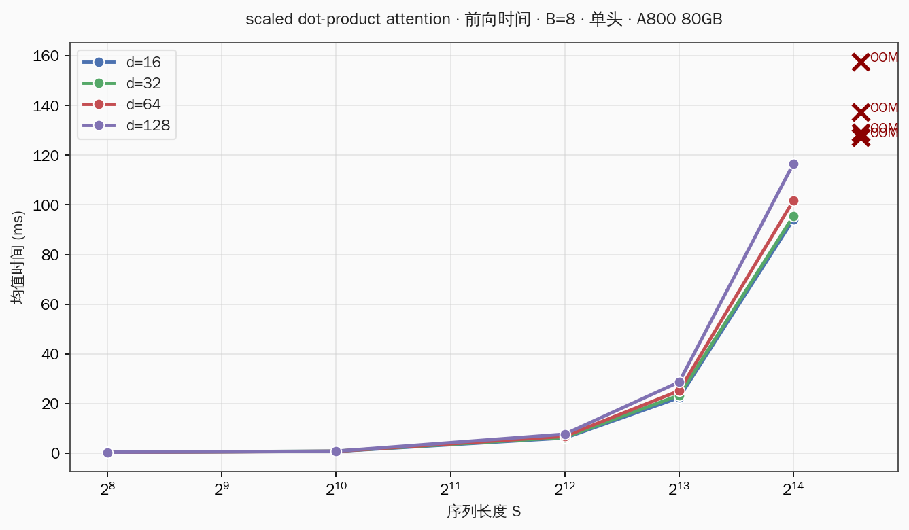
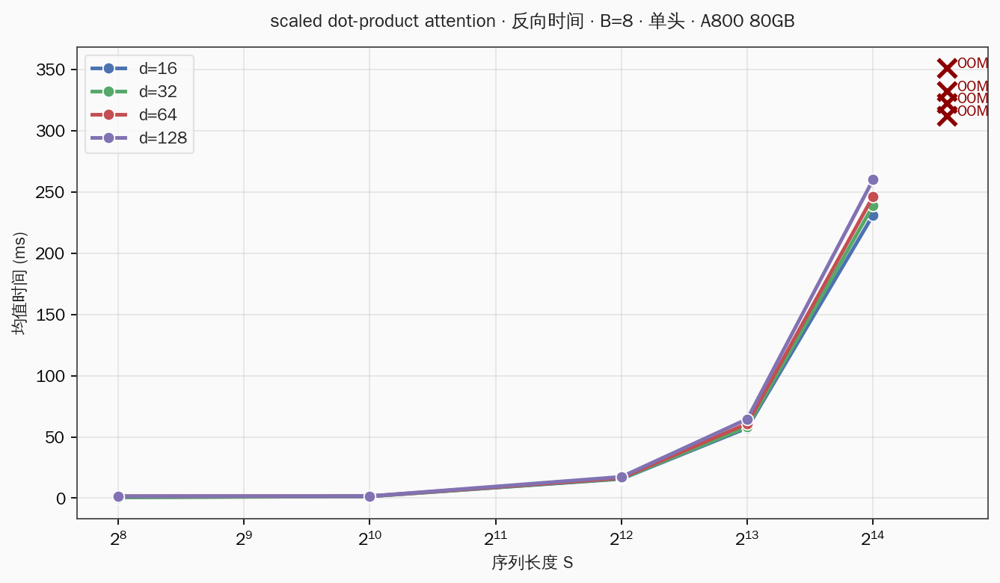
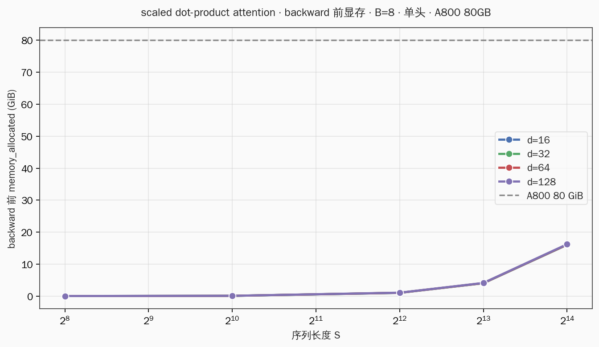
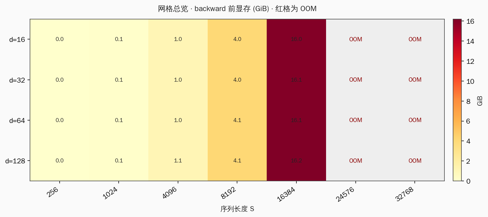

# Benchmarking Scaled Dot-Product Attention

**硬件：** NVIDIA A800-SXM4-80GB（80 GiB HBM）。

**设定：** 孤立调用 `/root/.dev/ml-sys/cs336/assignment2-systems/cs336-basics/cs336_basics/model.py` 中的 `scaled_dot_product_attention`；batch = 8；单头（Q、K、V 形状均为 `(B, S, d)`）；FP32（每个元素 4 字节）；无 causal mask。

**代码：** `/root/.dev/ml-sys/cs336/assignment2-systems/cs336_systems/attention_operator/` · **数据：** `/root/.dev/ml-sys/cs336/assignment2-systems/artifacts/attention_operator/results.json`。

---

## 符号表

| 符号 | 含义 | 本实验取值 |
|------|------|-----------|
| B | batch size（批大小） | 8 |
| S | 序列长度（query / key 维） | 256 … 32768 |
| d | 每个头的特征维（embedding 维） | 16, 32, 64, 128 |

全文按 FP32 计，每个元素占 4 字节。单头设定下没有 head 维；张量形状一律写为 `(B, S, …)`。

**显存三项（backward 开始前）：**

```
两张 S×S 保存张量占用（字节）= 2 · B · S² · 4        # scores + weights
四张 B×S×d 张量占用（字节）   = 4 · B · S · d · 4      # Q, K, V, out 各一张
backward 前显存主项（字节）     = 上述两项之和
                              = 8·B·S² + 16·B·S·d
```

代入 B = 8，化成 GiB（1 GiB = 1024³ 字节）：

```
backward 前显存主项（GiB）= (64·S² + 128·S·d) / 1024³
```

**前向浮点运算量主项：**

```
前向浮点运算量 ≈ 4·B·S²·d + 5·B·S²
              = B·S²·(4d + 5)
```

（乘加各算 1 次；softmax 按每个元素约 5 次运算估算。）

---

## 1. 实验在量什么

scaled dot-product attention（缩放点积注意力，SDPA）的前向分三步：

1. **缩放点积：** `scores = Q @ K^T / sqrt(d)`，形状 `(B, S, S)`；
2. **softmax：** `weights = softmax(scores)`，形状 `(B, S, S)`；
3. **加权求和：** `out = weights @ V`，形状 `(B, S, d)`。

朴素实现把 scores 和 weights 两张 `(B, S, S)` 矩阵写入 HBM，留给反向读取。

本实验在 A800 上扫描 d = 16、32、64、128，S = 256、1024、4096、8192、16384、24576、32768，共 28 个配置。每个配置记录：

| 指标 | 含义 |
|------|------|
| 前向均值时间 | 100 轮 forward，每轮后 `cuda.synchronize` |
| backward 前显存 | 首轮 forward 结束、`backward` 开始前读 `memory_allocated` |
| 反向均值时间 | 100 轮 backward，每轮后 `cuda.synchronize` |

每轮流程是 **forward → backward → zero_grad**，对应训练步里 attention 子步的完整代价。

---

## 2. 公式：显存与算力

### 2.1 前向各阶段的张量形状

| 步骤 | 张量 | 形状 | 元素个数 |
|------|------|------|----------|
| 输入 | Q, K, V | `(B, S, d)` | B·S·d（各一张） |
| 缩放点积 | scores | `(B, S, S)` | B·S·S |
| softmax | weights | `(B, S, S)` | B·S·S |
| 输出 | out | `(B, S, d)` | B·S·d |

### 2.2 backward 前显存（保存张量账本）

反向开始前，计算图里需要保留的前向结果：

| 张量 | 形状 | 字节数（FP32，×4） |
|------|------|-------------------|
| scores | `(B, S, S)` | B·S²·4 |
| weights | `(B, S, S)` | B·S²·4 |
| Q, K, V | 各 `(B, S, d)` | 3·B·S·d·4 |
| out | `(B, S, d)` | B·S·d·4 |

合并：

```
两张 S×S 保存张量占用 = 2 · B · S² · 4
四张 B×S×d 张量占用   = 4 · B · S · d · 4
backward 前显存主项   = 8·B·S² + 16·B·S·d   （字节）
```

代入 B = 8：

```
backward 前显存主项（GiB）= (64·S² + 128·S·d) / 1024³
```

**两张 S×S 矩阵**（scores + weights）随 S 按平方增长；**四张 B×S×d 张量**（Q、K、V、out）随 S 线性增长。  
当 S 较大时，两张 S×S 矩阵占去绝大部分字节，四张 B×S×d 张量的增量在图上几乎看不出来，所以不同 d 的显存曲线叠在一起。  
例如 d = 16、S = 16384：两张 S×S 占用 = 64·16384² / 1024³ = 16 GiB；四张 B×S×d 占用 = 128·16384·16 / 1024³ ≈ 0.031 GiB，后者约占 0.2%。

**S 翻倍时显存怎么变：** 两张 S×S 矩阵里 S 变成 2S，(2S)² / S² = 4，占用变为原来的 4 倍。  
例如 d = 16：S = 4096 时两张 S×S 共 1 GiB；S = 8192 时共 4 GiB；实测 backward 前显存从 1.022 升到 4.028 GiB，比值 4.028 / 1.022 ≈ 3.94。

### 2.3 前向算力

| 步骤 | 运算 | 浮点运算次数（乘加各算 1） |
|------|------|---------------------------|
| Q @ K^T | `(B,S,d) × (B,d,S) → (B,S,S)` | 2·B·S²·d |
| softmax | 对 `(B,S,S)` 做归一化 | ≈ 5·B·S² |
| weights @ V | `(B,S,S) × (B,S,d) → (B,S,d)` | 2·B·S²·d |

合计：

```
前向浮点运算量 ≈ 4·B·S²·d + 5·B·S²
              = B·S²·(4d + 5)
```

固定 d 时，前向浮点运算量与 S² 成正比：S 变为 4 倍，运算量变为 16 倍。  
例如 d = 16：S = 4096 时前向 6.02 ms，S = 16384 时 94.23 ms；时间比 94.23 / 6.02 ≈ 15.7，接近长度比的平方 16 = (16384 / 4096)²。

---

## 3. 理论与实测对照（显存）

取 d = 16 的成功格。  
第三列用完整公式计算：`backward 前显存主项（GiB）= (64·S² + 128·S·d) / 1024³`。  
第四列单独拆出两张 S×S 矩阵：`两张 S×S 占用（GiB）= 64·S² / 1024³`。

| S | 理论 backward 前总显存 (GiB) | 其中两张 S×S (GiB) | 实测 (GiB) | 实测 ÷ 理论 |
|--:|-----------------------------:|-------------------:|-----------:|------------:|
| 256 | 0.0044 | 0.0039 | 0.020 | 4.55 |
| 1024 | 0.065 | 0.0625 | 0.080 | 1.23 |
| 4096 | 1.008 | 1.000 | 1.022 | 1.01 |
| 8192 | 4.016 | 4.000 | 4.028 | 1.00 |
| 16384 | 16.031 | 16.000 | 16.041 | 1.00 |

最后一列是实测值除以理论 backward 前总显存。  
S ≥ 4096 后比值落在 1.00–1.02：此时两张 S×S 矩阵主导读数，公式与 `memory_allocated` 吻合。  
S 较小时实测偏高（例如 S = 256 时比值 4.55），因为总占用只有几十 MiB，CUDA 分配器的块对齐、计算图元数据等固定开销占了大头，公式只计了张量本体。

---

## 4. 时间结果



**前向时间。** 前向里两次矩阵乘都产生 `(B, S, S)` 规模的中间结果；前向浮点运算量主项为 `B·S²·(4d + 5)`。  
以 d = 16 为例：S = 4096 时前向均值 6.02 ms；S = 16384 时 94.23 ms。  
时间比：94.23 / 6.02 ≈ 15.7。  
长度比：16384 / 4096 = 4；理论运算量比为 4² = 16。实测 15.7 与 16 接近。  
图上四条 d 曲线走势一致：S² 项随 S 变化，d 只作为系数 4d 进入。



**反向时间。** 反向读回 scores、weights 两张 `(B, S, S)` 并传播梯度，运算量同样含 B·S² 项。  
仍以 d = 16、S = 16384 为例：前向 94.23 ms，反向 231.24 ms；反向除以前向：231.24 / 94.23 ≈ 2.45。  
四条 d 曲线彼此平行：d 增大只抬高绝对时间，不改变随 S 变陡的整体形状。

---

## 5. 显存结果



纵轴是 backward 开始前的 `memory_allocated`。  
S = 16384、d = 16 时读到 16.041 GiB，与两张 S×S 矩阵的理论占用 `64·16384² / 1024³ = 16 GiB` 一致（四张 B×S×d 张量另占约 0.031 GiB）。  
灰色虚线是 A800 的 80 GiB 上限。OOM 出现在 S = 24576：此时单张 scores 占 `8·24576²·4 / 1024³ ≈ 18 GiB`，前向写出第一张 `(B, S, S)` 矩阵时就触顶。

---

## 6. 网格总览与 OOM



28 个配置里，20 个跑通，8 个 OOM。OOM 全部出现在 S = 24576 或 S = 32768；S ≤ 16384 时四个 d 都能完成 100 轮前向加反向。

### 6.1 最小 OOM 配置：d = 16, S = 24576 —— 80 GiB 边界怎么算

本实验**没有可学习参数**（没有 `nn.Parameter`，也没有 optimizer）。显存里只有输入张量 Q、K、V 及其前向/反向产生的**激活值**。下面用「最后一个成功格」和「第一个 OOM 格」对照，把 80 GiB 边界算清楚。

固定 B = 8，d = 16，每个元素 4 字节（FP32）。

#### 6.1.1 最后一个成功格：S = 16384

| 类别 | 张量 | 形状 | 字节公式 | 占用 (GiB) |
|------|------|------|----------|----------:|
| 输入激活 | Q, K, V | 各 `(8, 16384, 16)` | 3·B·S·d·4 | 0.023 |
| 保存激活 | scores | `(8, 16384, 16384)` | B·S²·4 | 8.000 |
| 保存激活 | weights | `(8, 16384, 16384)` | B·S²·4 | 8.000 |
| 保存激活 | out | `(8, 16384, 16)` | B·S·d·4 | 0.008 |
| **backward 前合计** | — | — | 2·B·S²·4 + 4·B·S·d·4 | **16.031** |

实测 backward 前显存 **16.041 GiB**，与上表 16.031 GiB 一致（误差 0.01 GiB）。

反向传播时，scores、weights 两张保存矩阵仍在，反向还要再物化 **dScores**、**dWeights**（各一张 `(8, S, S)`）。四张 S×S 族张量同时驻留的峰值：

```
反向峰值（S×S 族）= 4 · B · S² · 4
                 = 4 · 8 · 16384² · 4 / 1024³
                 = 32 GiB
```

加上 Q、K、V、out 及其梯度（约 0.05 GiB），**反向整步峰值约 32 GiB**，远在 80 GiB 以内，所以 S = 16384 能跑完 100 轮前向加反向。

#### 6.1.2 第一个 OOM 格：S = 24576

同一张表，把 S 换成 24576：

| 类别 | 张量 | 形状 | 字节公式 | 占用 (GiB) |
|------|------|------|----------|----------:|
| 输入激活 | Q, K, V | 各 `(8, 24576, 16)` | 3·B·S·d·4 | 0.035 |
| 保存激活 | scores | `(8, 24576, 24576)` | B·S²·4 | 18.000 |
| 保存激活 | weights | `(8, 24576, 24576)` | B·S²·4 | 18.000 |
| 保存激活 | out | `(8, 24576, 16)` | B·S·d·4 | 0.012 |
| **backward 前合计** | — | — | 2·B·S²·4 + 4·B·S·d·4 | **36.047** |

若前向能跑完，backward 前就会占 **约 36 GiB**——单是两张 S×S 保存矩阵就从 16 GiB 跳到了 36 GiB（S 变为 1.5 倍，S² 变为 2.25 倍：16 × 2.25 = 36）。

反向峰值（四张 S×S 族同时驻留）：

```
反向峰值（S×S 族）= 4 · B · S² · 4
                 = 4 · 8 · 24576² · 4 / 1024³
                 = 72 GiB
```

加上线性项与梯度，**反向整步峰值约 72.1 GiB**——仍在 80 GiB 卡上「勉强能塞下」的理论范围内。真正让 S = 24576 在本扫参流程里爆掉的，是下面两件事叠加。

#### 6.1.3 80 GiB 理论临界：S 取多少会顶满卡？

令反向峰值里的四张 S×S 族张量恰好占满 80 GiB：

```
4 · B · S² · 4 = 80 · 1024³
S² = 80 · 1024³ / (4 · 8 · 4)
S² = 671,088,640
S ≈ 25,905
```

也就是说：**在 B = 8、d = 16、朴素实现的假设下，反向峰值四张 S×S 同时驻留时，临界序列长度 S ≈ 25,905**。  
S = 24,576 时反向峰值约 72 GiB（留约 8 GiB 余量）；S = 25,891 时约 79.9 GiB（几乎贴满 80 GiB）；S = 32,768 时四张 S×S 族 alone 就要 128 GiB，必 OOM。

#### 6.1.4 实测为何在 S = 24576 就 OOM（日志解读）

扫参是同一进程连续跑多个 S。S = 16384 刚跑完一轮反向（峰值约 32 GiB 的 S×S 族），CUDA 分配器往往仍握着大块缓存。紧接着跑 S = 24576，前向要为 scores 申请 **18 GiB** 连续空间时，日志为：

> Tried to allocate **18.00 GiB** … **72.57 GiB** memory in use（其中 PyTorch 已分配 54.07 GiB，预留 18.01 GiB）… 仅剩 **6.74 GiB** free

算式验证单张 scores 大小：

```
8 × 24576² × 4 = 18,874,368,192 字节 = 18.0 GiB
```

此时进程里已有约 72.6 GiB 被占用或预留，再要 18 GiB 连续块，6.74 GiB 空闲不够，于是**在前向写出第一张 scores 时就失败**——甚至还没走到 backward 前那 36 GiB 的稳态。

**汇总（参数量 + 激活值 + 合计）：**

| | S = 16384（成功） | S = 24576（OOM） |
|--|------------------:|-----------------:|
| 可学习参数量 | **0** | **0** |
| backward 前激活（保存张量） | 16.0 GiB | 36.0 GiB（若前向能跑完） |
| 反向峰值（四张 S×S 族） | 32.0 GiB | 72.0 GiB |
| 反向峰值 + 线性项/梯度 | ≈ 32.1 GiB | ≈ 72.1 GiB |
| 与 80 GiB 关系 | 有余量 | 理论峰值已占 90%；叠加分配器缓存后前向即 OOM |

结论：**80 GiB 边界由 S×S 激活值的平方增长决定，与参数量无关**（本实验无参数）。临界 S ≈ 25,905；实测在 S = 24,576 因扫参进程中的分配器缓存叠加而提前 OOM。

### 6.2 完整实测表

| d | S | forward (ms) | backward (ms) | mem before bwd (GiB) | OOM |
|--:|--:|--:|--:|--:|:---:|
| 16 | 256 | 0.32 | 0.81 | 0.020 | no |
| 16 | 1024 | 0.62 | 1.45 | 0.080 | no |
| 16 | 4096 | 6.02 | 15.67 | 1.022 | no |
| 16 | 8192 | 22.31 | 57.28 | 4.028 | no |
| 16 | 16384 | 94.23 | 231.24 | 16.041 | no |
| 16 | 24576 | — | — | — | yes |
| 16 | 32768 | — | — | — | yes |
| 32 | 256 | 0.28 | 0.52 | 0.021 | no |
| 32 | 1024 | 0.71 | 1.45 | 0.081 | no |
| 32 | 4096 | 6.26 | 15.96 | 1.028 | no |
| 32 | 8192 | 23.24 | 58.24 | 4.040 | no |
| 32 | 16384 | 95.59 | 238.92 | 16.064 | no |
| 32 | 24576 | — | — | — | yes |
| 32 | 32768 | — | — | — | yes |
| 64 | 256 | 0.28 | 1.61 | 0.021 | no |
| 64 | 1024 | 0.65 | 1.59 | 0.084 | no |
| 64 | 4096 | 6.71 | 16.45 | 1.040 | no |
| 64 | 8192 | 25.06 | 60.87 | 4.063 | no |
| 64 | 16384 | 101.80 | 246.43 | 16.111 | no |
| 64 | 24576 | — | — | — | yes |
| 64 | 32768 | — | — | — | yes |
| 128 | 256 | 0.29 | 1.51 | 0.023 | no |
| 128 | 1024 | 0.70 | 1.63 | 0.090 | no |
| 128 | 4096 | 7.59 | 17.40 | 1.063 | no |
| 128 | 8192 | 28.59 | 64.61 | 4.110 | no |
| 128 | 16384 | 116.70 | 260.14 | 16.205 | no |
| 128 | 24576 | — | — | — | yes |
| 128 | 32768 | — | — | — | yes |

---

## 7. 出路：消掉 S×S 物化

根本原因是把完整的 `(B, S, S)` 矩阵写进 HBM：两张 S×S 保存张量占用 `2·B·S²·4` 字节，随 S 二次增长。  
FlashAttention 在 GPU 片上缓存里分块完成 softmax，HBM 里只保留 `(B, S, d)` 输出，上述 S×S 显存项消失；前向里两次 `B·S²·d` 量级的矩阵乘，其 HBM 读写带宽也会下降。

本题测的是朴素实现的基线。下一题换成融合实现之后，在同一张 (d, S) 网格上，时间和显存曲线应整体下移，OOM 会推迟到更大的 S 才出现。
