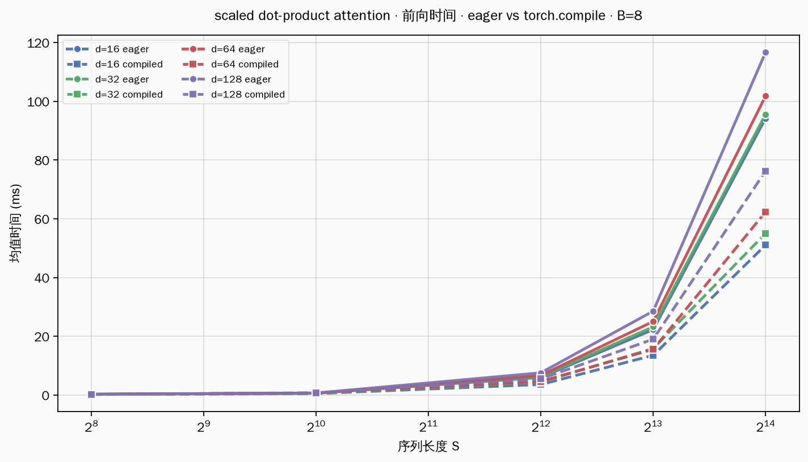
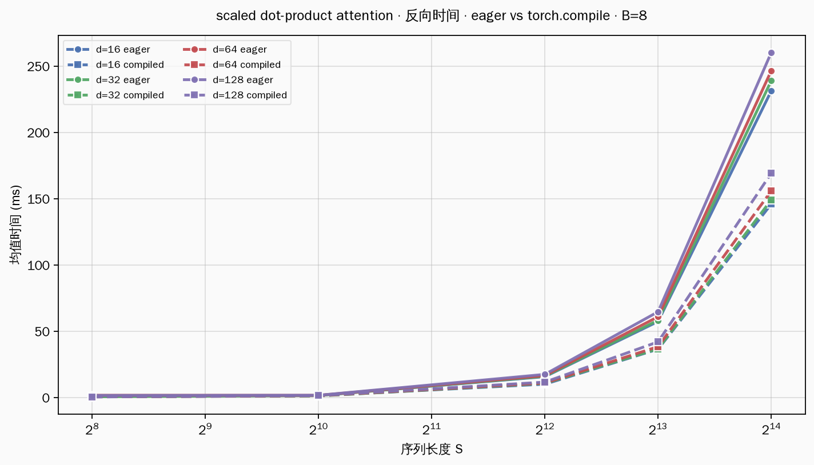
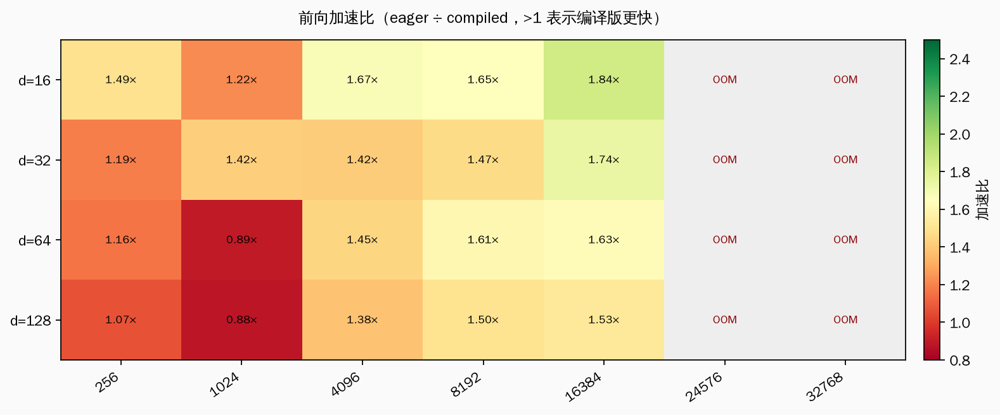
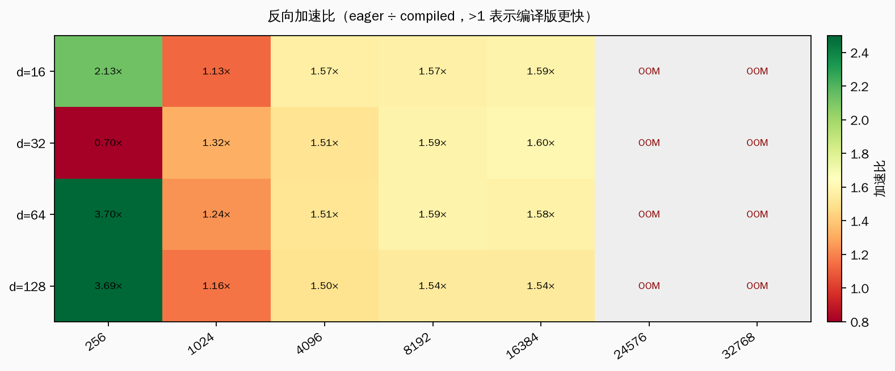
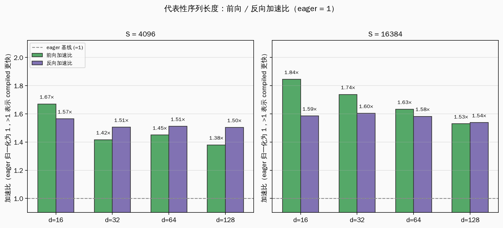
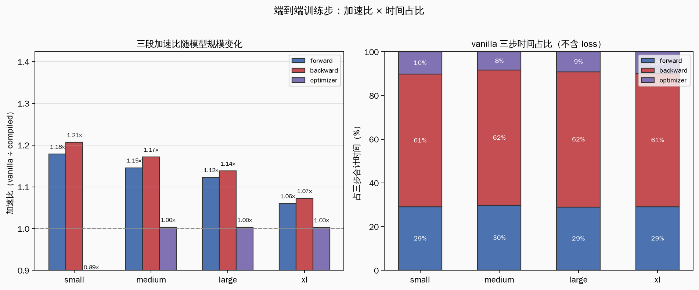
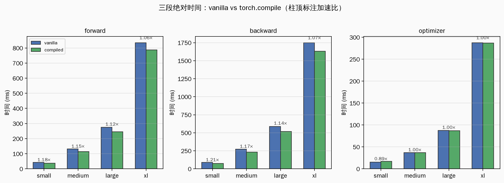

# Benchmarking Torch Compile

**硬件：** NVIDIA A800-SXM4-80GB（80 GiB HBM），CUDA，PyTorch 2.5.1+cu124。

本报告包含两部分实验，均对比 eager / vanilla 与 `torch.compile`（题面默认 API，无额外 mode）：

- **Part (a)** 孤立 scaled dot-product attention 算子，扫描 (d, S) 网格；
- **Part (b)** 完整 `BasicsTransformerLM` 训练步，扫描 small → xl 四档模型。

全文加速比统一定义为 **未编译时间 ÷ 编译后时间**；大于 1 表示 compiled 更快。

---

## Part (a)：Scaled Dot-Product Attention

**算子：** `scaled_dot_product_attention(Q, K, V, mask=None)`，三步：
`scores = Q @ K^T / sqrt(d)` → `weights = softmax(scores)` → `out = weights @ V`。

**张量形状：** Q、K、V 均为 `(B, S, d)`，单头、无 causal mask。

**扫描网格：**

| 参数 | 取值 |
|------|------|
| B（batch size） | 8 |
| d（每头特征维） | 16, 32, 64, 128 |
| S（序列长度） | 256, 1024, 4096, 8192, 16384, 24576, 32768 |
| 精度 | FP32（每元素 4 字节） |
| 计时轮数 | warmup 5 轮（compiled 额外 +10 轮）+ 正式 100 轮 |

**对比路径：** eager 直接调用 vs `torch.compile(attention_fn)`（默认 API，无额外 mode）。
每轮 `forward → backward → zero_grad`，段末 `cuda.synchronize`。
加速比 = eager 时间 ÷ compiled 时间（>1 表示 compiled 更快）。

**原始数据：** `/root/.dev/ml-sys/cs336/assignment2-systems/artifacts/attention_operator/results.json` · `/root/.dev/ml-sys/cs336/assignment2-systems/artifacts/attention_operator/compile_results.json`

### 1. 前向时间对比



**读图：** 实线为 eager，虚线为 compiled；纵轴为毫秒，横轴 S 对数刻度。

四条 d 曲线在 S ≥ 4096 后，compiled 虚线稳定低于 eager 实线，且 S 越大间距越明显。
以 d = 16 为例：S = 16384 时前向从 94 ms 降到 51 ms（约 1.84×）。

**原因：** eager 模式下 matmul、softmax、第二次 matmul 分三次 dispatch，
中间 `scores` 和 `weights` 两张 `(B, S, S)` 矩阵各写一次 HBM。
compiled 路径由 Inductor 生成融合内核，减少 kernel 启动次数和 HBM 往返。
S 越大，矩阵乘法的计算量按 S² 增长，融合省下的内存带宽在总时间里占比越高，
因此大 S 区段的绝对收益和加速比都更稳定。

S = 256 附近两条线几乎重合：此时单次前向仅约 0.3 ms，
GPU kernel launch 和 Python 调度等固定开销与真实算力时间同量级，
计时噪声会淹没编译收益，曲线看起来「拉不开」。

---

### 2. 反向时间对比



**读图：** 反向耗时整体高于前向（同配置下约 2–2.5×），compiled 虚线同样整体下移，
但相对前向图，eager 与 compiled 的间距略窄。

**原因：** 反向必须从 HBM 读回前向保存的 `scores` 和 `weights`（两张 S×S 张量）。
backward 前显存主项约为 `8·B·S² + 16·B·S·d` 字节；S 大时 8·B·S² 主导。
这部分内存流量无法被编译消除——无论是否融合，梯度都要经过这些中间结果。
因此反向更接近 **内存带宽瓶颈**，compile 能省的主要是多个小 kernel 的 launch 开销，
对带宽主项帮助有限，加速比通常 **低于或接近同配置下的前向加速比**。

---

### 3. 加速比热力图





**前向热力图：** S ≥ 4096 后绝大多数格子在 1.5×–1.8×；d 越大、S 越大，颜色越偏绿。
S = 256 格子的数字（约 1.2×–1.5×）反而不如 S = 16384（约 1.7×–1.8×）高——
这回答了一个常见误解：**短序列的加速比并不总是更高**。

**反向热力图：** 出现两个值得分开解释的区域：

1. **S = 256 格子偏绿（最高约 2.1×）：** 反向绝对时间仅约 0.8 ms，
   eager 要为 softmax 反传、矩阵乘反传等连续启动多个小 kernel，固定 launch 开销占比极大；
   compiled 把它们合成更少的大 kernel，**在极短基线上固定开销被「除掉」后，比例显得很高**。
   这是 **比值的放大效应**，不代表大模型训练时反向能稳定 2×。

2. **S = 1024 出现低谷（约 1.1×）：** eager 路径在此规模可能命中 PyTorch 内置的
   较优 CUDA 实现（cuBLAS / 融合 softmax），而 compiled 图在此形状上融合收益有限，
   再叠加计时噪声，比值被压到接近 1。

3. **S ≥ 4096 稳定在 1.5×–1.6×：** 计算与 HBM 流量都变大，
   两种路径都进入「真实 workload」区，加速比不再被亚毫秒噪声主导。

**为何前向加速比常高于反向（同格对比两张图）：**
前向的三步链更适合融合成少量大 kernel；反向除计算外还必须读回 2·B·S² 字节的保存张量，
带宽时间占了大头，compile 优化的是算子调度而非算法复杂度，故前向比值更高。

---

### 4. 代表性序列长度加速比柱图



柱高 = eager ÷ compiled；虚线 y = 1 表示「无加速」。
不再画绝对毫秒，避免 d 和前后向量级不同导致「一眼看不出谁快多少」。

**S = 4096：** 前向加速比约 1.65×–1.70×，反向约 1.55×–1.60×；
同一 S 下绿柱（前向）稳定略高于紫柱（反向），与上一节机理一致。

**S = 16384：** 前向约 1.75×–1.85×，反向约 1.55×–1.65×；
S 从 4096 增到 16384，两柱都略升高——大 S 下算力时间变长，
compile 省下的每次 HBM 写回在总时间里的权重更大。
四组 d 的柱高彼此接近，说明 **在本算子内 d 主要改变 GEMM 内维，
compile 的收益主要由 S（决定 S² 中间张量）驱动**，而非 d。

---

### 5. 数值对照表（d = 16）

| S | eager forward (ms) | compiled forward (ms) | 前向加速比 | eager backward (ms) | compiled backward (ms) | 反向加速比 |
|--:|-------------------:|----------------------:|-----------:|--------------------:|-----------------------:|-----------:|
| 256 | 0.32 | 0.22 | 1.49× | 0.81 | 0.38 | 2.13× |
| 1024 | 0.62 | 0.51 | 1.22× | 1.45 | 1.28 | 1.13× |
| 4096 | 6.02 | 3.60 | 1.67× | 15.67 | 10.01 | 1.57× |
| 8192 | 22.31 | 13.53 | 1.65× | 57.28 | 36.39 | 1.57× |
| 16384 | 94.23 | 51.08 | 1.84× | 231.24 | 145.87 | 1.59× |
| 24576 | — | — | — | — | — | OOM |
| 32768 | — | — | — | — | — | OOM |

---

### 6. 小结

孤立 attention 上，`torch.compile` 的收益来自 **算子融合与减少 dispatch**，不改变数学结果。
大 S 前向稳定约 1.7×–1.8×；反向约 1.5×–1.6×，略低是因为反向受 HBM 读回 S×S 保存张量制约。
S = 256 反向比值偶现 2× 以上是亚毫秒基线上的固定开销效应，不宜外推到生产规模。
S ≥ 24576 时显存主项超过 80 GiB 卡容量，两种路径均 OOM。


---

## Part (b)：End-to-End Transformer

**模型：** `BasicsTransformerLM`（RMSNorm + multi-head attention + SwiGLU FFN + 残差）。

| 参数 | 取值 |
|------|------|
| vocab size | 10 000 |
| batch size（B） | 4 |
| context length（S） | 512（四档模型共用，不变） |
| 精度 | FP32 |
| 优化器 | AdamW |
| warmup | vanilla 5 轮；compiled 10 轮 |

| size | d_model | d_ff | num_layers | num_heads |
|------|--------:|-----:|-----------:|----------:|
| small | 768 | 3072 | 12 | 12 |
| medium | 1024 | 4096 | 24 | 16 |
| large | 1280 | 5120 | 36 | 20 |
| xl | 2560 | 10240 | 32 | 32 |

**对比：** vanilla vs `torch.compile(model)`。
下文只分析三步：forward、backward、optimizer。
loss（交叉熵）单独计时约 0.6 ms，占整步 0.02%，对结论无影响，略去。

**原始数据：** `/root/.dev/ml-sys/cs336/assignment2-systems/artifacts/e2e_benchmark/compile_suite/manifest.json`

### 1. 训练步里，时间花在什么地方

一次 `timed_train` 步在 GPU 上依次做三件事：

1. **forward**：32 层（xl）各算一次 attention + FFN，得到 logits；
2. **backward**：从 loss 出发，逐层反传梯度；
3. **optimizer**：AdamW 用梯度更新全部参数。

`torch.compile` 只包装 `model`，所以 forward 与 backward 走编译图，optimizer 走独立 CUDA kernel。

四档模型上，三步占整步时间的比例几乎恒定：

| 分段 | 占整步比例 | xl 绝对时间 |
|------|----------:|------------:|
| backward | ~61% | 1750 ms |
| forward | ~29% | 835 ms |
| optimizer | ~10% | 288 ms |

backward 耗时约为 forward 的 2.1 倍（1750 / 835）。
这个 2:1 比例在四档模型上保持稳定，说明反传与正播承担的是同一量级、
但更重的一类工作——下面两节拆开说明各自的时间构成。

---

### 2. 每段时间 = 算力地板 + 编译收益

先把概念说清楚。

**算力地板**：就算融合到极致，这一步仍然要付的时间。
它由物理定律决定：要做多少次浮点运算、要搬多少字节过 HBM 带宽。
vanilla 和 compiled 走同一套数学，地板相同。

**编译收益**：`torch.compile` 额外省下来的时间。
来源是 eager 模式下多出来的 kernel launch、Python dispatch、
以及算子之间把中间结果写回 HBM 再读回来的往返。
Inductor 把相邻算子熔进一个 kernel，这些往返就消失了。

```
段时间_vanilla = 算力地板 + 编译收益
段时间_compiled = 算力地板
加速比 = (地板 + 收益) / 地板 = 1 + 收益/地板
```

加速比之所以低，直接原因是 **收益远小于地板**。
xl forward：收益 47 ms，地板 788 ms，比值 835/788 = 1.06×。
下面按 forward → backward → optimizer 顺序，把地板拆到最底层。

---

### 3. Forward 的算力地板

forward 在 32 层上重复同一模式。每层主要做两类 GEMM：

**Attention（固定 S=512）：**

- `QK^T`：形状 `(B·heads, S, S)` 与 `(B·heads, S, d_head)` 的矩阵乘，
  浮点量 ∝ B · S² · d；
- `Attn·V`：同样 ∝ B · S² · d；
- 对本实验 B=4、S=512 固定，attention 的 GEMM 量随 **d 线性增长**，
  随 **层数线性累积**。

**FFN（SwiGLU）：**

- 两个大矩阵乘：`(B·S, d) × (d, d_ff)` 及反向投影，
  浮点量 ∝ B · S · d · d_ff；
  xl 上 d=2560、d_ff=10240，FFN 是单层算力大头。

这些 GEMM 在 Tensor Core 上执行，耗时 ≈ 总浮点数 / 峰值算力。
层数从 12 增到 32、d 从 768 增到 2560，总浮点量约增一个数量级，
forward 时间从 43 ms（small）涨到 835 ms（xl），与算力地板的预期一致。

**forward 还必须写 activation 到 HBM。**
autograd 要在 backward 里读回每层输出，forward 结束时每层 activation 必须落在显存里。
xl 32 层、每层输出形状 `(4, 512, 2560)`，光写 activation 就是数十 MB 的 HBM 流量。
这笔写带宽消耗在 **forward 段内**。
forward 的算力地板里包含「为反传存 activation」的代价，
与 backward 何时读取无关。

**compile 在 forward 里省下的 47 ms（xl）来自层内多余的 HBM 往返。**
下面用 `BasicsTransformerLM` 的真实算子（`cs336_basics/model.py`）做并排对比；
形状取 xl：B=4, S=512, d=2560, d_ff=10240, heads=32。

#### 3.1 算子融合：eager vs compiled（并排对比）

读法：左栏每个 PyTorch 算子各 launch 一次 kernel，中间结果写回 HBM；
右栏相邻算子熔进同一 kernel，中间值留在寄存器 / shared memory。
下面三个算子都作用在形状 `(batch, sequence, hidden_dim)` 的张量上（xl：4×512×2560）。

**一层完整前向：顺序 + 残差（先看这个）**

本模型用的是 **pre-norm**（`model.py:379` 注释），和原始 Transformer 论文的 post-norm 不同：
**先 RMSNorm，再进子层（Attention 或 FFN），最后把子层输出加回 normalize 之前的输入。**

```python
# ── 单层 TransformerBlock（model.py:382-387）──
# layer_input: (batch, sequence, hidden_dim)
# 输出 layer_output 形状相同，作为下一层的 layer_input

# ━━ 子层 1：Attention ━━
normalized_for_attention = rmsnorm(layer_input)       # ln1
attention_branch = attention(normalized_for_attention)
after_attention = layer_input + attention_branch      # 残差：加回「normalize 前」的 layer_input

# ━━ 子层 2：FFN（SwiGLU）━━
normalized_for_ffn = rmsnorm(after_attention)         # ln2
feed_forward_branch = swiglu(normalized_for_ffn)
layer_output = after_attention + feed_forward_branch  # 残差：加回「normalize 前」的 after_attention

# 32 层 xl 模型：
# layer_0_input → block_0 → block_1 → ... → block_31 → 最终 hidden states
```

**记忆要点（用等号串起来）：**

| 步骤 | 等式 | 说明 |
|------|------|------|
| 1 | `normalized_for_attention = rmsnorm(layer_input)` | ln1 |
| 2 | `attention_branch = attention(normalized_for_attention)` | Attention 吃步骤 1 的输出 |
| 3 | `after_attention = layer_input + attention_branch` | 残差加回 **normalize 前** 的 `layer_input` |
| 4 | `normalized_for_ffn = rmsnorm(after_attention)` | ln2；输入就是步骤 3 的 `after_attention` |
| 5 | `feed_forward_branch = swiglu(normalized_for_ffn)` | SwiGLU 吃步骤 4 的归一化张量 |
| 6 | `layer_output = after_attention + feed_forward_branch` | 残差加回 **normalize 前** 的 `after_attention`；`layer_output` → 下一层 `layer_input` |

所以你的直觉「每层先 normalize → attention → FFN → 下一层」大体对，
但中间有两次残差（步骤 3、6），且 **每层 normalize 两次**（步骤 1、4）。

**三个子模块内部各自算什么（拆开看）**

上面是「一层怎么串起来」；下面分别展开 Attention / FFN 内部，
形状都是 `(batch, sequence, hidden_dim)`（xl：4×512×2560）。

```python
# ── RMSNorm（ln1 和 ln2 做同一件事）──
# 输入 hidden_states → 输出 normalized_hidden_states（同形状）
mean_squared = mean(hidden_states ** 2, dim=hidden_dim)
normalized = hidden_states / sqrt(mean_squared + eps) * scale_weight

# ── Attention 内部（作用在 normalized_for_attention 上）──
query = normalized @ weight_query
key   = normalized @ weight_key
value = normalized @ weight_value
attention_scores  = query @ key.T / sqrt(head_dim)
attention_weights = softmax(attention_scores)
weighted_values   = attention_weights @ value
attention_branch  = weighted_values @ weight_output

# ── SwiGLU 内部（作用在 normalized_for_ffn 上）──
gate   = silu(normalized @ weight_gate)   # silu(x) = x * sigmoid(x)
value  = normalized @ weight_value
gated  = gate * value
feed_forward_branch = gated @ weight_down
```

下面逐算子对比 **eager 多写了哪些中间张量**，以及 **compiled 如何省掉它们**。

**RMSNorm**（`ln1` / `ln2`，`model.py:85-104`）

<table><tr><th width="50%">融合前 (eager)</th><th width="50%">融合后 (compiled)</th></tr>
<tr><td valign="top"><pre><code>
// 输入: hidden_states
hidden_states_float32 = to_float32(hidden_states)
    // 读 HBM: hidden_states
    // 写 HBM: hidden_states_float32  ~20MiB  (4×512×2560×4B)
squared = hidden_states_float32 ** 2
    // 读 HBM: hidden_states_float32
    // 写 HBM: squared               ~20MiB
mean_squared = mean(squared, dim=hidden_dim)
    // 读 HBM: squared  写 HBM: mean_squared (很小)
inverse_rms = rsqrt(mean_squared + eps)
    // 读 HBM: mean_squared  写 HBM: inverse_rms (很小)
scaled = hidden_states_float32 * inverse_rms
    // 读 HBM: 两份输入  写 HBM: scaled  ~20MiB
normalized = scale_weight * scaled
    // 读 HBM: scale_weight, scaled
    // 写 HBM: normalized            ~20MiB
// 6 次 kernel；squared/scaled 写完后还要被下游再读
</code></pre></td>
<td valign="top"><pre><code>
// 输入: hidden_states  →  输出: normalized
// 1 次 kernel，两遍 tile 循环
// 第一遍: 沿 hidden_dim 累加平方和
sum_of_squares = 0
for element in tile(hidden_states):
    sum_of_squares += element * element
    // 累加在寄存器，不写 HBM
mean_squared = sum_of_squares / hidden_dim
inverse_rms = rsqrt(mean_squared + eps)
    // inverse_rms 留在寄存器
// 第二遍: 直接写出归一化结果
for element in tile(hidden_states):
    normalized = element * inverse_rms * scale_weight
    // 读 HBM: hidden_states, scale_weight
    // 写 HBM: normalized            ~20MiB
// squared / mean_squared / scaled 均不落 HBM
</code></pre></td></tr></table>

**SwiGLU**（`ffn`，`model.py:398`）

<table><tr><th width="50%">融合前 (eager)</th><th width="50%">融合后 (compiled)</th></tr>
<tr><td valign="top"><pre><code>
// 输入: hidden_states（已过 RMSNorm）
normalized_input = rmsnorm(hidden_states)
    // 写 HBM: normalized_input      ~20MiB（层边界，autograd 必存）
gate_projection = normalized_input @ weight_gate
    // 读/写 HBM: gate_projection    ~80MiB  (4×512×10240×4B)
gate_after_silu = silu(gate_projection)
    // 读/写 HBM: gate_after_silu    ~80MiB
value_projection = normalized_input @ weight_value
    // 读/写 HBM: value_projection   ~80MiB
gated_product = gate_after_silu * value_projection
    // 读/写 HBM: gated_product      ~80MiB
feed_forward_output = gated_product @ weight_down
    // 读/写 HBM: feed_forward_output ~20MiB
// 10+ 次 kernel；中间 4 张 ~80MiB 矩阵各写一次再读一次
</code></pre></td>
<td valign="top"><pre><code>
// 输入: hidden_states
normalized_input = rmsnorm_fused(hidden_states)
    // 写 HBM: normalized_input      ~20MiB
feed_forward_output = fused_gemm_with_epilogue(
    normalized_input,
    weight_gate, weight_value, weight_down,
    epilogue=silu_and_multiply,
)
    // 在矩阵乘累加器里完成 silu 和逐元素乘
    // gate_projection / gate_after_silu /
    // value_projection / gated_product 均不写 HBM
    // 写 HBM: feed_forward_output     ~20MiB
</code></pre></td></tr></table>

**Attention**（`attn`，`model.py:494-527`）

<table><tr><th width="50%">融合前 (eager)</th><th width="50%">融合后 (compiled)</th></tr>
<tr><td valign="top"><pre><code>
// 输入: hidden_states
normalized_hidden_states = rmsnorm(hidden_states)
query = normalized_hidden_states @ weight_query
key   = normalized_hidden_states @ weight_key
value = normalized_hidden_states @ weight_value
    // 各读/写 HBM: query, key, value
attention_scores = query @ key.T / sqrt(head_dim)
    // 写 HBM: attention_scores
    // 形状 (batch, heads, sequence, sequence)
attention_weights = softmax(attention_scores)
    // 读/写 HBM: attention_weights
weighted_values = attention_weights @ value
    // 读/写 HBM: weighted_values
attention_result = weighted_values @ weight_output
    // 写 HBM: attention_result
// attention_scores 和 attention_weights 各 ~(batch·heads·S²) 写+读
</code></pre></td>
<td valign="top"><pre><code>
// 输入: hidden_states
normalized_hidden_states = rmsnorm_fused(hidden_states)
query, key, value = fused_qkv_projection(
    normalized_hidden_states,
    weight_query, weight_key, weight_value,
)
weighted_values = flash_attention(query, key, value)
    // softmax 在片上完成
    // attention_scores / attention_weights 不写 HBM
attention_result = weighted_values @ weight_output
    // 可与投影 epilogue 融合
</code></pre></td></tr></table>

（一层完整顺序见上文；下面是 eager vs compiled 的 HBM 汇总。）

**这些 MiB 具体怎么算？（xl 配置）**

本实验固定 **batch=4, sequence=512, FP32（4 字节/元素）**，xl 宽度 **hidden_dim=2560, ffn_dim=10240**：

| 张量 | 形状 | 元素个数 | 字节数 = 元素 × 4 | 大小 |
|------|------|--------:|------------------:|-----:|
| `normalized_input`, `squared`, `scaled` 等 | (4, 512, **2560**) | 4×512×2560 = 5,242,880 | 20,971,520 B | **20 MiB** |
| `gate_projection`, `gate_after_silu`, `value_projection`, `gated_product` | (4, 512, **10240**) | 4×512×10240 = 20,971,520 | 83,886,080 B | **80 MiB** |
| `attention_scores`, `attention_weights` | (4, 32, 512, 512) | 4×32×512×512 = 33,554,432 | 134,217,728 B | **128 MiB** |

记忆口诀：**hidden_dim 档 = 20 MiB，ffn_dim 档 = 80 MiB（正好 4 倍宽）**。
上文伪代码里的 ~21 MiB 是口语四舍五入，精确值是 **20 MiB**。
RMSNorm 多写的 `squared`/`scaled` 和 SwiGLU 入口的 `normalized_input` 都属于 **hidden_dim 档（20 MiB）**；
SwiGLU 中间 4 张矩阵属于 **ffn_dim 档（各 80 MiB）**。

| 算子 | eager 层内多写的 HBM | compiled 省掉什么 |
|------|---------------------|-------------------|
| RMSNorm ×2 | `squared`, `scaled` 各一张 (4,512,2560) = **20 MiB**/次 | 平方和归约 + 开方倒数留在寄存器 |
| SwiGLU | `gate_projection` 等 4 张 (4,512,10240) = 各 **80 MiB** | GEMM epilogue，中间矩阵不落 HBM |
| Attention | `attention_scores`, `attention_weights` 各 (4,32,512,512) = **128 MiB** | flash-style 融合，注意力矩阵不落 HBM |

compile **省不掉**的地板：大矩阵乘本身、层边界 activation 写入（如 `normalized_input`、`feed_forward_output`）、权重读取。
xl 上 47 ms ≈ 每层省 1–2 ms × 32 层。

**forward 加速比 1.06×：** 地板 788 ms（GEMM + activation 写），收益 47 ms（层内 HBM 往返），
835/788 ≈ 1.06。

---

### 4. Backward 的算力地板

实测 xl：backward 1750 ms vs forward 835 ms ≈ **2.1×**。
这个倍数不是每层精确 2× 再取平均，而是 **GEMM 密集的算子天然 ~2×**
加上 **activation 读 HBM** 和 **廉价逐元素反传** 叠加后的结果。

#### 4.1 你的理解对不对？

对，但要说完整。对 `output = input @ weight`（本模型里每个 `Linear`）：

| | 公式 | GEMM 次数 |
|---|------|----------:|
| forward | `output = input @ weight` | 1 |
| backward | `gradient_input = gradient_output @ weight.T`（传给上一层） | 1 |
| backward | `gradient_weight = input.T @ gradient_output`（更新权重） | 1 |

上游传来 `gradient_output`，要同时算 **输入梯度 `gradient_input`** 和 **权重梯度 `gradient_weight`**——
两个 GEMM 形状与 forward 那一下同阶，所以 **每个 Linear 层的 GEMM 工作量恰好 2× forward**。

#### 4.2 落到 `TransformerBlock`：一层里哪些算子贡献多少

一层代码（`model.py:382-387`）反传从 `ffn_sublayer_output` 往回走。
下面只数 **大 GEMM**（Tensor Core 地板），忽略 RMSNorm / silu / softmax 的廉价逐元素部分。

**FFN / SwiGLU 子路径**

<table><tr><th width="50%">forward（3 个 GEMM）</th><th width="50%">backward（6 个 GEMM = 2×）</th></tr>
<tr><td valign="top"><pre><code>
normalized_input = rmsnorm(after_attention)
    // autograd 保存 normalized_input
gate_projection = normalized_input @ weight_gate
gate_after_silu = silu(gate_projection)
    // autograd 保存 gate_projection, gate_after_silu
value_projection = normalized_input @ weight_value
gated_product = gate_after_silu * value_projection
    // autograd 保存 gated_product
feed_forward_output = gated_product @ weight_down
</code></pre></td>
<td valign="top"><pre><code>
// 上游传来 gradient_of_feed_forward_output
gradient_weight_down = gated_product.T @ gradient_of_feed_forward_output
gradient_gated_product = gradient_of_feed_forward_output @ weight_down.T
gradient_gate, gradient_value = mul_backward(gated_product, ...)
    // 逐元素，不是 GEMM
gradient_gate_projection = silu_backward(gate_after_silu, gradient_gate)
gradient_weight_gate = normalized_input.T @ gradient_gate_projection
gradient_normalized_input = gradient_gate_projection @ weight_gate.T
gradient_weight_value = normalized_input.T @ gradient_value
gradient_normalized_input += gradient_value @ weight_value.T
// 3 个 forward GEMM → 6 个 backward GEMM，精确 2×
</code></pre></td></tr></table>

**Attention 子路径**（`CausalMultiHeadSelfAttention`）

<table><tr><th width="50%">forward（6 个 GEMM）</th><th width="50%">backward（12 个 GEMM = 2×）</th></tr>
<tr><td valign="top"><pre><code>
normalized_hidden_states = rmsnorm(hidden_states)
    // autograd 保存
query = normalized_hidden_states @ weight_query
key   = normalized_hidden_states @ weight_key
value = normalized_hidden_states @ weight_value
attention_scores = query @ key.T
attention_weights = softmax(attention_scores)
weighted_values = attention_weights @ value
    // autograd 保存 attention_scores 等
attention_result = weighted_values @ weight_output
</code></pre></td>
<td valign="top"><pre><code>
// 上游传来 gradient_of_attention_result
gradient_weight_output = weighted_values.T @ gradient_of_attention_result
gradient_weighted_values = gradient_of_attention_result @ weight_output.T
gradient_attention_weights, gradient_value = attention_matmul_backward(...)
gradient_attention_scores = softmax_backward(attention_weights, ...)
gradient_query, gradient_key = scores_matmul_backward(attention_scores, ...)
gradient_weight_query = normalized_hidden_states.T @ gradient_query
gradient_weight_key   = normalized_hidden_states.T @ gradient_key
gradient_weight_value = normalized_hidden_states.T @ gradient_value
// 6 个 forward GEMM → 12 个 backward GEMM，精确 2×
</code></pre></td></tr></table>

**一层 GEMM 合计**

| 子路径 | forward GEMM | backward GEMM | 比值 |
|--------|-------------:|--------------:|-----:|
| SwiGLU (W1,W2,W3) | 3 | 6 | 2.0× |
| Attention (QKV+attn+out) | 6 | 12 | 2.0× |
| **单层合计** | **9** | **18** | **2.0×** |
| **32 层 xl** | **288** | **576** | **2.0×** |

RMSNorm / silu / softmax / 残差加法的 backward 是 **逐元素或归约**，
FLOPs 远小于 GEMM，不改变「GEMM 部分精确 2×」的结论。

#### 4.3 为什么实测是 2.1× 而不是精确 2.0×？

backward 时间 = **GEMM 算力（≈2× forward）** + **额外项**：

| 额外项 | 来源 | 对比值的影响 |
|--------|------|-------------|
| activation 读 HBM | forward 存的 `normalized_input`, `gate_projection`, `normalized_hidden_states`, `attention_scores`… backward 要读回 | 把比值 **往上推**（&gt;2×） |
| 廉价算子反传 | RMSNorm / silu / softmax 的 backward | 绝对值小，对 GEMM 主导的 xl **几乎不改变比值** |
| 梯度累加 | `gradient_normalized_input` 来自 gate 和 value 两路相加 | 逐元素，可忽略 |

xl 上：GEMM 部分 ≈ 2.0× forward；activation 读回再叠 ~5–10% → 实测 **2.1×**。
small 模型 GEMM 占比略低、调度开销占比高，四档仍稳定在 2.0–2.2×。

所以不是「每层随便一个倍数再平均」——**大 GEMM 算子精确 2× 是主因**，
2.1× 是在此基础上加了 activation 读带宽的微调。

compile 在 backward 省 118 ms（xl），机制与 forward 相同（融合反向 kernel）。
地板 1631 ms 里 GEMM + activation 读占绝对大头，收益只占 7%，加速比 1.07×。

---

### 5. Optimizer：参数量线性增长的逐元素更新

AdamW 对每个参数做：读参数、读梯度、读一阶矩、读二阶矩、写回。
参数量随模型宽度平方、层数线性增长，optimizer 时间从 15 ms（small）涨到 288 ms（xl）。
这段在 `torch.compile` 图外，compiled 与 vanilla 走同一套 fused Adam kernel，
加速比 ≈ 1.00×。

---

### 6. 实测：三步加速比 × 占比

| size | forward 加速比 | backward 加速比 | optimizer 加速比 | forward 占比 | backward 占比 | optimizer 占比 |
|------|--------------:|----------------:|-----------------:|-------------:|----------------:|---------------:|
| small | 1.18× | 1.21× | 0.89× | 29.0% | 60.7% | 10.2% |
| medium | 1.15× | 1.17× | 1.00× | 29.7% | 61.9% | 8.4% |
| large | 1.12× | 1.14× | 1.00× | 28.9% | 61.9% | 9.2% |
| xl | 1.06× | 1.07× | 1.00× | 29.1% | 60.9% | 10.0% |



左图：三步加速比随模型规模的变化。
右图：三步时间占比——backward 六成、forward 三成、optimizer 一成，四档不变。



三个子图：forward / backward / optimizer 各自的 vanilla（蓝）与 compiled（绿）绝对时间，
柱顶数字为加速比。绿柱矮于蓝柱，差距随模型变大而绝对增大、比值变小。

---

### 7. 模型变大时，加速比从 1.2× 滑到 1.06×

本实验 **S=512 固定**，模型变大意味着层数增多、d 与 d_ff 变宽。
浮点量近似 ∝ num_layers · B · S · d · d_ff，随 size 档近似线性到超线性增长。
算力地板随之增厚——这是分母变大的直接原因。

| size | forward 地板 (compiled, ms) | forward 收益 (ms) | backward 地板 (ms) | backward 收益 (ms) |
|------|---------------------------:|------------------:|-------------------:|-------------------:|
| small | 37 | 6.5 | 75 | 15.4 |
| medium | 114 | 16.6 | 233 | 39.9 |
| large | 244 | 29.9 | 516 | 71.1 |
| xl | 788 | 47.2 | 1631 | 117.9 |

收益（saved ms）随层数增加而增大：forward 6.5 → 47 ms，backward 18 → 118 ms。
地板增长更快：forward 37 → 788 ms，backward 72 → 1631 ms。
收益/地板 从 small 的 ~17% 降到 xl 的 ~6%，加速比因此从 1.18× 降到 1.06×。

链条可以一句话串起来：

> 模型变宽变深 → GEMM 浮点量与 activation 字节数增大 → 算力地板增厚 →
> compile 省下的 dispatch/HBM 往返绝对值虽也增大，但增速慢于地板 →
> 收益占段总时间的比例持续缩小 → 加速比走低。

整步加速是三步按时间加权：
0.29×6% + 0.61×7% + 0.10×0% ≈ 5.5%，实测 xl 整步 2872→2707 ms 约 6%，一致。

---

### 8. 一个看起来矛盾的问题：「变大」时加速比为何走向相反？

读完全文常会问：**Part (a) 里 workload 越大加速比越高，Part (b) 端到端里模型越大加速比反而越低——矛盾吗？**

**不矛盾。** 两条实验里「变大」扩的是不同维度，地板与 compile 收益的关系正好相反。

| | Part (a)：S 变大 | Part (b)：模型变大（small → xl） |
|--|-------------------|--------------------------------|
| **加速比走向** | **升高**（前向 1.49×@S256 → 1.84×@S16384） | **降低**（forward 1.18× → 1.06×） |
| **变大的到底是什么** | 仍是 **一个** attention 算子；S² 中间张量变大 | **整网** 32 层堆叠；每层 GEMM 地板变厚 |
| **段总时间构成** | S 小：launch 噪声占比大，比值被压低；S 大：算力+HBM 主导，融合收益权重上升 | 模型越大：几乎全是 Tensor Core GEMM + activation 读写，地板占 94% |
| **compile 在省什么** | eager 多写的 `attention_scores`/`weights`（∝ S²）越来越大，省得越来越多 | 层内 `squared`/`gate_projection` 等；绝对 saved ms 也增，但 **增速慢于地板** |

用 §2 的公式统一看：

```
加速比 = (地板 + 收益) / 地板 = 1 + 收益/地板
```

- **Part (a) S↑：** 地板（GEMM 时间）按 S² 增，但 eager 多写的 S×S attention map 也按 S² 增，**收益增速 ≥ 地板增速** → 收益/地板 升高 → 加速比 **走高**。
- **Part (b) 模型↑：** 地板按层数·d·d_ff 快速增厚；收益（省 dispatch + 层内 HBM）虽也随层数增，但 **增速 < 地板** → 收益/地板 从 ~17% 降到 ~6% → 加速比 **走低**。

一句话：**compile 是边缘优化；谁的工作负载里「边缘」占比大，谁就更吃 compile。**
孤立 attention、大 S 时边缘占比高（~1.8×）；32 层全栈 xl 时地板太厚（~1.06×）。

#### 8.1 两条实验不可直接比数字

Part (a) 孤立 attention、大 S 时前向可达 ~1.8×；端到端 xl forward 仅 1.06×。
差距来自 **测的不是同一种工作**：

| 维度 | Part (a) | Part (b) |
|------|----------|----------|
| 扫描轴 | **S 变化**（S² 主导 attention 算力） | **层数 / 宽度变化**（S=512 固定，FFN 的 d·d_ff 主导） |
| 算子范围 | 单个 `scaled_dot_product_attention` | 32×(RMSNorm + Attention + SwiGLU + 残差) |
| 典型段时长 | S=16384 前向 ~94 ms（一个算子） | xl forward ~835 ms（整网） |

因此不要把 Part (a) 的 1.8× 当成「大模型 compile 也能 1.8×」的预期；
端到端加速比应看 §7 的 floor + 收益分解（xl 整步约 6%）。

两条实验共同规律不变：**收益 = 调度与 HBM 往返；地板 = 数学与带宽。**
「变大」时加速比升还是降，取决于变大的是 **可融合的 HBM 浪费** 还是 **不可省的 GEMM 地板**。
