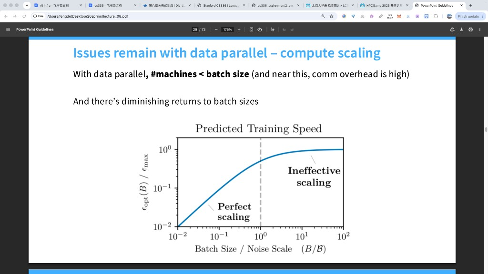

# 数据并行的通信-计算权衡:以单个 FFN 层为例

> 对应 handout 的 data_parallel_calcs 问题。给定每台设备算力 C(FLOP/s)与出向带宽 W(字节/s),数据并行切 N_DP 份时:反向传播要算多少 FLOP、要跨设备传多少字节、以及 N_DP 大到什么程度通信会压过计算。

数据并行是"把一个大 batch 摊到多张卡上,各算各的,最后把权重梯度汇总"的做法。只要机器的算力 C 和带宽 W 不成比例,就一定存在一个设备数,超过它之后加卡不再划算——因为每多一台,通信量涨得比计算量快。这道题就是把那个临界点算出来。而算它只需要两个数:一次反向传播的 FLOP 数,和一次反向传播需要跨设备传送的字节数。下面一步步来。

---

## 符号表

全文符号约定,与 handout 一致:

| 符号 | 含义 | 例子(§4 数值例的取值) |
|------|------|----------------------|
| B | 全局 batch:一步训练喂进模型的样本数 | 64 |
| D | 隐藏维度 d_model(模型宽度) | 2560(XL 配置) |
| D_FF | FFN 中间维度 | 10240(XL 配置) |
| N_DP | 数据并行设备数 | 2–4 |
| C | 单设备算力,单位 FLOP/s | ≈ 2×10^14(RTX 5090,FP16 稠密) |
| W | 单设备出向带宽,单位 字节/s | ≈ 5×10^10(PCIe 5.0 x16) |
| S | 一次反向需要 all-reduce 的总字节数 | 6·D·D_FF ≈ 157 MB |
| W1, W2, W3 | FFN 的三个权重矩阵 | (D,D_FF)、(D,D_FF)、(D_FF,D) |
| x, x1, x2, z, y | 前向的输入、中间量、输出 | 形状见 §1 |
| dy, dz, dx1, dx2, dx, dW1, dW2, dW3 | 反向梯度 | 与各自源张量同形 |
| T_compute | 每设备一次反向的计算时间 | 公式见 §3 |
| T_comm | 每设备一次反向的通信时间 | 公式见 §3 |

运算约定:`·` 矩阵乘,`⊙` 逐元素乘,`ᵀ` 转置,`f` 为激活函数(如 SiLU)。下文公式里出现的每个符号都可在本表查到含义与量纲。

---

## 1. 一条 FFN 层的前后向

一条 FFN 层:输入 x 形状 (B, D),两个升维权重 W1、W2 形状 (D, D_FF),一个降维权重 W3 形状 (D_FF, D)。

```
前向:
  x1 = x·W1         (B, D)·(D, D_FF)   → (B, D_FF)
  x2 = x·W2         (B, D)·(D, D_FF)   → (B, D_FF)
  z  = f(x1) ⊙ x2                       逐元素相乘
  y  = z·W3         (B, D_FF)·(D_FF, D) → (B, D)
```

矩阵乘的代价:形状 (m,n)·(n,p)→(m,p) 的 matmul 要 2·m·n·p 次 FLOP(用 m、n、p 表示形状维度,以免和 batch B、算力 C 冲突)。前向 3 个 matmul,每个都是 2·B·D·D_FF,合计 6·B·D·D_FF。

反向遵循一个通用规律:**前向每个 matmul,在反向里对应一个"输入梯度"和一个"权重梯度"**。前向 3 个 matmul,反向就是 6 个:

```
激活梯度(乘转置权重,形状带着 batch):
  dz  = dy·W3ᵀ     (B, D_FF)
  dx  = dx1·W1ᵀ + dx2·W2ᵀ               ← 两项,各是 (B, D_FF)·(D_FF, D)

权重梯度(外积,对 batch 求和):
  dW1 = xᵀ·dx1     (D, D_FF)
  dW2 = xᵀ·dx2     (D, D_FF)
  dW3 = zᵀ·dy      (D_FF, D)
```

逐元素的部分(f、f′)不算 FLOP。把 6 个 matmul 逐个代进 2·m·n·p:三个转置乘法是 2·B·D_FF·D,三个外积是 2·D·B·D_FF / 2·D_FF·B·D——**全部等于 2·B·D·D_FF**。所以单设备、全 batch 的一次反向传播:

```
反向 FLOPs = 6 × 2·B·D·D_FF = 12·B·D·D_FF
```

反向恰好是前向的 2 倍,这是深度学习的常态,可以作为 sanity check。

---

## 2. 数据并行之后:计算量与通信量

把 batch 按 N_DP 切份后,每台设备只拿到 B/N_DP 个样本,上面所有形状里的 B 都换成 B/N_DP。这时候两类梯度命运不同:

- **激活梯度**(dz、dx)只依赖设备自己的激活和完整权重,完全本地,**零通信**;
- **权重梯度**是"对 batch 求和"的外积,每台设备只得到自己那 B/N_DP 个样本的**部分和**:

```
dW1⁽ⁱ⁾ = x⁽ⁱ⁾ᵀ·dx1⁽ⁱ⁾
dW2⁽ⁱ⁾ = x⁽ⁱ⁾ᵀ·dx2⁽ⁱ⁾
dW3⁽ⁱ⁾ = z⁽ⁱ⁾ᵀ·dy⁽ⁱ⁾
```

只有把 N_DP 份部分和加在一起才是完整梯度。**通信只发生在这三个张量上**,这就是数据并行全部的网络流量。

### (a) 反向 FLOPs

batch 切成 B/N_DP 后,每台设备上 6 个 matmul 每个 2·(B/N_DP)·D·D_FF:

```
每设备反向 FLOPs = 12·B·D·D_FF / N_DP
```

理由一句话:**反向共有 6 个 matmul(3 个激活梯度 + 3 个权重梯度),每个代价 2·(B/N_DP)·D·D_FF。** 顺便,全部设备加起来是 12·B·D·D_FF,与 N_DP 无关——数据并行不改变总计算量,只是均摊,这也是数据并行"计算效率不损失"的理论基础。

### (b) 反向的通信时间

三个权重梯度各有 D·D_FF 个元素(W3 是 (D_FF, D),元素数仍是 D·D_FF),合计 3·D·D_FF 个元素。FP16 每个 2 字节:

```
待汇总字节数 S = 6·D·D_FF
```

把 N_DP 份部分和合成完整梯度,标准做法是环形 all-reduce(先 reduce-scatter 再 all-gather,推导见 [alternate-ring-all-reduce.md](./alternate-ring-all-reduce.md))。每台设备在两段里累计发出的数据量为:

```
每设备出向量 = 2·(N_DP−1)/N_DP · S
```

于是反向的通信时间:

```
T_comm = 2·(N_DP−1)/N_DP · 6·D·D_FF / W
```

理由一句话:**数据并行唯一要跨设备传的是 3 个权重梯度的 all-reduce,共 6·D·D_FF 字节;环形算法下每设备出向量为总量的 2(N_DP−1)/N_DP 倍。**

---

## 3. 什么时候通信压过计算 (c)

每台设备的计算时间与通信时间分别是:

```
T_compute = 12·B·D·D_FF / (N_DP·C)
T_comm    = 2·(N_DP−1)/N_DP · 6·D·D_FF / W
```

因为计算和通信可以重叠,瓶颈判据就是通信时间不小于计算时间。令 T_comm ≥ T_compute,两边同乘 N_DP、约掉公共因子 12·D·D_FF:

```
(N_DP−1)/W ≥ B/C
```

解出:

```
N_DP ≥ 1 + B·W/C
```

理由一句话:**当每设备 all-reduce 的通信量超过每设备反向的计算量时(可重叠),通信成为瓶颈;解得 N_DP ≥ 1 + B·W/C。** 换句话说,在 N_DP < 1 + B·W/C 时仍是计算主导,越过这个阈值就通信主导,加卡不再提升吞吐。

这里有一个反直觉但很关键的观察:**D 和 D_FF 被完全约掉了。** 临界点与层宽无关——因为 FLOP 数和字节数都正比于 D·D_FF,一比就把它们消干净了。决定临界点的只剩两样东西:

- **B**:总 batch 越大,每设备计算量越大,能撑起的设备数越多;
- **C/W**:机器的"每字节算力"比值(算术强度)。它翻倍,临界点就翻倍。

把不等式换一种写法更直观:

```
B ≥ (N_DP−1) · C/W
```

或者粗略地说:**每台设备分到的样本数 B/N_DP,至少要达到机器的浮点-字节比 C/W,计算才不会被通信拖垮。** 在 C/W 很高的机器(算力强、带宽窄)上,数据并行需要非常大的 batch 才能吃饱。

---

## 4. 用 XL 模型和实验室的卡算一笔真实账

XL 配置:d_model = 2560,d_ff = 10240。硬件取实验室 gj-5090 节点的 RTX 5090:FP16 稠密 Tensor Core 算力取 C ≈ 2×10^14 FLOP/s,出向带宽取 PCIe 5.0 x16 单方向 W ≈ 50 GB/s(消费级 5090 无 NVLink,跨卡走 PCIe)。于是:

```
C/W = 2×10^14 / 5×10^10 = 4000 FLOP/字节
```

单层反向要汇总的梯度字节数:

```
6·D·D_FF = 6 × 2560 × 10240 ≈ 157 MB
```

不同总 batch B 对应的临界点 N_DP ≥ 1 + B·W/C:

| B(总样本数)| 临界点 1 + B·W/C | 读法 |
|-----------:|------------------:|------|
| 64 | 1.02 | 2 台设备就已经通信受限 |
| 512 | 1.13 | 仍几乎无法扩到第 2 台 |
| 2048 | 1.51 | 2 台依然通信受限 |
| 4000 | 2.00 | 恰好够 2 台打平 |
| 8000 | 3.00 | 能勉强撑到 3 台 |

再直接算一组时间对比(B = 64,N_DP = 4):

```
T_compute = 12·64·2560·10240 / (4 · 2×10^14) ≈ 25 μs
T_comm    = 2·(3/4)·157 MB / (50 GB/s)       ≈ 4.7 ms
比值      ≈ 190×
```

单看一个 FFN 层,4 台数据并行时通信比计算慢约 190 倍——几乎从第 2 台起就是通信瓶颈。这个"悲观"的结论并不是单层特有的:因为 D 和 D_FF 在临界点里被约掉了,N_DP ≥ 1 + B·W/C 对整个模型同样成立。真实训练里数据并行还能用,靠的其实就两种手段,而且它们起作用的方式完全不同:

1. **大有效 batch——改变瓶颈点本身**:真实预训练用梯度累积把每步的全局 B 顶到几千上万,把 B·W/C 抬过设备数 N_DP,回到计算主导。这是唯一一种直接改动临界点 N_DP ≥ 1 + B·W/C 的手段——它加大的是分子 B,让每设备的计算量在绝对意义上变大;
2. **overlap——把通信藏进计算,总量不变**:反向从最后一层往前算,先算完的层立刻异步发起自己的梯度 all-reduce,让它和后面还没算完的几十层反向并行。真正暴露出来、必须干等的只有最后一发——最前面那层梯度的同步,它在反向结束时才发起;若本步计算已藏不下,还能挪进下一步前向的阴影里。层数越多、能遮的后续计算越多,暴露越小。OverlapDDP 实测把梯度同步段从 0.40 s 压到 0.02 s、整步提速约 13%(见 [distributed-communication.md](./distributed-communication.md) §7)。

两者互补:大 batch 在数学上把临界点往上抬,overlap 在工程上把没抬住的那部分通信藏进计算里。

如果只盯单层 FFN,结论是:在 C/W = 4000 的机器上,每个设备至少得摊到几千个样本,数据并行才不会被通信吃掉。

---

## 附录:关于系数 2 的一点说明

(b)(c) 里的系数 2 来自**环形 all-reduce**(先 reduce-scatter 后 all-gather,两段各发出 (N_DP−1)/N_DP 份)。这是 NCCL 这类库实际采用的算法,也是 [distributed-communication.md](./distributed-communication.md) 里实测验证过的模型。

需要写答案时讲清的一点:all-reduce 的每设备通信量随算法而变。若改用简化模型——每台设备把自己的 1/N_DP 分片直接发给其余 N_DP−1 台(即每台最终收到除自己之外的全部数据,只算这一次收发)——每设备出向量为 (N_DP−1)/N_DP·S,少一个因子 2,临界点随之变成:

```
N_DP ≥ 1 + 2·B·W/C
```

量级与直觉一致,仅常数不同。环形 all-reduce 的逐段推导(含与另一种"整份沿环累加"算法的对比)见 [alternate-ring-all-reduce.md](./alternate-ring-all-reduce.md)。

---

## 附录:临界点 $N_{\mathrm{DP}} \ge 1 + B\cdot W/C$ 的直觉

通信开始压过计算，当

$$
N_{\mathrm{DP}} \ge 1 + B\cdot\frac{W}{C}.
$$

右边越大，能加的卡越多。三项各自的作用是：

| 变大的量 | 临界点怎么动 | 含义 |
|----------|--------------|------|
| $W$（带宽） | 往上抬 | 传得快，同样计算量养得起更多卡 |
| $B$（总 batch） | 往上抬 | 每台分到的活更多，通信相对不那么贵 |
| $C$（算力） | 往下掉 | 算得更快，同一份通信相对更显眼 |

这个式子比的是两段时间：

- 计算：$T_{\mathrm{compute}} \propto 1/(N_{\mathrm{DP}}\,C)$ — 卡越多、卡越快，这段越短；
- 通信：$T_{\mathrm{comm}}$ 主要由梯度字节数和 $W$ 决定 — **$C$ 变强时，通信时间几乎不动**。

所以 $C$ 变大时，计算段变短、通信段还在原处，通信更容易成为瓶颈，临界 $N_{\mathrm{DP}}$ 就变小。带宽 $W$ 变大则相反：通信段被压短，临界点往上走。工业界要能扩很多卡，节点内 / 集群互联的 $W$ 必须足够高，才能配得上很强的 $C$。

§4 里 $B=64$、$C/W\approx 4000$ 时，

$$
B\cdot\frac{W}{C} = \frac{64}{4000} = 0.016,
\qquad
1 + B\cdot\frac{W}{C} \approx 1.02.
$$

在这组设定下（单层 FFN、小 batch、跨卡走 PCIe），从第 2 台起就是通信主导。粗规则是：每台分到的样本数大约要达到 $C/W$ 量级，计算才养得起通信；这里 $C/W\sim 4000$，而 $B=64$ 切成两份后每台只有 32，差两个数量级。

工业界数据并行能扩到很多卡，靠的是把临界点抬上去、再把剩余通信藏起来：

1. **很大的有效 batch**（含梯度累积）— 抬高 $B$，直接抬高 $1+B\cdot W/C$；
2. **更快的互联**（NVLink 等）— 抬高 $W$，同样抬高临界点；
3. **overlap** — 层间异步 all-reduce，把通信叠进别层的计算里（见 §4）。

大模型训练里有效 $B$ 常到几千上万，节点内 $W$ 也高一个数量级，再加 overlap，数据并行才能在强算力上扩开。§4 那笔「两台就通信受限」的账，描述的就是「小 batch + PCIe + 单层、且先不谈 overlap」时的真实比例。

---

## 附录:幻灯片「DP 算力扩展还剩什么问题」在说什么

讲义里有一张图，标题是 *Issues remain with data parallel – compute scaling*。读它之前，先记住我们已经有的一条线：前面几节在谈 **系统侧**——算力 $C$、带宽 $W$、batch $B$、设备数 $N_{\mathrm{DP}}$ 之间，什么时候通信时间压过计算时间。这张图要补的是另一条线：**优化侧**——就算通信完全免费，只靠「加大 $B$、加更多 DP 卡」，训练速度也有上限。两条线合在一起，才是「数据并行扩到头」的完整画面。



幻灯片正文只有两句。我们按顺序把每一句拆开，再读图，最后用 §4 的数字把两堵墙接在一起。

---

### 第一句在说什么：机器数受 batch 卡住，靠近上限时通信特别贵

原句：*With data parallel, #machines < batch size (and near this, comm overhead is high).*

#### 硬上限：每台至少要有一个样本

数据并行的做法是：总 batch 有 $B$ 个样本，摊到 $N_{\mathrm{DP}}$ 台设备上，每台做

$$
\frac{B}{N_{\mathrm{DP}}}
$$

个样本的前向和反向，再 all-reduce 梯度。

每台至少要分到 1 个样本，否则这台设备这一步无数据可算。于是有硬约束：

$$
N_{\mathrm{DP}} \le B.
$$

拿 §4 的设定：$B=64$。那么 $N_{\mathrm{DP}}$ 最多是 64。你不能说「我有 128 张卡，batch 仍是 64」还叫标准数据并行——多出来的卡这一步分不到样本。

这一条只是「能不能开工」的上界，还没谈快不快。

#### 为什么「靠近这个上限」时通信开销会很高

硬上限只保证每台有活干。真正让人痛的是：当你把 $N_{\mathrm{DP}}$ 往 $B$ 那边推时，**每台分到的计算变少，但每台要传的梯度几乎一样多**。把这两边分别写清楚。

**计算这边。**  
单设备、完整 batch 时，一次反向大约是 $12\,B\,D\,D_{\mathrm{FF}}$ 次 FLOP（§1）。切成 $N_{\mathrm{DP}}$ 份之后，每台只算自己那份样本，所以

$$
T_{\mathrm{compute}}
=
\frac{12\,B\,D\,D_{\mathrm{FF}}}{N_{\mathrm{DP}}\,C}.
$$

$N_{\mathrm{DP}}$ 变大 → 分子里的有效 batch 变成 $B/N_{\mathrm{DP}}$ → $T_{\mathrm{compute}}$ 变短。  
例如 $B=64$：

- $N_{\mathrm{DP}}=2$：每台 32 个样本；
- $N_{\mathrm{DP}}=64$：每台 1 个样本，计算量相对 $N_{\mathrm{DP}}=2$ 时大约再少到 $1/32$。

**通信这边。**  
数据并行要 all-reduce 的是三份权重梯度，字节数

$$
S = 6\,D\,D_{\mathrm{FF}}
$$

（FP16，§2）。注意：$S$ 里 **没有 $B$**。完整模型的梯度张量多大，就传多大；你把 batch 切细，梯度张量的形状不变，只是每个元素从「更多样本的平均」变成「更少样本的平均」。环形 all-reduce 下

$$
T_{\mathrm{comm}}
=
\frac{2(N_{\mathrm{DP}}-1)}{N_{\mathrm{DP}}}\cdot\frac{S}{W}.
$$

$N_{\mathrm{DP}}$ 从 2 加到很大时，因子 $2(N_{\mathrm{DP}}-1)/N_{\mathrm{DP}}$ 只会从 1 慢慢逼近 2，**量级上通信时间几乎不降**；它更不会因为「每台样本变少」而变小。

于是出现不对称：

| $N_{\mathrm{DP}}$ 变大时 | 计算时间 | 通信时间 |
|-------------------------|----------|----------|
| 变化 | 近似按 $1/N_{\mathrm{DP}}$ 变短 | 几乎仍是同一量级 |

所以「靠近 $N_{\mathrm{DP}}\approx B$」时：每台算得飞快（样本很少），却仍要等一次差不多同样大的 all-reduce——通信开销相对计算就显得特别高。幻灯片括号里那句 *near this, comm overhead is high*，说的就是这个不对称。

#### 这和临界点公式是同一件事

前面已经把「通信压过计算」解成

$$
N_{\mathrm{DP}} \ge 1 + B\cdot\frac{W}{C}.
$$

它的来历就是令 $T_{\mathrm{comm}}\ge T_{\mathrm{compute}}$，约掉 $D$、$D_{\mathrm{FF}}$ 之后得到的（§3）。用 §4 的数代进去：

$$
\frac{C}{W}\approx 4000,
\qquad
B=64,
\qquad
B\cdot\frac{W}{C}=\frac{64}{4000}=0.016,
\qquad
1+B\cdot\frac{W}{C}\approx 1.02.
$$

含义按步骤读：

1. 临界点大约是 $1.02$。  
2. 因此只要 $N_{\mathrm{DP}}\ge 2$，就已经满足「通信时间 $\ge$ 计算时间」。  
3. 在 PCIe、$B=64$、单层 FFN 这笔账里，**从第 2 台起就是通信主导**——这和 §4 表第一行一致。

若有人仍把 $N_{\mathrm{DP}}$ 往硬上限 64 推：

- 每台样本从（比如）$N_{\mathrm{DP}}=2$ 时的 32 个降到 1 个，$T_{\mathrm{compute}}$ 大约再缩到原来的 $1/32$；
- $T_{\mathrm{comm}}$ 仍在毫秒量级（§4 里 $N_{\mathrm{DP}}=4$ 时已经约 $4.7\,\mathrm{ms}$）；
- 比值会从「通信已经慢一两百倍」变得更夸张。

所以第一句其实是两层：

1. **能不能分：** $N_{\mathrm{DP}}\le B$；  
2. **划不划算：** 远在碰到 $B$ 之前，你往往已经越过 $1+B\cdot W/C$，通信主导了。  
$B=64$ 时，硬上限是 64，系统临界点却在 $\approx 1$——两台就已经「near this, comm overhead is high」。

---

### 第二句在说什么：加大 batch 本身也有收益递减

原句：*And there's diminishing returns to batch sizes.*

系统侧的常用药方是：把 $B$ 做大。因为临界点右边有 $B$，

$$
1 + B\cdot\frac{W}{C}
$$

会随 $B$ 变大而变大，于是在通信–计算意义上，你能加更多卡（§4 表：$B=4000$ 才够 2 台打平，$B=8000$ 勉强到 3 台）。

问题是：$B$ 变大时，**每一步对优化真正有用的进度**，会不会一直跟着变大？答案是：开始会，后来几乎不会。图里画的就是「会 → 不会」这条曲线。

---

### 图的坐标：先认清横轴和纵轴在比什么

横轴、纵轴都是对数坐标，所以直线、弯折在图上的样子和线性坐标不一样；读图时记住「刻度是数量级」。

**横轴：$B/\mathcal{B}$**

- $B$：你实际选用的（全局）batch。  
- $\mathcal{B}$：这个任务 / 模型 / 训练阶段下的 **噪声尺度**（noise scale）。  

$\mathcal{B}$ 可以先这样理解，而不必先啃论文公式：随机抽一批样本算出来的梯度，既有「真实更新方向」的信号，也有采样带来的噪声。batch 很小，噪声很大；batch 大起来，噪声被平均掉。$\mathcal{B}$ 大致是「信号和噪声打平」附近的那个 batch 量级。

重要一点：$\mathcal{B}$ 由 **数据和优化问题** 决定，不是由 $C$、$W$ 决定。换一台更快的 GPU，$\mathcal{B}$ 不会因此变大。大模型预训练里，$\mathcal{B}$ 的数量级常见在几千到数万（精确值要测；下面只用数量级和 §4 对照）。

竖虚线画在 $B/\mathcal{B}=1$，也就是 $B=\mathcal{B}$：batch 刚好到噪声尺度。

**纵轴：$\varepsilon_{\mathrm{opt}}(B)/\varepsilon_{\mathrm{max}}$**

把它读成：在 batch 取 $B$ 时，**优化意义上的训练速度**，占「把 batch 加到极限时所能达到的速度上限」的比例。

- 纵轴靠近 $10^{-2}$：现在这个 $B$ 下，你只吃到上限的大约百分之一量级。  
- 纵轴靠近 $10^{0}=1$：再加大 $B$，优化速度也几乎到顶了，没有多少可挖。

注意：这里的「训练速度」指的是 **收敛进度随时间的有效速率**（和梯度噪声、步数有关），不是单纯的「每秒算多少 FLOP」。系统侧的 $T_{\mathrm{compute}}$、$T_{\mathrm{comm}}$ 管的是一步墙钟时间；纵轴管的是「一步对优化有多大用」。

---

### 曲线左半边：Perfect scaling（$B/\mathcal{B}\ll 1$）

虚线左边，曲线在 log-log 图上接近一条斜率为 1 的直线，也就是

$$
\frac{\varepsilon_{\mathrm{opt}}(B)}{\varepsilon_{\mathrm{max}}}
\propto
\frac{B}{\mathcal{B}}.
$$

逐步含义：

1. 此时 $B$ 远小于 $\mathcal{B}$，梯度噪声仍很大。  
2. 你把 $B$ 翻倍，梯度估计明显更稳，每步有效进度近似也翻倍。  
3. 反映在纵轴上：纵轴也近似翻倍。  
4. 若同时用数据并行：总 $B$ 翻倍、机器数也翻倍、每卡样本数不变，那么在通信还养得起的前提下，墙钟上的有效训练速度也可以近似翻倍。

这就是图上标的 **Perfect scaling**：加大 batch（并按比例加机器）换来近似成比例的加速。

---

### 曲线右半边：Ineffective scaling（$B/\mathcal{B}\gg 1$）

虚线右边，曲线弯平，慢慢贴着纵轴 $=1$ 的天花板：

$$
B\ \text{再翻倍，纵轴几乎不动}.
$$

逐步含义：

1. 此时 $B$ 已经大过 $\mathcal{B}$，梯度估计已经够稳。  
2. 再往 batch 里堆样本，多出来的主要是重复信息，方向不会明显变更准。  
3. 每步对优化的有效进度几乎不再涨，纵轴接近 $\varepsilon_{\mathrm{max}}$。  
4. 你若为了加卡而继续加大 $B$，系统上一步可能算得动，但优化上「一步的价值」已经饱和——多出来的机器在并行计算一份已经够准的梯度。

这就是 **Ineffective scaling**，也是第二句 *diminishing returns to batch sizes* 的图像版。

---

### 用 §4 的数字把「系统墙」和「优化墙」接起来

先只看系统墙。要让通信不压过计算，需要

$$
N_{\mathrm{DP}} < 1 + B\cdot\frac{W}{C},
$$

改写成对 $B$ 的要求更直观：

$$
B > (N_{\mathrm{DP}}-1)\cdot\frac{C}{W}.
$$

代入 $C/W\approx 4000$：

| 目标 $N_{\mathrm{DP}}$ | 系统侧要求的 $B$（大约） | 来源 |
|------------------------|---------------------------|------|
| 2 | $>4000$ | $(2-1)\times 4000$ |
| 4 | $>12000$ | $(4-1)\times 4000$ |
| 8 | $>28000$ | $(8-1)\times 4000$ |

这和 §4 表一致：$B=64$ 远不够 2 台；$B=4000$ 刚够 2 台打平；$B=8000$ 刚够靠近 3 台。  
结论先停在这里：**在咱们实验室这档 $C/W$ 上，想多加几张卡，系统侧会逼你把 $B$ 推到上千、上万。**

再看优化墙。假设这个任务的噪声尺度 $\mathcal{B}$ 落在「几千到一两万」这个常见数量级（只作对照，不是本实验测得的精确值）。那么：

| 你想要的 $N_{\mathrm{DP}}$ | 系统逼你用的 $B$ | 相对 $\mathcal{B}$ 大概在哪 | 图上的区域 |
|---------------------------|------------------|------------------------------|------------|
| 2 | $\sim 4000$ | 可能接近 $B\sim\mathcal{B}$ | 虚线附近，加大 $B$ 往往仍有用 |
| 4 | $\sim 12000$ | 常常已经 $\ge\mathcal{B}$ | 开始进入弯折 / 右侧 |
| 8 | $\sim 28000$ | 多半 $B\gg\mathcal{B}$ | Ineffective scaling |

按时间顺序把一个人「想加卡」时会经历的事写出来：

**阶段 A — $B$ 很小（例如 64）。**  
系统临界点 $1+B\cdot W/C\approx 1.02$。还没碰到噪声尺度的故事，通信已经主导。图左边的 Perfect scaling 你享受不到，因为墙钟时间耗在 all-reduce 上。§4 算的 $T_{\mathrm{comm}}/T_{\mathrm{compute}}\approx 190$（$N_{\mathrm{DP}}=4$）就是这个阶段。

**阶段 B — 把 $B$ 抬到几千上万。**  
$1+B\cdot W/C$ 变大，更多卡在通信–计算意义上变得可行；同时横轴 $B/\mathcal{B}$ 往右移，你从 Perfect scaling 走向虚线。系统墙在松动，优化墙在靠近。

**阶段 C — 为了继续加卡，再把 $B$ 抬过 $\mathcal{B}$。**  
系统公式可能仍说「可以再加」；图的右边却说：纵轴已经贴顶，每步有效进度几乎不再随 $B$ 增长。多加的 DP 卡，主要在更快地算出一份已经够准的梯度，**收敛加速不再近似线性。**

幻灯片标题里的 *Issues remain*，指的就是：即便带宽足够、overlap 也做好了，**只靠「更大的 $B$ + 更多的 DP 卡」** 仍然会被噪声尺度卡住。数据并行擅长的是把「一步里的 $B$ 个样本」摊到多机；当 $B$ 已经远大于 $\mathcal{B}$ 时，一步本身的优化价值已经饱和，再摊更多机，墙钟收益变薄。

---

### 收束：两条约束，同一条扩卡之路

想加大 $N_{\mathrm{DP}}$ 时，你同时受两件事管：

```text
想加卡（N_DP 变大）
        │
        ├─ 系统约束（前文 §3–§4、临界点附录）
        │     N_DP  ≲  1 + B·W/C
        │     通解：加大 B、加大 W、做 overlap
        │
        └─ 优化约束（本张幻灯片）
              B / ℬ  ≲  O(1)  时，加大 B 仍近似成比例加速
              B / ℬ  ≫ 1  时，再加大 B、再加 DP 卡，收敛加速接近饱和
```

逻辑顺序是：

1. 先要过系统关：否则像 $B=64$ 那样，两台就通信主导；  
2. 过系统关通常要加大 $B$；  
3. $B$ 加大到超过 $\mathcal{B}$ 之后，优化关出现：再大的 batch / 再多的 DP 卡，换不来成比例的训练加速。

因此数据并行的扩展空间是有限的。这也是后面还要引入张量并行、流水线并行等策略的原因之一：当 $B$ 已经够大、再大收益变薄时，继续扩卡往往要改切 **模型**，而不是继续切 **batch**。
