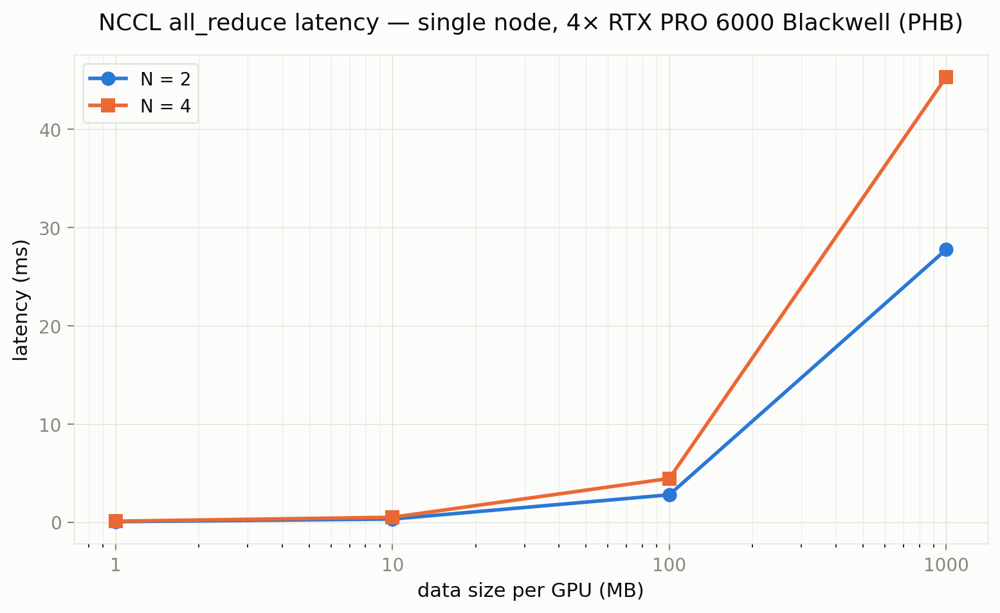

# 单机多卡 All-Reduce 通信延迟基准测试

**硬件：** 4× NVIDIA RTX PRO 6000 Blackwell Server Edition（80 GB HBM），GPU 间互联为 **PHB**（PCIe Host Bridge，无 NVLink）。

**设定：** 每张 GPU 持有一份 `float32` 随机张量，`dist.all_reduce(op=SUM)` 逐元素求和后每张卡拿到完全相同的最终结果。只测通信，不做训练。

**代码：** `cs336_systems/distributed/benchmark_all_reduce_single_node.py` · **画图：** `cs336_systems/distributed/plot_all_reduce.py` · **数据：** `artifacts/all_reduce_single_node.csv`

---

## 符号表

| 符号 | 含义 | 本实验取值 |
|------|------|-----------|
| N | 参与通信的 GPU 数（world size） | 2, 4 |
| B | 每张 GPU 上张量的字节数（float32） | 1 MB … 1 GB |
| t | 单次 all_reduce 端到端墙上时间（ms） | — |

---

## 1. 实验在量什么

一个 `all_reduce` 调用让 N 张 GPU 各自持有的同 shape 张量按元素求和，结果写回每一张 GPU。以 N = 2、每卡 1 MB 为例：

```
  调用前:   GPU0 [a₀, a₁, …]    GPU1 [b₀, b₁, …]
  调用后:   GPU0 [a₀+b₀, a₁+b₁, …]    GPU1 [a₀+b₀, a₁+b₁, …]
```

NCCL 在底层用环形算法（ring all-reduce）完成这件事：数据沿一个逻辑环分块传递，每个 GPU 同时从上一跳接收、向下一跳发送，每块数据绕环一周后被所有 GPU 持有。环上每张 GPU 发送和接收的总数据量为：

```
单 GPU 通信量（字节）= 2 · (N − 1) / N · B
```

N = 2 时每 GPU 恰好发送和接收各 B 字节（因子 = 1）；N = 4 时每 GPU 收发各 1.5·B 字节（因子 = 1.5）。这个因子是环算法本身的特性，与硬件无关。

本实验扫两个自变量：

| 自变量 | 取值 | 含义 |
|--------|------|------|
| N | 2, 4 | 多少张 GPU 一起做 all-reduce |
| B | 1, 10, 100, 1000 MB | 每张 GPU 上的数据量 |

共 **8 个配置**。每个配置 warmup 5 次（丢弃，不计时），正式计时 20 次取平均。

**计时方法：**

1. `torch.cuda.synchronize(device)` — 等 GPU 上所有排队操作完成
2. `t0 = time.perf_counter()`
3. 20 次 `dist.all_reduce(tensor, async_op=False)`，每次后 `cuda.synchronize`
4. `t1 = time.perf_counter()`
5. 平均单次耗时 = `(t1 − t0) / 20`

`async_op=False` 只保证 NCCL kernel 已入队到 GPU 流，**不保证通信完成**。前后各一次 `synchronize` 是准确计时的必要条件。

各 rank 测完后通过 `all_gather_object` 交换各自的平均耗时，rank 0 汇总计算跨 rank 的 mean / min / max。

---

## 2. 原始数据

| N | 每卡数据量 (MB) | 张量元素数 | 字节数 | ms (mean) | ms (min) | ms (max) | alg BW (GB/s) |
|---|----------------:|----------:|-------:|----------:|---------:|---------:|--------------:|
| 2 | 1 | 250,000 | 10⁶ | 0.0581 | 0.0580 | 0.0582 | 17.2 |
| 2 | 10 | 2,500,000 | 10⁷ | 0.3239 | 0.3238 | 0.3240 | 30.9 |
| 2 | 100 | 25,000,000 | 10⁸ | 2.7923 | 2.7918 | 2.7927 | 35.8 |
| 2 | 1000 | 250,000,000 | 10⁹ | 27.7618 | 27.7617 | 27.7619 | 36.0 |
| 4 | 1 | 250,000 | 10⁶ | 0.1059 | 0.1058 | 0.1059 | 9.4 |
| 4 | 10 | 2,500,000 | 10⁷ | 0.5041 | 0.5038 | 0.5044 | 19.8 |
| 4 | 100 | 25,000,000 | 10⁸ | 4.4544 | 4.4537 | 4.4549 | 22.5 |
| 4 | 1000 | 250,000,000 | 10⁹ | 45.3239 | 45.3235 | 45.3242 | 22.1 |

alg BW = `B / t`（即算法带宽，字节数除以墙上时间）。

---

## 3. 延迟曲线



横轴为每 GPU 数据量（MB，对数坐标），纵轴为单次 all-reduce 平均延迟（ms）。蓝色实线为 N = 2，橙色实线为 N = 4。

两条线在 1 MB 到 1 GB 之间走势一致：随数据量增大，延迟从几十微秒增长到几十毫秒。N = 4 的线始终在 N = 2 上方，二者差距随数据量增大而趋于一个稳定的比例。

---

## 4. 分析

### 4.1 小消息区（1 MB）：固定开销主导

N = 2 耗时 **58 μs**，N = 4 耗时 **106 μs**。比值 = 1.83。

1 MB 数据在 PCIe 5.0 x16 链路上传输的时间约 16 μs（按 ~63 GB/s 单向理论带宽）。实测 58 μs 远大于这个数，说明大部分时间花在传输数据之外：NCCL kernel 启动、进程组内的协议握手、GPU 流调度。这些开销对每次 `all_reduce` 调用近似为常数，不随数据量增大而显著增加。

N 从 2 增到 4 时固定开销的来源包括：多 2 个进程的 kernel launch、环上多 2 跳的协议协商。因此小消息时 N = 4 / N = 2 的比值（1.83）高于大消息时。

### 4.2 大消息区（1 GB）：带宽主导

N = 2 耗时 **27.8 ms**，N = 4 耗时 **45.3 ms**。比值 = 1.63。

此时数据传输时间占绝对主导，固定开销（几十 μs）可以忽略。环算法下 N = 4 时每 GPU 收发量为 1.5·B，N = 2 时每 GPU 收发量为 1.0·B。如果硬件总线吞吐量完全相同，N = 4 延迟应是 N = 2 的 1.5 倍。实测 1.63，与理论值 1.5 方向一致，差值约 8%。

这 8% 的额外增量来自 PHB 竞争：4 张 GPU 共享同一个 PCIe Host Bridge 时，4 对收发同时占用总线，仲裁开销比 2 对收发时更高。

为了剥离算法因子的影响，定义 **总线带宽**（bus bandwidth）：

```
bus BW = 2 · (N − 1) / N · B / t
```

它反映的是「环上实际流过的总数据量除以时间」——即 PCIe 总线真实承受的吞吐，而不只是单 GPU 看到的算法带宽（B / t）。

| N | B (MB) | alg BW (GB/s) | bus BW (GB/s) |
|---|-------:|--------------:|--------------:|
| 2 | 1 | 17.2 | 17.2 |
| 2 | 10 | 30.9 | 30.9 |
| 2 | 100 | 35.8 | 35.8 |
| 2 | 1000 | 36.0 | 36.0 |
| 4 | 1 | 9.4 | 14.2 |
| 4 | 10 | 19.8 | 29.8 |
| 4 | 100 | 22.5 | 33.7 |
| 4 | 1000 | 22.1 | 33.1 |

在 1 GB 大消息处，N = 2 和 N = 4 的 bus BW 分别为 **36.0 GB/s** 和 **33.1 GB/s**，仅相差 8%。这证明**底层 PCIe 5.0 PHB 的总吞吐量并不随 GPU 数量变化**——N = 4 延迟更高的原因几乎完全来自环算法要求的 1.5× 数据量，而非总线本身变慢。

RTX PRO 6000 Blackwell 使用 PCIe 5.0 x16，单方向理论有效带宽约 63 GB/s（32 GT/s × 128/130 编码 × 16 lane ÷ 8 bit/byte）。实测 bus BW ≈ 33–36 GB/s，约为理论单向峰值的 53–57%。这个利用率在 NCCL 环形 all-reduce 中是典型值：协议头开销、消息分块与聚合、以及 PHB 上多对收发之间的仲裁间隙都吃掉一部分带宽。

### 4.3 过渡区（10–100 MB）：从固定开销过渡到带宽限制

以 N = 2 为例，1 MB → 10 MB 数据量增大 10 倍，延迟从 58 μs 增到 324 μs（约 5.6 倍）而非 10 倍。这说明固定开销在 10 MB 时仍然占总延迟的一个不可忽略的比例。

到 100 MB 时延迟为 2.79 ms，与 1 GB 时的 27.8 ms 之比约为 1:10，与数据量比一致——此时已进入带宽主导区。有效带宽从 1 MB 时的 17.2 GB/s 攀升到 1 GB 时的 36.0 GB/s，收敛过程跨越约两个数量级的数据量。

N = 4 的过渡趋势相同：有效带宽从 1 MB 时的 9.4 GB/s（此时 bus BW 仅 14.2 GB/s，小消息固定开销在 bus BW 计算中被 1.5× 因子放大）收敛到 1 GB 时的 22.1 GB/s（bus BW 33.1 GB/s）。

### 4.4 min ≈ max：单机对称性

全部 8 个配置中 `ms_min` 与 `ms_max` 的差异小于 0.001 ms（全表精度内不可区分）。单机 PHB 拓扑下所有 GPU 对等：没有 NUMA 节点跳变、没有网络交换机队列波动、没有远端链路拖尾。各 rank 测到的延迟本质上是同一个通信操作的对称视角。

---

## 5. 总结

All-reduce 端到端延迟可以拆成两项：

```
t(N, B) ≈ t_fixed(N) + B / BW_eff(N)
```

| 区间 | 主导项 | N = 4 / N = 2 比值 | 原因 |
|------|--------|-------------------|------|
| B ≤ 10 MB | `t_fixed`（固定开销） | ~1.8× | 更多 GPU → 更多 kernel launch + 协议轮次 |
| B ≥ 100 MB | `B / BW_eff`（数据传输） | ~1.6× | 环算法每 GPU 多传 1.5× 数据 + PHB 竞争 (~0.1×) |

总线带宽在大消息时 N = 2 与 N = 4 仅相差 8%（36.0 vs 33.1 GB/s），验证了物理总线吞吐量为常数。N = 4 延迟更高的根因是环算法要求每张 GPU 收发 `2(N−1)/N` 倍数据——这是算法的代价，不是硬件的退化。

本实验限定在单机 4 卡无 NVLink 的 PHB 拓扑。跨节点（网络）或多机多卡的通信特性会引入网络延迟和带宽层级，数据量和 GPU 数对延迟的影响将不同。

---

## 附录：固定开销的逐层拆解

> 以下以 N = 2、1 MB 的实测数据（总延迟 58 μs）为例，逐层追踪一次 `all_reduce` 调用从 Python 代码到 GPU 完成通信的完整路径。固定开销定义为"和数据量无关、1 MB 和 1 GB 都要花的时间"。按稳态带宽 36 GB/s 计算，1 MB 纯数据传输只需约 28 μs，剩余约 30 μs 为固定开销。

### 附录 A. CPU 到 GPU 的发令路径（约 5–10 μs）

Python 调用 `dist.all_reduce(tensor)` 到 GPU 真正开始干活，中间经过四层转发：

```
Python (用户代码)
  → PyTorch C++ 层 (把 Python 对象转成 C++ tensor 描述符)
    → NCCL C API (ncclAllReduce)
      → CUDA Driver API (cuLaunchKernel 等)
        → 写一条指令到 GPU 的命令队列 (pinned memory 里的 command buffer)
          → 敲 GPU 的 "doorbell" 寄存器 (MMIO 写操作)
```

每一步都是函数调用 + 参数打包。最后敲 doorbell 这一步：CPU 通过 PCIe 做一次 MMIO 写操作，数据从 CPU 出发 → PCIe Root Complex → PCIe 总线 → GPU 的 MMIO 地址空间 → GPU 内部寄存器。这条 PCIe 写操作有固定的物理往返延迟。doorbell 本身只发目标地址，不传数据 payload——所以和 1 MB 还是 1 GB 无关。

### 附录 B. GPU 启动 NCCL kernel（约 3–5 μs）

GPU 收到 doorbell 后，SM（流式多处理器）启动 NCCL 通信 kernel：

- **分配寄存器文件**：每个 SM 有固定的寄存器池（例如 65536 个 32-bit 寄存器 per SM），启动 kernel 前从池里划一块分配给它
- **初始化线程网格**：确定多少个 block、多少 warps、warp 如何映射到 SM
- **从显存加载 kernel 参数**：tensor 基地址、长度、目标 rank 列表等

这些操作是 GPU 硬件层面的，和 CUDA 编程里 `<<<grid, block>>>` 的启动开销本质上是一个东西。数据 1 MB 还是 1 GB，启动动作完全一样。

### 附录 C. NCCL 内部同步——各 GPU "对表"（约 10–15 μs，占固定开销的大头）

在真正开始传数据之前，NCCL 必须完成三项内部同步：

1. **确认上一轮通信已结束**：GPU 之间发小的 flag 信号（走 PCIe 原子操作或小消息），确保上轮 all_reduce 的中间缓冲区可以安全覆盖。这个 flag 不带数据 payload。
2. **协商分块大小**：环形算法要把 B 字节切成 S 个 chunk。S 取多大取决于数据量和拓扑，NCCL 内部有个快速决策逻辑，需要各 GPU 的元数据对齐。
3. **同步起始点**：所有 GPU 必须从同一起跑线出发。NCCL 用 GPU 端 barrier 或 CUDA event 做这件事——本质上是一次小型的控制消息交换。

这些控制交互的包体量很小（几十到几百字节），但消息数量是固定的——每个 GPU 都要和至少一个环上邻居交换若干轮 round trip 的控制信息。每多一个 round trip，PCIe 的往返延迟（约 1–2 μs）就累加一次。

### 附录 D. PCIe 协议层——TLP 包头与 DMA 建链（约 3–5 μs）

数据传输本身在 PCIe 上不是以"1 MB 大块"形式完成的。PCIe 的最小传输单元叫 TLP（Transaction Layer Packet），每个 TLP 最大 payload 只有 4 KB。1 MB 数据需要约 250 个 TLP。每个 TLP 带 20–28 字节的包头（地址、长度、请求类型、tag 等），加上链路层的序列号和 CRC 帧尾。

但**第一个 TLP 发出之前**，GPU 的 DMA 引擎需要：

- 向 PCIe Root Complex 申请总线使用权（仲裁）
- 建立 DMA 传输描述符（源地址、目标地址、长度）
- 等 Root Complex 返回 grant 信号

这套流程的耗时和数据量无关——无论后续传 1 个 TLP 还是 10000 个 TLP，仲裁和建描述符都要走一遍。

### 附录 E. 为什么 N=4 的固定开销比 N=2 大

N = 4、1 MB 总耗时 106 μs。按 bus BW 33 GB/s 算，1.5 MB（N = 4 时每 GPU 的实际收发量）传输时间约 `1.5 MB / 33 GB/s ≈ 45 μs`。剩余开销 = 106 − 45 ≈ **61 μs**，约是 N = 2 的两倍。

增量来源（按影响从大到小）：

| 来源 | N=4 与 N=2 的差异 |
|------|-------------------|
| NCCL 内部同步 | 环上从 2 跳到 4，每个 GPU 邻居从 1 个变 2 个，控制消息翻倍，且 4 跳环需要更多轮次才能让所有 GPU 就绪 |
| PCIe 仲裁 | 4 对收发同时竞争 PHB 仲裁器（N=2 时只有 2 对），每次仲裁延迟累加 |
| CPU 发令 | 4 个进程各自走 PyTorch→NCCL→CUDA driver 路径，都通过同一个 PCIe Root Complex 发 doorbell，MMIO 窗口竞争 |

GPU kernel 启动这步是各 GPU 并行完成的，不互相等待，因此不随 N 增长。
