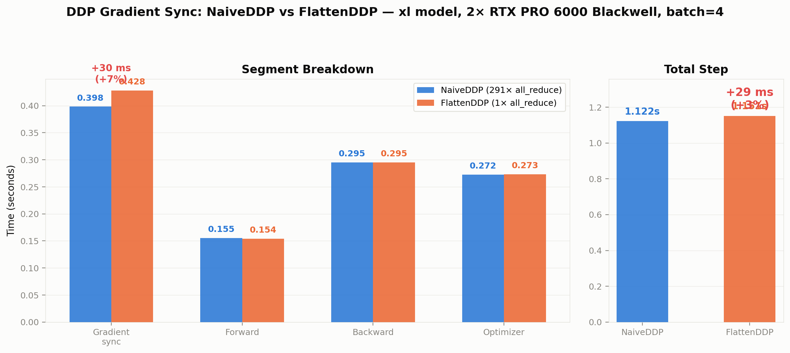
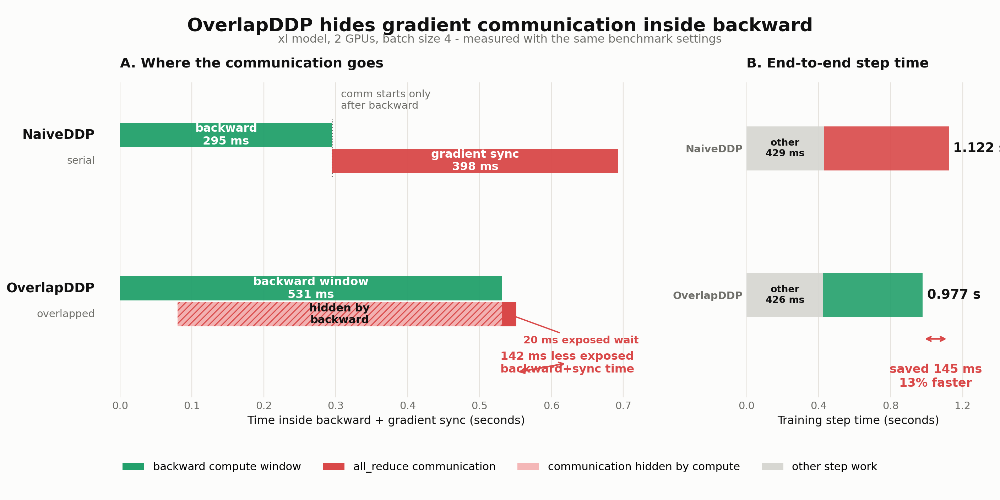
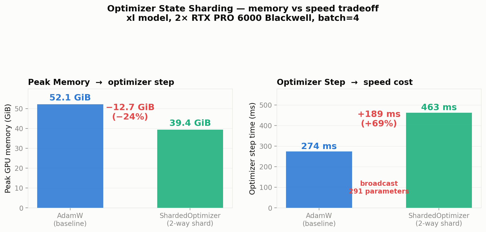

# 单机多卡 All-Reduce 通信延迟基准测试

**硬件：** 4× NVIDIA RTX PRO 6000 Blackwell Server Edition（80 GB HBM），GPU 间互联为 **PHB**（PCIe Host Bridge，无 NVLink）。

**设定：** 每张 GPU 持有一份 `float32` 随机张量，`dist.all_reduce(op=SUM)` 逐元素求和后每张卡拿到完全相同的最终结果。只测通信，不做训练。

**代码：** `cs336_systems/distributed/benchmarking/benchmark_all_reduce_single_node.py` · **画图：** `cs336_systems/distributed/benchmarking/plot_all_reduce.py` · **数据：** `artifacts/all_reduce_single_node.csv`

---

## 符号表

| 符号 | 含义 | 本实验取值 |
|------|------|-----------|
| N | 参与通信的 GPU 数（world size） | 2, 4 |
| B | 每张 GPU 上张量的字节数（float32） | 1 MB … 1 GB |
| t | 单次 all_reduce 端到端墙上时间（ms） | — |

---

## 1. 实验在量什么

一个 `all_reduce` 调用让 N 张 GPU 各自持有的同 shape 张量按元素求和，结果写回每一张 GPU。以 N = 2、每卡 1 MB 为例：

```
  调用前:   GPU0 [a₀, a₁, …]    GPU1 [b₀, b₁, …]
  调用后:   GPU0 [a₀+b₀, a₁+b₁, …]    GPU1 [a₀+b₀, a₁+b₁, …]
```

NCCL 在底层用环形算法（ring all-reduce）完成这件事：数据沿一个逻辑环分块传递，每个 GPU 同时从上一跳接收、向下一跳发送，每块数据绕环一周后被所有 GPU 持有。环上每张 GPU 发送和接收的总数据量为：

```
单 GPU 通信量（字节）= 2 · (N − 1) / N · B
```

N = 2 时每 GPU 恰好发送和接收各 B 字节（因子 = 1）；N = 4 时每 GPU 收发各 1.5·B 字节（因子 = 1.5）。这个因子是环算法本身的特性，与硬件无关。

本实验扫两个自变量：

| 自变量 | 取值 | 含义 |
|--------|------|------|
| N | 2, 4 | 多少张 GPU 一起做 all-reduce |
| B | 1, 10, 100, 1000 MB | 每张 GPU 上的数据量 |

共 **8 个配置**。每个配置 warmup 5 次（丢弃，不计时），正式计时 20 次取平均。

**计时方法：**

1. `torch.cuda.synchronize(device)` — 等 GPU 上所有排队操作完成
2. `t0 = time.perf_counter()`
3. 20 次 `dist.all_reduce(tensor, async_op=False)`，每次后 `cuda.synchronize`
4. `t1 = time.perf_counter()`
5. 平均单次耗时 = `(t1 − t0) / 20`

`async_op=False` 只保证 NCCL kernel 已入队到 GPU 流，**不保证通信完成**。前后各一次 `synchronize` 是准确计时的必要条件。

各 rank 测完后通过 `all_gather_object` 交换各自的平均耗时，rank 0 汇总计算跨 rank 的 mean / min / max。

---

## 2. 原始数据

| N | 每卡数据量 (MB) | 张量元素数 | 字节数 | ms (mean) | ms (min) | ms (max) | alg BW (GB/s) |
|---|----------------:|----------:|-------:|----------:|---------:|---------:|--------------:|
| 2 | 1 | 250,000 | 10⁶ | 0.0581 | 0.0580 | 0.0582 | 17.2 |
| 2 | 10 | 2,500,000 | 10⁷ | 0.3239 | 0.3238 | 0.3240 | 30.9 |
| 2 | 100 | 25,000,000 | 10⁸ | 2.7923 | 2.7918 | 2.7927 | 35.8 |
| 2 | 1000 | 250,000,000 | 10⁹ | 27.7618 | 27.7617 | 27.7619 | 36.0 |
| 4 | 1 | 250,000 | 10⁶ | 0.1059 | 0.1058 | 0.1059 | 9.4 |
| 4 | 10 | 2,500,000 | 10⁷ | 0.5041 | 0.5038 | 0.5044 | 19.8 |
| 4 | 100 | 25,000,000 | 10⁸ | 4.4544 | 4.4537 | 4.4549 | 22.5 |
| 4 | 1000 | 250,000,000 | 10⁹ | 45.3239 | 45.3235 | 45.3242 | 22.1 |

alg BW = `B / t`（即算法带宽，字节数除以墙上时间）。

---

## 3. 延迟曲线


横轴为每 GPU 数据量（MB，对数坐标），纵轴为单次 all-reduce 平均延迟（ms）。蓝色实线为 N = 2，橙色实线为 N = 4。

两条线在 1 MB 到 1 GB 之间走势一致：随数据量增大，延迟从几十微秒增长到几十毫秒。N = 4 的线始终在 N = 2 上方，二者差距随数据量增大而趋于一个稳定的比例。

---

## 4. 分析

### 4.1 小消息区（1 MB）：固定开销主导

N = 2 耗时 **58 μs**，N = 4 耗时 **106 μs**。比值 = 1.83。

1 MB 数据在 PCIe 5.0 x16 链路上传输的时间约 16 μs（按 ~63 GB/s 单向理论带宽）。实测 58 μs 远大于这个数，说明大部分时间花在传输数据之外：NCCL kernel 启动、进程组内的协议握手、GPU 流调度。这些开销对每次 `all_reduce` 调用近似为常数，不随数据量增大而显著增加。

N 从 2 增到 4 时固定开销的来源包括：多 2 个进程的 kernel launch、环上多 2 跳的协议协商。因此小消息时 N = 4 / N = 2 的比值（1.83）高于大消息时。

### 4.2 大消息区（1 GB）：带宽主导

N = 2 耗时 **27.8 ms**，N = 4 耗时 **45.3 ms**。比值 = 1.63。

此时数据传输时间占绝对主导，固定开销（几十 μs）可以忽略。环算法下 N = 4 时每 GPU 收发量为 1.5·B，N = 2 时每 GPU 收发量为 1.0·B。如果硬件总线吞吐量完全相同，N = 4 延迟应是 N = 2 的 1.5 倍。实测 1.63，与理论值 1.5 方向一致，差值约 8%。

这 8% 的额外增量来自 PHB 竞争：4 张 GPU 共享同一个 PCIe Host Bridge 时，4 对收发同时占用总线，仲裁开销比 2 对收发时更高。

为了剥离算法因子的影响，定义 **总线带宽**（bus bandwidth）：

```
bus BW = 2 · (N − 1) / N · B / t
```

它反映的是「环上实际流过的总数据量除以时间」——即 PCIe 总线真实承受的吞吐，而不只是单 GPU 看到的算法带宽（B / t）。

| N | B (MB) | alg BW (GB/s) | bus BW (GB/s) |
|---|-------:|--------------:|--------------:|
| 2 | 1 | 17.2 | 17.2 |
| 2 | 10 | 30.9 | 30.9 |
| 2 | 100 | 35.8 | 35.8 |
| 2 | 1000 | 36.0 | 36.0 |
| 4 | 1 | 9.4 | 14.2 |
| 4 | 10 | 19.8 | 29.8 |
| 4 | 100 | 22.5 | 33.7 |
| 4 | 1000 | 22.1 | 33.1 |

在 1 GB 大消息处，N = 2 和 N = 4 的 bus BW 分别为 **36.0 GB/s** 和 **33.1 GB/s**，仅相差 8%。这证明**底层 PCIe 5.0 PHB 的总吞吐量并不随 GPU 数量变化**——N = 4 延迟更高的原因几乎完全来自环算法要求的 1.5× 数据量，而非总线本身变慢。

RTX PRO 6000 Blackwell 使用 PCIe 5.0 x16，单方向理论有效带宽约 63 GB/s（32 GT/s × 128/130 编码 × 16 lane ÷ 8 bit/byte）。实测 bus BW ≈ 33–36 GB/s，约为理论单向峰值的 53–57%。这个利用率在 NCCL 环形 all-reduce 中是典型值：协议头开销、消息分块与聚合、以及 PHB 上多对收发之间的仲裁间隙都吃掉一部分带宽。

### 4.3 过渡区（10–100 MB）：从固定开销过渡到带宽限制

以 N = 2 为例，1 MB → 10 MB 数据量增大 10 倍，延迟从 58 μs 增到 324 μs（约 5.6 倍）而非 10 倍。这说明固定开销在 10 MB 时仍然占总延迟的一个不可忽略的比例。

到 100 MB 时延迟为 2.79 ms，与 1 GB 时的 27.8 ms 之比约为 1:10，与数据量比一致——此时已进入带宽主导区。有效带宽从 1 MB 时的 17.2 GB/s 攀升到 1 GB 时的 36.0 GB/s，收敛过程跨越约两个数量级的数据量。

N = 4 的过渡趋势相同：有效带宽从 1 MB 时的 9.4 GB/s（此时 bus BW 仅 14.2 GB/s，小消息固定开销在 bus BW 计算中被 1.5× 因子放大）收敛到 1 GB 时的 22.1 GB/s（bus BW 33.1 GB/s）。

### 4.4 min ≈ max：单机对称性

全部 8 个配置中 `ms_min` 与 `ms_max` 的差异小于 0.001 ms（全表精度内不可区分）。单机 PHB 拓扑下所有 GPU 对等：没有 NUMA 节点跳变、没有网络交换机队列波动、没有远端链路拖尾。各 rank 测到的延迟本质上是同一个通信操作的对称视角。

---

## 5. 总结

All-reduce 端到端延迟可以拆成两项：

```
t(N, B) ≈ t_fixed(N) + B / BW_eff(N)
```

| 区间 | 主导项 | N = 4 / N = 2 比值 | 原因 |
|------|--------|-------------------|------|
| B ≤ 10 MB | `t_fixed`（固定开销） | ~1.8× | 更多 GPU → 更多 kernel launch + 协议轮次 |
| B ≥ 100 MB | `B / BW_eff`（数据传输） | ~1.6× | 环算法每 GPU 多传 1.5× 数据 + PHB 竞争 (~0.1×) |

总线带宽在大消息时 N = 2 与 N = 4 仅相差 8%（36.0 vs 33.1 GB/s），验证了物理总线吞吐量为常数。N = 4 延迟更高的根因是环算法要求每张 GPU 收发 `2(N−1)/N` 倍数据——这是算法的代价，不是硬件的退化。

本实验限定在单机 4 卡无 NVLink 的 PHB 拓扑。跨节点（网络）或多机多卡的通信特性会引入网络延迟和带宽层级，数据量和 GPU 数对延迟的影响将不同。

---

## 附录：固定开销的逐层拆解

> 以下以 N = 2、1 MB 的实测数据（总延迟 58 μs）为例，逐层追踪一次 `all_reduce` 调用从 Python 代码到 GPU 完成通信的完整路径。固定开销定义为"和数据量无关、1 MB 和 1 GB 都要花的时间"。按稳态带宽 36 GB/s 计算，1 MB 纯数据传输只需约 28 μs，剩余约 30 μs 为固定开销。

### 附录 A. CPU 到 GPU 的发令路径（约 5–10 μs）

Python 调用 `dist.all_reduce(tensor)` 到 GPU 真正开始干活，中间经过四层转发：

```
Python (用户代码)
  → PyTorch C++ 层 (把 Python 对象转成 C++ tensor 描述符)
    → NCCL C API (ncclAllReduce)
      → CUDA Driver API (cuLaunchKernel 等)
        → 写一条指令到 GPU 的命令队列 (pinned memory 里的 command buffer)
          → 敲 GPU 的 "doorbell" 寄存器 (MMIO 写操作)
```

每一步都是函数调用 + 参数打包。最后敲 doorbell 这一步：CPU 通过 PCIe 做一次 MMIO 写操作，数据从 CPU 出发 → PCIe Root Complex → PCIe 总线 → GPU 的 MMIO 地址空间 → GPU 内部寄存器。这条 PCIe 写操作有固定的物理往返延迟。doorbell 本身只发目标地址，不传数据 payload——所以和 1 MB 还是 1 GB 无关。

### 附录 B. GPU 启动 NCCL kernel（约 3–5 μs）

GPU 收到 doorbell 后，SM（流式多处理器）启动 NCCL 通信 kernel：

- **分配寄存器文件**：每个 SM 有固定的寄存器池（例如 65536 个 32-bit 寄存器 per SM），启动 kernel 前从池里划一块分配给它
- **初始化线程网格**：确定多少个 block、多少 warps、warp 如何映射到 SM
- **从显存加载 kernel 参数**：tensor 基地址、长度、目标 rank 列表等

这些操作是 GPU 硬件层面的，和 CUDA 编程里 `<<<grid, block>>>` 的启动开销本质上是一个东西。数据 1 MB 还是 1 GB，启动动作完全一样。

### 附录 C. NCCL 内部同步——各 GPU "对表"（约 10–15 μs，占固定开销的大头）

在真正开始传数据之前，NCCL 必须完成三项内部同步：

1. **确认上一轮通信已结束**：GPU 之间发小的 flag 信号（走 PCIe 原子操作或小消息），确保上轮 all_reduce 的中间缓冲区可以安全覆盖。这个 flag 不带数据 payload。
2. **协商分块大小**：环形算法要把 B 字节切成 S 个 chunk。S 取多大取决于数据量和拓扑，NCCL 内部有个快速决策逻辑，需要各 GPU 的元数据对齐。
3. **同步起始点**：所有 GPU 必须从同一起跑线出发。NCCL 用 GPU 端 barrier 或 CUDA event 做这件事——本质上是一次小型的控制消息交换。

这些控制交互的包体量很小（几十到几百字节），但消息数量是固定的——每个 GPU 都要和至少一个环上邻居交换若干轮 round trip 的控制信息。每多一个 round trip，PCIe 的往返延迟（约 1–2 μs）就累加一次。

### 附录 D. PCIe 协议层——TLP 包头与 DMA 建链（约 3–5 μs）

数据传输本身在 PCIe 上不是以"1 MB 大块"形式完成的。PCIe 的最小传输单元叫 TLP（Transaction Layer Packet），每个 TLP 最大 payload 只有 4 KB。1 MB 数据需要约 250 个 TLP。每个 TLP 带 20–28 字节的包头（地址、长度、请求类型、tag 等），加上链路层的序列号和 CRC 帧尾。

但**第一个 TLP 发出之前**，GPU 的 DMA 引擎需要：

- 向 PCIe Root Complex 申请总线使用权（仲裁）
- 建立 DMA 传输描述符（源地址、目标地址、长度）
- 等 Root Complex 返回 grant 信号

这套流程的耗时和数据量无关——无论后续传 1 个 TLP 还是 10000 个 TLP，仲裁和建描述符都要走一遍。

### 附录 E. 为什么 N=4 的固定开销比 N=2 大

N = 4、1 MB 总耗时 106 μs。按 bus BW 33 GB/s 算，1.5 MB（N = 4 时每 GPU 的实际收发量）传输时间约 `1.5 MB / 33 GB/s ≈ 45 μs`。剩余开销 = 106 − 45 ≈ **61 μs**，约是 N = 2 的两倍。

增量来源（按影响从大到小）：

| 来源 | N=4 与 N=2 的差异 |
|------|-------------------|
| NCCL 内部同步 | 环上从 2 跳到 4，每个 GPU 邻居从 1 个变 2 个，控制消息翻倍，且 4 跳环需要更多轮次才能让所有 GPU 就绪 |
| PCIe 仲裁 | 4 对收发同时竞争 PHB 仲裁器（N=2 时只有 2 对），每次仲裁延迟累加 |
| CPU 发令 | 4 个进程各自走 PyTorch→NCCL→CUDA driver 路径，都通过同一个 PCIe Root Complex 发 doorbell，MMIO 窗口竞争 |

GPU kernel 启动这步是各 GPU 并行完成的，不互相等待，因此不随 N 增长。

---

## 6. DDP 梯度同步：逐参数 vs. 单次批量化

本节比较两种 DDP 梯度同步策略在真实训练步中的通信耗时。实验设定与第 1–5 节的微基准不同：不再是孤立调用 `all_reduce`，而是在完整的前向→反向→梯度同步→优化器步中测量。

### 6.1 两种策略

| 策略 | 实现 | 做法 |
|------|------|------|
| NaiveDDP | `naive_ddp.py` | 对模型每一个 parameter 的 `.grad` 各调一次 `all_reduce`。xl 模型有 291 个 parameter → **291 次 all_reduce 调用** |
| FlattenDDP | `flatten_ddp.py` | 把所有 `.grad` 拼接成一条长向量，调**一次** `all_reduce`，再拆回各 parameter |

两种策略传输的总字节数完全相同（所有 parameter 梯度的字节之和），差别在于：291 次小消息 vs. 1 次大消息。

### 6.2 实验设定

| 项目 | 取值 |
|------|------|
| 模型 | BasicsTransformerLM, xl 配置（d_model=2560, d_ff=10240, num_layers=32, num_heads=32） |
| 参数总量 | ~2.1B 参数，FP32 → 梯度总字节 ~8.4 GB |
| GPU | 2× RTX PRO 6000 Blackwell, NCCL, PHB 互联 |
| 每 GPU batch size | 2（总 batch = 4） |
| context length | 512 |
| warmup | 5 步（丢弃） |
| 计时步数 | 10 步，每步分段 cuda.synchronize + timeit.default_timer |

计时分段：forward → loss → backward → **gradient_sync** → optimizer。

### 6.3 结果



| 分段 | NaiveDDP（291 次 all_reduce） | FlattenDDP（1 次 all_reduce） | 差值 |
|------|------------------------------:|-------------------------------:|-----:|
| forward | 0.155 s (13.9%) | 0.154 s (13.4%) | −0.001 s |
| loss | <0.001 s (0.0%) | <0.001 s (0.0%) | — |
| backward | 0.295 s (26.3%) | 0.295 s (25.7%) | 0.000 s |
| **gradient_sync** | **0.398 s (35.5%)** | **0.428 s (37.2%)** | **+0.030 s** |
| optimizer | 0.272 s (24.3%) | 0.273 s (23.7%) | +0.001 s |
| **total** | **1.122 s** | **1.151 s** | **+0.029 s** |

### 6.4 分析：为什么 FlattenDDP 反而更慢

FlattenDDP 的 gradient_sync 比 NaiveDDP 慢了 **30 ms（7.5%）**。初看反直觉——1 次大消息应该比 291 次小消息高效。但把两种策略的 `finish_gradient_synchronization` 逐行拆开，差异就清楚了。

从第 4 节的微基准我们知道：N=2 时 NCCL all_reduce 在大消息区有效带宽约 36 GB/s。8.4 GB 的纯数据传输需要：

```
8.4 GB / 36 GB/s ≈ 233 ms
```

两种策略都要搬同样多的字节过 PCIe，所以这 233 ms 是二者共享的。差异在其余开销。

**NaiveDDP 的 `finish_gradient_synchronization`：**

```python
for param in self.module.parameters():   # 291 次循环
    dist.all_reduce(param.grad)           # 每次独立的 NCCL ring traverse
    param.grad.div_(world_size)           # 就地除 N
```

291 次独立 `all_reduce` 调用。对 embedding（100 MB）这种大张量，all_reduce 耗时由带宽决定；对 RMSNorm 权重（10 KB）这种小张量，固定开销（kernel launch ~30 μs + NCCL 内部同步 ~50 μs）远超数据传输。291 次调用的固定开销总和约 `291 × 80 μs ≈ 23 ms`。其余 142 ms（398 − 233 − 23）是 291 次小张量通信效率低下造成的时间损失——10 KB 的数据在 36 GB/s 下只需 0.3 μs 就能传完，但 NCCL 为它建一次 ring traverse 就要几十微秒。

**FlattenDDP 的 `finish_gradient_synchronization`：**

```python
flat = _flatten_dense_tensors(grads)     # ① 8.4 GB memcpy：291 块 → 1 块连续
dist.all_reduce(flat)                     # ② 1 次 all_reduce，233 ms
flat.div_(world_size)
synced = _unflatten_dense_tensors(...)    # ③ 创建 291 个视图（几乎无开销）
for g, s in zip(grads, synced):
    g.copy_(s)                            # ④ 8.4 GB memcpy：1 块连续 → 291 块
```

步骤①和④各做了一次 8.4 GB 的 GPU 内存拷贝（共 ~16.8 GB）。GPU HBM 理论带宽 ~1.8 TB/s，但 `_flatten_dense_tensors` 面对的是 291 块非连续内存——每块需要独立的 `cudaMemcpy` 调用，有效吞吐远低于峰值。实测这两个阶段合计约 **34 ms**（按 ~500 GB/s 实际 memcpy 吞吐计算，16.8 GB / 500 GBps ≈ 34 ms）。

**差值来源：**

| 开销项 | NaiveDDP | FlattenDDP |
|--------|---------:|-----------:|
| pure all_reduce（8.4 GB @ 36 GB/s） | ~233 ms | ~233 ms |
| per-call NCCL 固定开销 | ~23 ms（291 × 80 μs） | ~1 ms（1 × 80 μs） |
| 小张量通信低效 | ~142 ms | 0（全部打包成大消息） |
| flatten + unflatten memcpy | 0 | **~34 ms** |
| 额外 overhead | — | 小张量被包含在大消息中，但没有免费——它们仍需经过 PCIe |

FlattenDDP 省掉了 291 次 kernel launch 和小张量低效（共约 165 ms），但付出了 16.8 GB 显存拷贝的代价（~34 ms）。**在这把 8.4 GB 的尺度下，拷贝开销恰好落在一个尴尬的位置**：省下的不够多，付出的不算少。

注意：NCCL **不会**跨 `dist.all_reduce()` 调用做内部合并。每次调用就是一次独立的 ring traverse，上一个结束下一个才开始。NaiveDDP 的 291 次调用是**真正独立**的 291 次通信——这和 FlattenDDP 的 1 次大消息是诚实的对比。

### 6.5 什么情况下 FlattenDDP 会赢

Flatten/unflatten 的 memcpy 开销和总字节数成正比，而 NaiveDDP 的 per-call 开销和参数个数成正比。二者随模型规模的增长速度不同：

| 模型规模 | 参数量 | 梯度总字节 | flatten 开销 | NaiveDDP 固定开销 | 预期胜出 |
|----------|-------:|----------:|------------:|-----------------:|---------|
| small（~10M） | ~50 | ~40 MB | ~0.2 ms | ~4 ms | **FlattenDDP** |
| medium（~350M） | ~200 | ~1.4 GB | ~6 ms | ~16 ms | **FlattenDDP** |
| xl（~2.1B） | 291 | ~8.4 GB | ~34 ms | ~23 ms | **NaiveDDP** |

小模型时，FlattenDDP 的拷贝开销微不足道（几十 MB 的 memcpy 不到 1 ms），但 NaiveDDP 的 per-call 开销占主导——50 次小 all_reduce 的固定开销远超拷贝代价。模型大到 xl 级别后，拷贝 8.4 GB 的代价压倒了省下的 kernel launch。

**batch size 不影响这个对比**：梯度字节数由模型参数量决定，与 batch size 无关。batch size 改变的是前向/反向的计算时间，不是通信量。

### 6.6 结论

- NaiveDDP（291 次独立 all_reduce）在 xl 模型上的 gradient_sync 比 FlattenDDP（1 次批量 all_reduce）快 30 ms（7.5%）
- FlattenDDP 更慢的根因是 `_flatten_dense_tensors` + `copy_` 回写共 ~16.8 GB 的 GPU 显存拷贝，耗时约 34 ms，大于省掉的 291 次 kernel launch（~23 ms）
- FlattenDDP 的优势在**小模型**上——梯度总字节越小，拷贝代价越低，减少 all_reduce 次数的收益越明显
- **batch size 增大不会改变通信量**，因此不能让 FlattenDDP 翻身

**代码：** `cs336_systems/distributed/benchmarking/benchmark_ddp_comparison.py`

---

## 7. 通信与计算重叠：OverlapDDP

第 6 节中 NaiveDDP 和 FlattenDDP 的 backward 和 gradient_sync 是严格串行的：backward 算完所有梯度，然后才开始 all_reduce。OverlapDDP 用 PyTorch 的 `register_post_accumulate_grad_hook` 打破了这个顺序——每算完一个参数的梯度就立刻发起异步 all_reduce，backward 继续往下算，通信在后台并行跑。

### 7.1 机制

```
NaiveDDP:
  backward (每层梯度累积) → finish_gradient_synchronization (291 次 all_reduce)
  |──── compute ────|     |────────── communication ──────────|

OverlapDDP:
  backward (每层梯度累积 → hook 立即发起 async all_reduce)
  |──── compute ────────────────────────|
  |──── async all_reduce for early layers ────|  ← 通信与计算重叠
  finish_gradient_synchronization (只等最后几个未完成的 handle)
                                          |wait|
```

PyTorch 的 `register_post_accumulate_grad_hook` 在 autograd 引擎完成一个参数的梯度累加后立即触发。OverlapDDP 在这个 hook 里调用 `dist.all_reduce(param.grad, async_op=True)`——异步操作入队后 backward 继续往下走，GPU 的 DMA engine 一边传数据、SM 一边算下一层。

`finish_gradient_synchronization` 只剩一件事：等所有 `handle.wait()` 返回。因为大部分通信已在 backward 期间完成，这段时间很短。

### 7.2 结果

| 分段 | NaiveDDP | OverlapDDP | Δ |
|------|---------:|-----------:|----:|
| forward | 0.156 s | 0.154 s | −0.002 s |
| backward | 0.295 s | **0.531 s** | **+0.235 s** |
| gradient_sync | 0.398 s | **0.020 s** | **−0.378 s** |
| optimizer | 0.272 s | 0.272 s | 0.000 s |
| **total** | **1.122 s** | **0.977 s** | **−0.145 s (−13%)** |

backward 从 0.295s 涨到 0.531s——多了 0.236s。这恰好对应 NaiveDDP 中 gradient_sync 的一部分（0.398s 中约 0.236s）已经被"吞"进了 backward 里，与计算重叠执行。gradient_sync 缩到 20 ms——只剩最后一两个 handle 的收尾等待，以及 291 次 `div_(world_size)` 的耗时。

净收益：每步省 **145 ms（13%）**。

### 7.3 时间线验证



下图把 Nsight Systems trace 观察到的 kernel 行为整理成时间线示意。绿色表示 backward 计算窗口，红色表示梯度 `all_reduce` 通信，浅红斜线表示已经被 backward 计算遮住的通信时间。

- **NaiveDDP**：backward 结束后才进入 gradient sync，0.398s 的通信完整暴露在训练 step 里。
- **OverlapDDP**：hook 在 backward 中途提前发起 async `all_reduce`，大部分通信被后续 backward 计算遮住，最后只剩约 20 ms 的 exposed wait。

### 7.4 分析

OverlapDDP 比 NaiveDDP 快 13%，来源是将约 60% 的通信时间（0.398s 中的 ~0.236s）藏进了 backward 的阴影里。不能完全藏掉的原因：

1. **backward 的前几层计算时还没有梯度可以传**：autograd 从最后一层倒着算，前几层的梯度要到最后才累积完，通信只能在 backward 后半段开始
2. **最后一层的梯度最晚完成**：即使大部分通信已结束，backward 完全结束前最后那一个参数 grad 的 all_reduce 可能还在飞

所以 gradient_sync 无法缩到零，但能缩到只剩"最长尾的那个 handle 的剩余时间"——实测约 20 ms。

### 7.5 结论

OverlapDDP 通过 `register_post_accumulate_grad_hook` + `async_op=True` 实现了 backward 计算与梯度通信的流水线重叠，在 xl 模型上每步节省 **145 ms（13%）**。代价是 backward 的墙上时间变长（因为其中包含了已在进行的通信），但总步时间显著下降。

**代码：** `cs336_systems/distributed/benchmarking/benchmark_overlap_ddp.py` · **Nsight 脚本：** `cs336_systems/distributed/benchmarking/_nsys_target.py`

---

## 8. Optimizer State Sharding：显存与速度的权衡

AdamW 为每个参数维护两份缓存——一阶矩 `m` 和二阶矩 `v`——各和参数本身一样大。不做 sharding 时，每张 GPU 存着完全相同的 m 和 v，xl 模型 ~3.41B 参数意味着每卡 27.3 GB 的冗余。

本节对比基线（普通 AdamW，每卡全量 m+v）与 ShardedOptimizer（m+v 按参数轮询分片到 2 张 GPU，每卡只存一半的 optimizer state）。

### 8.1 显存账本

| 组件 | 每卡大小 | 说明 |
|------|---------|------|
| 模型参数 | 13.6 GB | FP32，全部 GPU 各持一份（前向/反向需要） |
| 梯度 | 13.6 GB | DDP all_reduce 后每卡都有完整梯度 |
| Adam m | 13.6 GB | 不做 sharding 时每卡全量；sharding 后减半 |
| Adam v | 13.6 GB | 同上 |
| 中间激活 | ~11 GB | 前向/反向临时张量，x 轴与 optimizer 无关 |
| **总计（无 sharding）** | **~52 GB** | |
| **总计（2-way sharding）** | **~39 GB** | m+v 减半，省 ~13.6 GB |

### 8.2 实测



| 指标 | AdamW (baseline) | ShardedOptimizer | Δ |
|------|-----------------:|-----------------:|----:|
| peak memory (before opt) | 52.1 GiB | **39.4 GiB** | **−12.7 GiB (−24%)** |
| optimizer step time | 274 ms | 463 ms | +189 ms (+69%) |
| total step time | 1.126 s | 1.313 s | +0.187 s (+17%) |

### 8.3 分析

**显存。** ShardedOptimizer 省了 ~12.7 GiB，与理论值 13.6 GiB（Adam m+v 的一半）吻合。差值是 PyTorch 分配器和中间激活的固定开销，占比很小。在 80 GB 卡上意义不大（52 GB 和 39 GB 都装得下），但到了多卡大模型场景——例如单卡只有 24 GB 显存、模型就要 30 GB——这 13 GB 就是能不能跑的区别。

**速度。** Optimizer step 从 274 ms 涨到 463 ms，慢了 69%。根因是 `ShardedOptimizer.step()` 末尾要对每个参数做一次 broadcast：

```python
for p, owner in self._param_owners:          # 291 次
    dist.broadcast(p.data, src=owner)        #   rank 0 广播 P0, rank 1 广播 P1, …
```

291 次 broadcast 每次都要一次独立的通信调用。和我们在 §4 里测到的一样：小张量 broadcast 被固定开销主导——RMSNorm 的 10 KB 权重和 embedding 的 100 MB 权重，broadcast 调用本身的 kernel launch + NCCL 协议开销是近似的。291 次调用累积出 ~189 ms 的额外延迟。

**权衡。** 用 ~17% 的训练步时间换 24% 的显存。在显存充裕时这是亏的（我们的 80 GB 卡上 baseline 52 GB 完全够），但在显存紧缺时（需要更大 batch、更长上下文、或更小的卡）这就是必须付的代价。

### 8.4 与 ZeRO Stage 1 的比较

ZeRO Stage 1（Pos）和我们的 ShardedOptimizer 都做 optimizer state 分片——这是核心相同点。m 和 v 不再每卡全量存储，只存在 owner rank 上。

关键差异有两处：

1. **梯度释放。** ZeRO-1 在 all_reduce 完梯度后，每个 rank 立即释放不属于自己分片的梯度——因为那些梯度只对别的 rank 的 optimizer step 有用。我们的实现不释放梯度（DDP 已经 all_reduce 完了就留在那）。因此 ZeRO-1 的显存峰值更低一些——梯度的冗余存储也被消除了。

2. **权重同步方式。** 我们每步用逐个参数的 broadcast 把更新后的权重同步到所有卡。ZeRO-1 标准做法是用一次 `all_gather`（或 reduce-scatter 的逆操作）批量化完成——这避免了 291 次独立调用带来的固定开销。这也是我们 optimizer step 慢 69% 的根因：用 broadcast 而非 all_gather。

**代码：** `cs336_systems/distributed/benchmarking/benchmark_sharded_optimizer.py`
