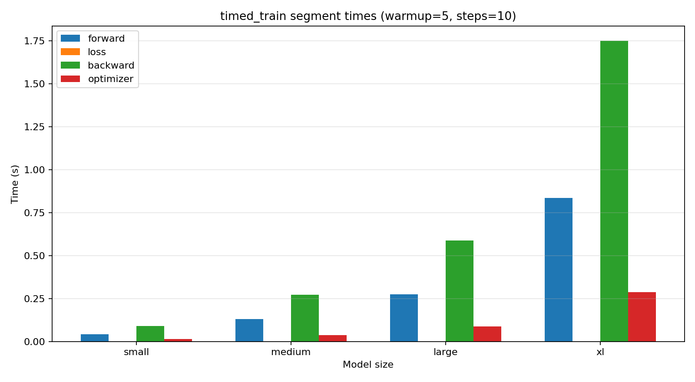
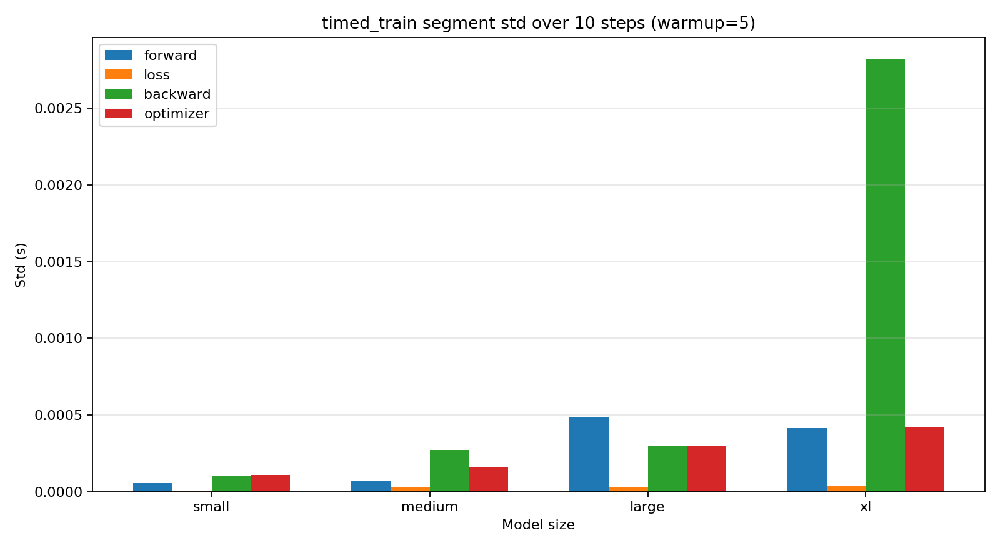
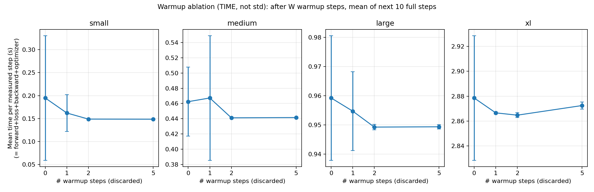

# End-to-End Benchmark Report

Assignment 2 `benchmarking_script` parts (b) and (c).

**Setup:** `BasicsTransformerLM`, vocab=10000, batch=4, context=512, AdamW, CUDA, `timed_train` segmented timing (forward / loss / backward / optimizer), `timeit.default_timer` + `torch.cuda.synchronize` per segment. Measurement steps=10.

**How to reproduce:**

```bash
uv run --no-sync python -m cs336_systems.e2e_timing
```

**Note:** model size(s) 10b hit CUDA OOM on this 80GB GPU (fp32 + AdamW + batch=4 + context=512) and are omitted from timing plots/tables.

## (b) Timings with warmup=5





| size | forward | loss | backward | optimizer | full step |
|---|---|---|---|---|---|
| small | 43.014 ms ± 0.056 ms | 0.572 ms ± 0.009 ms | 89.917 ms ± 0.103 ms | 15.179 ms ± 0.109 ms | 148.682 ms ± 0.224 ms |
| medium | 130.921 ms ± 0.072 ms | 0.595 ms ± 0.032 ms | 272.891 ms ± 0.272 ms | 37.158 ms ± 0.160 ms | 441.566 ms ± 0.438 ms |
| large | 274.286 ms ± 0.484 ms | 0.627 ms ± 0.029 ms | 587.214 ms ± 0.301 ms | 87.217 ms ± 0.301 ms | 949.343 ms ± 0.718 ms |
| xl | 834.849 ms ± 0.415 ms | 0.636 ms ± 0.038 ms | 1.7494 s ± 2.821 ms | 287.590 ms ± 0.425 ms | 2.8725 s ± 2.802 ms |
| 10b | OOM | OOM | OOM | OOM | OOM |

表中每个格子是 **mean ± std**（10 次测量）。方差 = std²，不另列表。

**Answer (b):** On the `medium` model, a forward pass takes 130.921 ms (std 0.072 ms) and a backward pass takes 272.891 ms (std 0.272 ms). Across sizes and segments the relative std (std/mean) is noticeable (max observed ≈ 0.059), so run-to-run variability after warmup is generally low.

## (c) Warmup ablation

Warmup ∈ {0,1,2,5}; warmup=5 reused from (b).

**What the y-axis is:** **time** (seconds), not std. For each warmup=`W` we **discard** the first `W` steps (untimed), then time the next 10 full steps and plot their **mean**. Warmup duration itself is **not** included in the plotted number. Error bars = std over those 10 measured steps.



| size | warmup=0 | warmup=1 | warmup=2 | warmup=5 |
|---|---|---|---|---|
| small | 194.883 ms ± 135.674 ms | 162.199 ms ± 40.196 ms | 148.938 ms ± 1.170 ms | 148.682 ms ± 0.224 ms |
| medium | 462.401 ms ± 45.296 ms | 467.237 ms ± 81.750 ms | 441.229 ms ± 0.313 ms | 441.566 ms ± 0.438 ms |
| large | 959.212 ms ± 21.354 ms | 954.694 ms ± 13.473 ms | 949.242 ms ± 0.964 ms | 949.343 ms ± 0.718 ms |
| xl | 2.8786 s ± 50.125 ms | 2.8666 s ± 0.929 ms | 2.8647 s ± 1.939 ms | 2.8725 s ± 2.802 ms |
| 10b | OOM | OOM | OOM | OOM |

**Answer (c):** Without warmup (warmup=0), measured full-step time on `medium` is 462.401 ms versus 441.566 ms at warmup=5, typically higher and/or noisier because the first steps pay one-time GPU costs (context init, kernel selection/caching, allocator warmup). With only 1–2 warmup steps (here 467.237 ms / 441.229 ms), results can still differ from warmup=5 because those transient effects may not have fully settled yet. Small dips at warmup=2 vs warmup=5 (when present) are within timing noise (see error bars / ±std), not evidence that 2 warmups is systematically faster.
