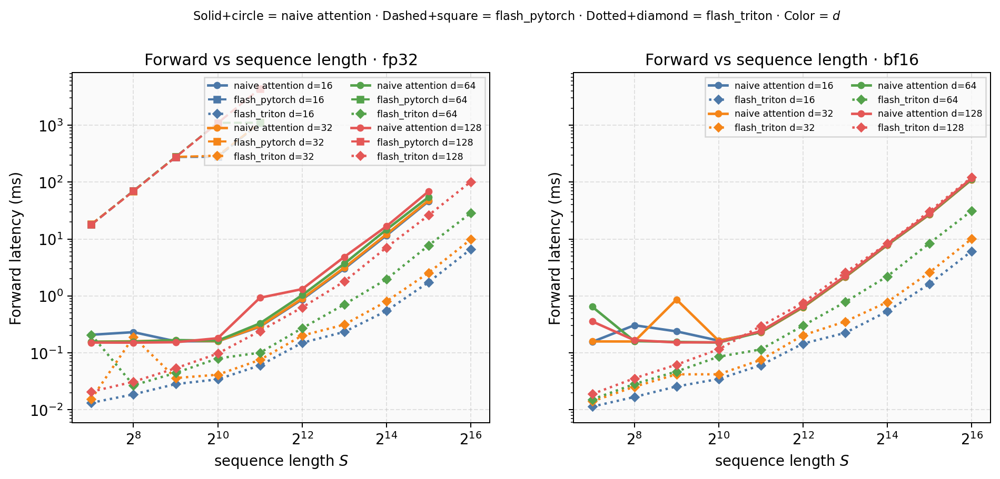
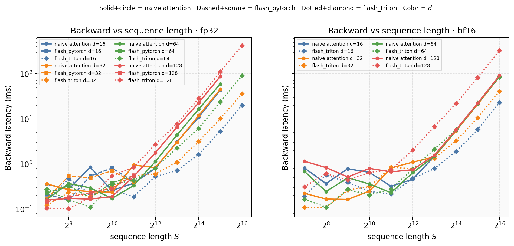
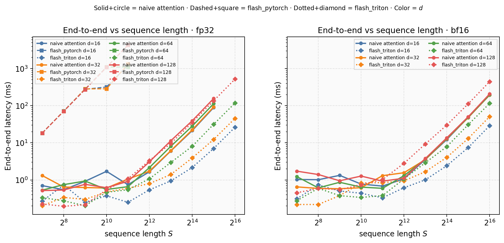
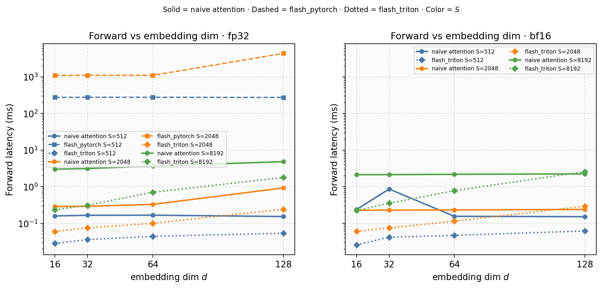
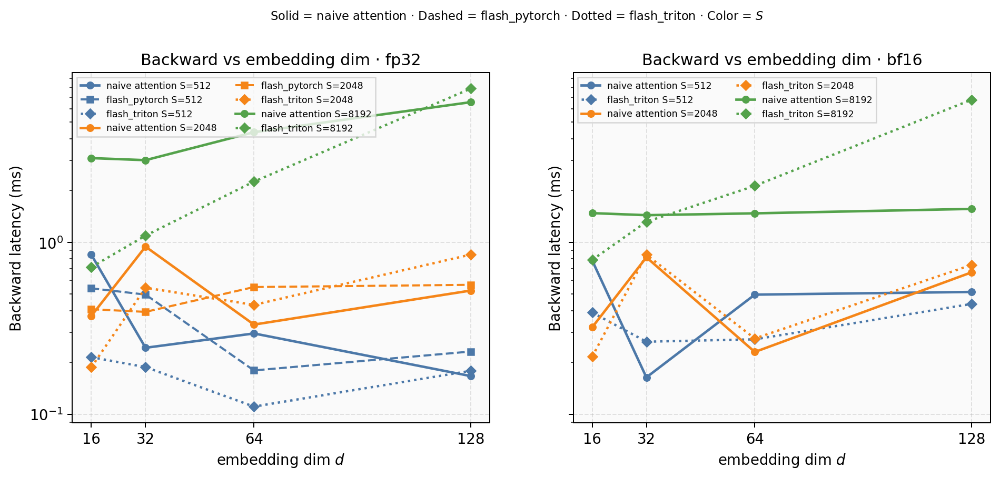
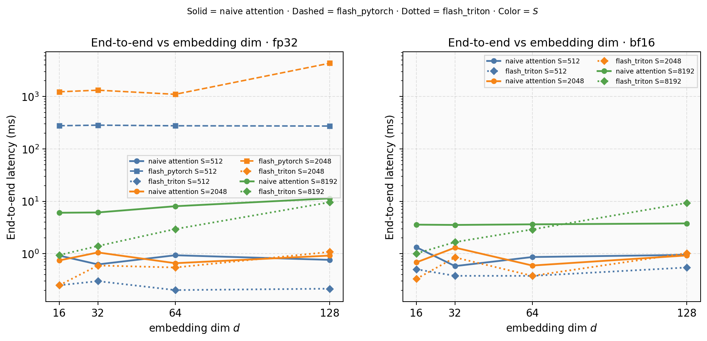
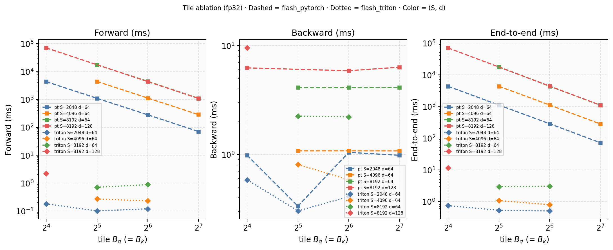

# FlashAttention 三对照组基准测试报告

## 1. 实验设置

- GPU：`NVIDIA A800-SXM4-80GB`
- Batch = 1，**causal = True**
- 计时：`triton.testing.do_bench` 中位数（ms）；每格同轮测 forward / backward / e2e

### 1.1 三对照组（不是三个 baseline）

| 名称 | 前向 | 反向 |
|------|------|------|
| **naive attention** | 物化 $S\times S$ 的朴素实现 | 普通 autograd |
| **flash_pytorch** | PyTorch 分块 Flash（Algorithm 1） | `torch.compile` dense 重算 $P$（Eq.13–19） |
| **flash_triton** | Triton 融合分块前向 | Triton 分块反向（Algorithm 2） |

主对比里两版 Flash 使用 **相同** `_choose_flash_tiles(S,d)`，因此主图上的差距应归因于执行引擎（融合/片上 vs Python+多 kernel / dense 反向），而不是分块大小不同。

### 1.2 两轮实验

- **实验 A（主对比）**：$S\in\{128\ldots65536\}$，$d\in\{16,32,64,128\}$，dtype $\in$ `{fp32,bf16}`；某 `(impl,d,dtype)` OOM 后更大 $S$ skip。例外：`flash_pytorch` 主对比只测到 $S\le 2048$——Python 双层 tile 循环在更长序列上单次前向可达秒级，do_bench 无法在合理时间内完成；更长 $S$ 上的 PyTorch 行为改由实验 B（更大 tile）观察。
- **实验 B（tile 消融）**：仅两版 Flash；fp32；$(S,d)\in\{(2048,64),(4096,64),(8192,64),(8192,128)\}$；中等 $S$ 扫 $\{16,32,64,128,\mathrm{heuristic}\}$，较大 $S$ 从 32 起（去掉会把 PyTorch 拖死的 16）。用来回答：PyTorch 加大 tile 能补多少；Triton 大 tile 是否因 shared memory 失败。

**读图**：实线+圆 = naive attention；虚线+方 = flash_pytorch；点线+菱 = flash_triton。对 $S$ 图颜色 = $d$；对 $d$ 图颜色 = $S$。左 fp32，右 bf16。

## 2. 实验 A：主对比图与解析

### 2.1 前向延迟 vs 序列长度

长序列上三条线应分开：naive attention 背 $S\times S$ HBM 流量；flash_pytorch 把大表切成 tile，显存压力下降，但仍是 Python 循环 + 多次小 kernel；flash_triton 在片上融合 online Softmax。锚点 $d=64$ fp32、$S=32768$：naive=54.5 ms，flash_pytorch=— ms，flash_triton=7.70 ms（相对 naive：pt —，triton 7.1×）。短 $S$ 上三条可能缠在一起——固定 launch / 编译开销尚未被 IO 优势淹没。

### 2.2 反向延迟 vs 序列长度

这里是相对旧实验变化最大的一张图：flash_triton 走分块反向，不应再与 naive 打平。flash_pytorch 反向仍 dense 重算 $P$，预期贴近 naive attention。锚点同上：naive=59.5，pt=—，triton=24.0 ms（pt/naive=—，triton/naive=2.5×）。若 pt 略慢于 naive，多半来自显式重算 $S/P$ 的路径，而不是「compile 让它变慢」这一笼统说法。

### 2.3 端到端延迟 vs 序列长度

e2e = 前向 + 反向。flash_triton 若反向也融合，e2e 优势应接近前向优势；flash_pytorch 则往往仍被 dense 反向拖住。锚点：naive=114，pt=—，triton=31.7 ms。

### 2.4 前向 / 反向 / 端到端 vs 隐藏维 $d$

固定若干 $S$，看 $d$ 增大时相对差距是否缩水：两边都付 $O(S^2 d)$ matmul，naive 额外付与 $d$ 无关的 $S\times S$ 存取；$d$ 越大，共同算力占比上升，Flash 相对优势常被稀释。Triton 大 $d$ 还会用更保守 tile（shared memory），launch 变多。

反向 vs $d$：关注 flash_triton 是否仍系统性低于另两条；flash_pytorch 与 naive 是否保持同量级。

端到端 vs $d$ 是前两张的合成；解读时对照同配置的 fwd/bwd，避免单独神话某一条曲线。

## 3. 实验 B：tile 消融

横轴为实际 $B_q$（与 $B_k$ 相同）；虚线 flash_pytorch，点线 flash_triton；颜色区分 $(S,d)$。预期：flash_pytorch 随 tile 增大而明显变快（循环次数↓、单次 GEMM 更大），但通常仍到不了同 tile 的 Triton；Triton 在过大 tile 上可能直接 OOM/编译失败（shared memory），此时 heuristic 的意义是「能跑且较快」而非「数学上最大 tile」。

| S | d | tile | flash_pytorch fwd/bwd/e2e | flash_triton fwd/bwd/e2e |
|---:|---:|:-----|:--------------------------|:-------------------------|
| 2048 | 64 | 16x16 | 4339/0.98/4302 | 0.18/0.58/0.74 |
| 2048 | 64 | 32x32 | 1101/0.34/1108 | 0.10/0.30/0.38 |
| 2048 | 64 | 64x64 | 281/1.05/284 | 0.12/0.41/0.50 |
| 2048 | 64 | 128x128 | 70.6/0.98/71.5 | err/err/err |
| 2048 | 64 | heuristic(32x32) | 1099/0.34/1106 | 0.10/0.30/0.53 |
| 4096 | 64 | 32x32 | 4364/1.08/4418 | 0.28/0.81/1.07 |
| 4096 | 64 | 64x64 | 1121/1.08/1109 | 0.23/0.59/0.79 |
| 4096 | 64 | 128x128 | 286/1.08/280 | err/err/err |
| 4096 | 64 | heuristic(32x32) | 4430/1.08/4323 | 0.27/0.81/1.07 |
| 8192 | 64 | 64x64 | 4488/4.13/4337 | 0.88/2.22/3.04 |
| 8192 | 64 | 128x128 | 1099/4.13/1091 | err/err/err |
| 8192 | 64 | heuristic(32x32) | 17450/4.13/17794 | 0.71/2.26/2.95 |
| 8192 | 128 | 64x64 | 4368/5.88/4390 | err/err/err |
| 8192 | 128 | 128x128 | 1094/6.34/1096 | err/err/err |
| 8192 | 128 | heuristic(16x16) | 70600/6.25/70211 | 2.18/9.53/11.6 |

## 4. 总结论

1. **前向**：长序列上 flash_triton 应显著快于 naive attention；flash_pytorch 介于中间或偏慢——省的是 $S\times S$ 显存形态，不是 Triton 级融合。
2. **反向**：flash_pytorch（dense）≈ naive attention 量级；flash_triton（分块）才是「反向也 Flash」的对照。旧实验打平是因为当时测的是 dense 反向。
3. **端到端**：由反向结构主导；只有 Triton 整条链路融合时，e2e 才会接近前向加速比。
4. **$d$ 与 dtype**：大 $d$ 稀释相对 IO 优势；bf16 更利好带宽型的 naive，Triton 是否吃到 bf16 红利取决于 kernel，不能先验保证。
5. **tile**：PyTorch 对小 tile 极敏感；加大 tile 是合法优化，但不能替代融合。主对比用相同 tile，是为了不把「分块大小」和「执行引擎」混为一谈；消融实验专门拆开看前者。

## 附录：主对比完整表（ms）

| S | d | dtype | naive fwd/bwd/e2e | flash_pytorch fwd/bwd/e2e | flash_triton fwd/bwd/e2e | tiles |
|---:|---:|:-----|:------------------|:--------------------------|:-------------------------|:------|
| 128 | 16 | fp32 | 0.21/0.35/0.70 | 17.8/0.21/18.4 | 0.01/0.16/0.27 | heuristic(16x16) |
| 256 | 16 | fp32 | 0.23/0.27/0.55 | 69.9/0.16/70.6 | 0.02/0.47/0.73 | heuristic(16x16) |
| 512 | 16 | fp32 | 0.16/0.85/0.92 | 276/0.54/278 | 0.03/0.21/0.25 | heuristic(16x16) |
| 1024 | 16 | fp32 | 0.16/0.26/1.71 | 278/0.81/320 | 0.03/0.26/0.37 | heuristic(32x32) |
| 2048 | 16 | fp32 | 0.29/0.37/0.74 | 1098/0.41/1235 | 0.06/0.19/0.25 | heuristic(32x32) |
| 4096 | 16 | fp32 | 0.86/0.80/1.66 | skip/skip/skip | 0.15/0.52/0.54 | heuristic(32x32) |
| 8192 | 16 | fp32 | 3.01/3.09/6.05 | skip/skip/skip | 0.23/0.72/0.94 | heuristic(64x64) |
| 16384 | 16 | fp32 | 11.6/10.8/21.4 | skip/skip/skip | 0.54/1.63/2.16 | heuristic(64x64) |
| 32768 | 16 | fp32 | 46.0/43.8/89.3 | skip/skip/skip | 1.74/5.34/7.06 | heuristic(64x64) |
| 65536 | 16 | fp32 | 187/OOM/OOM | skip/skip/skip | 6.62/19.9/26.4 | heuristic(64x64) |
| 128 | 32 | fp32 | 0.16/0.36/1.31 | 18.3/0.17/18.4 | 0.02/0.12/0.20 | heuristic(16x16) |
| 256 | 32 | fp32 | 0.16/0.27/0.64 | 69.2/0.54/70.7 | 0.19/0.23/0.34 | heuristic(16x16) |
| 512 | 32 | fp32 | 0.17/0.24/0.62 | 278/0.50/285 | 0.04/0.19/0.30 | heuristic(16x16) |
| 1024 | 32 | fp32 | 0.16/0.24/0.61 | 290/0.71/285 | 0.04/0.33/0.48 | heuristic(32x32) |
| 2048 | 32 | fp32 | 0.29/0.94/1.06 | 1109/0.39/1326 | 0.08/0.54/0.60 | heuristic(32x32) |
| 4096 | 32 | fp32 | 0.90/0.83/1.72 | skip/skip/skip | 0.20/0.60/0.80 | heuristic(32x32) |
| 8192 | 32 | fp32 | 3.13/3.01/6.13 | skip/skip/skip | 0.31/1.09/1.40 | heuristic(64x64) |
| 16384 | 32 | fp32 | 12.1/11.8/22.4 | skip/skip/skip | 0.80/3.13/3.92 | heuristic(64x64) |
| 32768 | 32 | fp32 | 47.5/45.4/92.8 | skip/skip/skip | 2.55/10.1/12.4 | heuristic(64x64) |
| 65536 | 32 | fp32 | 193/OOM/OOM | skip/skip/skip | 9.83/36.1/45.8 | heuristic(64x64) |
| 128 | 64 | fp32 | 0.16/0.16/0.53 | 17.9/0.23/18.3 | 0.21/0.27/0.33 | heuristic(16x16) |
| 256 | 64 | fp32 | 0.16/0.37/0.75 | 70.4/0.33/71.8 | 0.03/0.16/0.27 | heuristic(16x16) |
| 512 | 64 | fp32 | 0.17/0.29/0.93 | 278/0.18/277 | 0.04/0.11/0.20 | heuristic(16x16) |
| 1024 | 64 | fp32 | 0.16/0.17/0.55 | 1100/0.38/1108 | 0.08/0.35/0.47 | heuristic(16x16) |
| 2048 | 64 | fp32 | 0.33/0.33/0.66 | 1104/0.55/1106 | 0.10/0.43/0.54 | heuristic(32x32) |
| 4096 | 64 | fp32 | 1.03/1.13/2.15 | skip/skip/skip | 0.27/0.81/1.07 | heuristic(32x32) |
| 8192 | 64 | fp32 | 3.69/4.37/8.06 | skip/skip/skip | 0.71/2.26/2.95 | heuristic(32x32) |
| 16384 | 64 | fp32 | 14.6/16.4/28.3 | skip/skip/skip | 1.96/6.13/8.08 | heuristic(32x32) |
| 32768 | 64 | fp32 | 54.5/59.5/114 | skip/skip/skip | 7.70/24.0/31.7 | heuristic(32x32) |
| 65536 | 64 | fp32 | 220/OOM/OOM | skip/skip/skip | 28.6/90.8/119 | heuristic(32x32) |
| 128 | 128 | fp32 | 0.15/0.16/0.52 | 17.9/0.15/18.2 | 0.02/0.11/0.22 | heuristic(16x16) |
| 256 | 128 | fp32 | 0.15/0.17/0.53 | 69.6/0.18/71.1 | 0.03/0.10/0.19 | heuristic(16x16) |
| 512 | 128 | fp32 | 0.15/0.17/0.76 | 274/0.23/274 | 0.05/0.18/0.21 | heuristic(16x16) |
| 1024 | 128 | fp32 | 0.18/0.19/0.62 | 1095/0.29/1086 | 0.10/0.54/0.54 | heuristic(16x16) |
| 2048 | 128 | fp32 | 0.93/0.52/0.92 | 4392/0.57/4343 | 0.24/0.85/1.08 | heuristic(16x16) |
| 4096 | 128 | fp32 | 1.32/1.76/3.08 | skip/skip/skip | 0.63/2.72/3.33 | heuristic(16x16) |
| 8192 | 128 | fp32 | 4.84/6.54/11.4 | skip/skip/skip | 1.79/7.85/9.60 | heuristic(16x16) |
| 16384 | 128 | fp32 | 16.7/22.7/39.4 | skip/skip/skip | 7.08/28.2/35.3 | heuristic(16x16) |
| 32768 | 128 | fp32 | 68.7/88.0/157 | skip/skip/skip | 26.1/110/136 | heuristic(16x16) |
| 65536 | 128 | fp32 | 276/OOM/OOM | skip/skip/skip | 101/424/525 | heuristic(16x16) |
| 128 | 16 | bf16 | 0.16/0.81/1.03 | err/err/err | 0.01/0.19/0.31 | heuristic(16x16) |
| 256 | 16 | bf16 | 0.30/0.37/1.01 | err/err/err | 0.02/0.57/0.73 | heuristic(16x16) |
| 512 | 16 | bf16 | 0.24/0.78/1.33 | err/err/err | 0.03/0.39/0.50 | heuristic(16x16) |
| 1024 | 16 | bf16 | 0.16/0.65/0.77 | err/err/err | 0.03/0.25/0.44 | heuristic(32x32) |
| 2048 | 16 | bf16 | 0.23/0.32/0.68 | err/err/err | 0.06/0.22/0.33 | heuristic(32x32) |
| 4096 | 16 | bf16 | 0.63/0.46/1.07 | skip/skip/skip | 0.14/0.48/0.62 | heuristic(32x32) |
| 8192 | 16 | bf16 | 2.14/1.48/3.58 | skip/skip/skip | 0.22/0.79/1.01 | heuristic(64x64) |
| 16384 | 16 | bf16 | 7.81/5.46/12.3 | skip/skip/skip | 0.53/1.88/2.41 | heuristic(64x64) |
| 32768 | 16 | bf16 | 27.0/21.9/48.8 | skip/skip/skip | 1.63/5.85/7.47 | heuristic(64x64) |
| 65536 | 16 | bf16 | 111/85.5/195 | skip/skip/skip | 6.10/22.8/28.9 | heuristic(64x64) |
| 128 | 32 | bf16 | 0.16/0.22/0.65 | err/err/err | 0.01/0.11/0.22 | heuristic(16x16) |
| 256 | 32 | bf16 | 0.16/0.17/0.59 | err/err/err | 0.03/0.11/0.22 | heuristic(16x16) |
| 512 | 32 | bf16 | 0.86/0.16/0.58 | err/err/err | 0.04/0.26/0.38 | heuristic(16x16) |
| 1024 | 32 | bf16 | 0.16/0.25/0.62 | err/err/err | 0.04/0.31/0.83 | heuristic(32x32) |
| 2048 | 32 | bf16 | 0.23/0.82/1.30 | err/err/err | 0.07/0.85/0.85 | heuristic(32x32) |
| 4096 | 32 | bf16 | 0.63/1.10/1.56 | skip/skip/skip | 0.20/0.78/0.95 | heuristic(32x32) |
| 8192 | 32 | bf16 | 2.14/1.44/3.54 | skip/skip/skip | 0.35/1.32/1.67 | heuristic(64x64) |
| 16384 | 32 | bf16 | 7.85/5.42/13.0 | skip/skip/skip | 0.78/3.30/4.06 | heuristic(64x64) |
| 32768 | 32 | bf16 | 27.0/21.2/48.0 | skip/skip/skip | 2.58/10.6/13.1 | heuristic(64x64) |
| 65536 | 32 | bf16 | 111/85.7/195 | skip/skip/skip | 10.0/41.1/51.1 | heuristic(64x64) |
| 128 | 64 | bf16 | 0.65/0.69/1.23 | err/err/err | 0.02/0.17/0.28 | heuristic(16x16) |
| 256 | 64 | bf16 | 0.16/0.24/0.61 | err/err/err | 0.03/0.11/0.60 | heuristic(16x16) |
| 512 | 64 | bf16 | 0.16/0.50/0.86 | err/err/err | 0.05/0.27/0.38 | heuristic(16x16) |
| 1024 | 64 | bf16 | 0.15/0.36/0.64 | err/err/err | 0.09/0.21/0.34 | heuristic(16x16) |
| 2048 | 64 | bf16 | 0.23/0.23/0.59 | err/err/err | 0.11/0.28/0.38 | heuristic(32x32) |
| 4096 | 64 | bf16 | 0.64/0.64/1.30 | skip/skip/skip | 0.30/0.77/1.07 | heuristic(32x32) |
| 8192 | 64 | bf16 | 2.18/1.47/3.63 | skip/skip/skip | 0.78/2.13/2.91 | heuristic(32x32) |
| 16384 | 64 | bf16 | 7.95/5.57/13.4 | skip/skip/skip | 2.21/5.75/7.90 | heuristic(32x32) |
| 32768 | 64 | bf16 | 27.4/21.8/48.9 | skip/skip/skip | 8.41/22.5/30.9 | heuristic(32x32) |
| 65536 | 64 | bf16 | 112/86.7/198 | skip/skip/skip | 31.3/84.7/116 | heuristic(32x32) |
| 128 | 128 | bf16 | 0.36/1.15/1.72 | err/err/err | 0.02/0.31/0.45 | heuristic(16x16) |
| 256 | 128 | bf16 | 0.17/0.83/1.40 | err/err/err | 0.04/0.61/0.59 | heuristic(16x16) |
| 512 | 128 | bf16 | 0.15/0.51/0.95 | err/err/err | 0.06/0.44/0.54 | heuristic(16x16) |
| 1024 | 128 | bf16 | 0.15/0.80/1.27 | err/err/err | 0.12/0.65/0.74 | heuristic(16x16) |
| 2048 | 128 | bf16 | 0.24/0.67/0.93 | err/err/err | 0.29/0.74/1.03 | heuristic(16x16) |
| 4096 | 128 | bf16 | 0.66/0.75/1.11 | skip/skip/skip | 0.76/2.05/2.80 | heuristic(16x16) |
| 8192 | 128 | bf16 | 2.24/1.57/3.79 | skip/skip/skip | 2.58/6.76/9.33 | heuristic(16x16) |
| 16384 | 128 | bf16 | 8.17/5.75/13.6 | skip/skip/skip | 8.27/21.9/30.2 | heuristic(16x16) |
| 32768 | 128 | bf16 | 28.2/22.4/50.5 | skip/skip/skip | 30.7/82.3/113 | heuristic(16x16) |
| 65536 | 128 | bf16 | 117/91.4/209 | skip/skip/skip | 121/327/447 | heuristic(16x16) |
