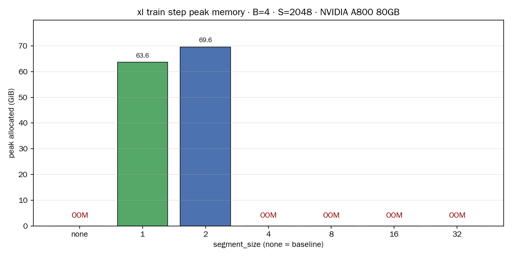
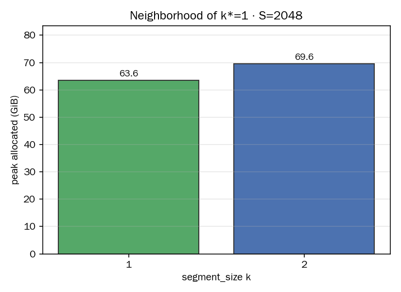
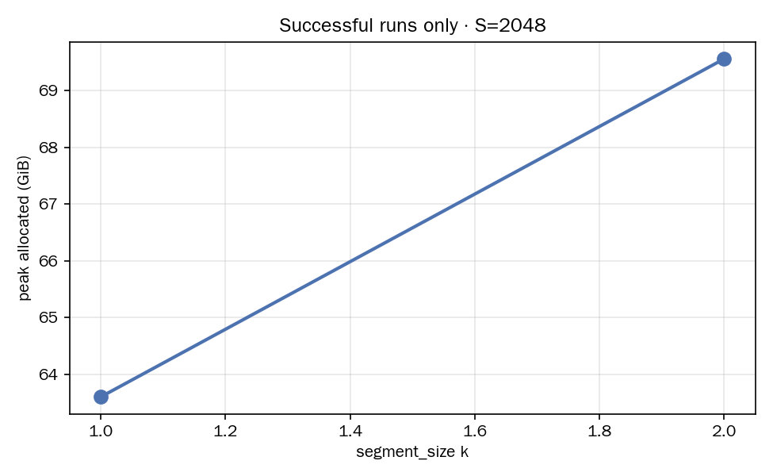
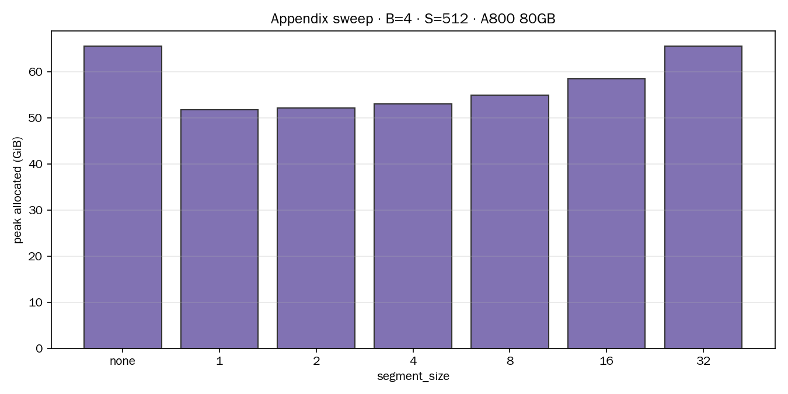

# Gradient Checkpointing

**硬件：** NVIDIA A800-SXM4-80GB（80 GiB HBM）。

**设定：** `BasicsTransformerLM` xl；batch=4；完整训练步（forward + loss + backward + AdamW）；指标 `torch.cuda.max_memory_allocated()`。Checkpoint 只包 `model.layers`。

**代码：** `cs336_systems/gradient_checkpointing/` · 数据：`artifacts/gradient_checkpointing/peaks.json`。

**背景：** `misc/misc-activation-checkpointing.md`（机制）· `misc/misc-gradient-checkpointing-problem.md`（题面认知）。

---

## 1. 读峰值之前：显存由哪几块拼成

整步 `max_memory_allocated` 是 **地板 + 激活峰值** 的 max，读数时先把两项分开想。

| 块 | 是什么 | xl·B=4 量级（与 context 弱相关） |
|----|--------|----------------------------------|
| **地板** | 参数 + AdamW 状态；反向时短暂叠一层梯度 | 约 **50–51 GiB**（memory profiling 同设定） |
| **激活峰** | 各层为反向保存的中间张量 R 叠加，或 checkpoint 重算时的临时 R | 随 **层数 N、段长 k、S** 变 |

Checkpoint **只动第二项**：让「同时活着的 block 级 R」从多层变成一层（或一段 k 层）。

单层 block 在 S=2048 时保存张量约 **4.0 GiB**（`measure_block_saved_tensors.py`）。32 层若全囤，仅 block 激活一项粗算可达 **32 × 4 ≈ 128 GiB**，加地板必超 80 GiB。

**思维方式：** 图上 63 GiB 与 78 GiB 的差距只有十几 GiB，是因为 **分母里有一半是地板**；checkpoint 省的是激活项里「多层 R 同时驻留」那一截，总峰值因此呈 **小幅下降或从 OOM 变为可跑**，很少出现「峰值腰斩」。

---

## 2. Checkpoint 机制（一句话）

前向：每段只存 **段入口** 的 `(B,S,d)`，段内 R 不登记。反向：用入口 **重算整段前向**，临时造 R，算完即释。

段长 **k** = 每段连续 k 个 block。k=1 即每层一段；k=32 即整网一段。

---

## 3. 粗算公式（读图用）

记 N=32，边界张量 B_bd ≈ 80 MiB（S=2048），单层 R ≈ 4 GiB。

```
激活竞争项 ≈ max( (N/k)·B_bd ,  k·R )
总峰值     ≈ 地板(~51 GiB) + 激活竞争项 + 其它小项
```

- k 小：重算时 k·R 小（k=1 → 约 4 GiB）；边界 (N/k)·B_bd 略大（32×80 MiB ≈ 2.5 GiB）。
- k 大：边界少；重算一段 k 层时 **k·R** 主导（k=4 → 约 16 GiB 临时；k=8 → 约 32 GiB）。

R 远大于 B_bd 时，**较小 k 压低激活峰**；地板不变，故 **总峰值下降幅度有限**。

---

## 4. 主实验 S=2048：看图说话

题面设定。下表为 A800 上实测（2026-07-24）。

| segment_size | peak (GiB) | OOM |
|-------------:|-----------:|:---:|
| none | — | yes |
| **1** | **63.599** | no |
| **2** | **69.561** | no |
| 4 | — | yes |
| 8 | — | yes |
| 16 | — | yes |
| 32 | — | yes |



### 4.1 none → OOM：爆在约 78 GiB

无 checkpoint 时，前向把 32 层 R 依次叠上去。OOM 日志显示失败时已占 **约 78 GiB**（距 80 GiB 上限只差约 2 GiB）。  
含义：**激活项**在 none 下把总占用顶穿 80 GiB；地板本身已在 50 GiB 量级。

### 4.2 k=1 → 63.6 GiB：省下的主要是「多层 R 叠满」那一截

k=1 时任意时刻至多 **一层** block 的 R 在重算中存活（约 4 GiB 量级），外加 32 个边界输入（约 2.5 GiB）与地板。

```
63.6 GiB 总峰值 ≈ 51 GiB 地板 + ~12–13 GiB 激活相关
```

相对 none 失败点 78 GiB，总峰值降 **约 14 GiB**——这就是在 80 GiB 卡上从 OOM 到可跑的差距。  
**观感「没降多少」的原因：** 分母 63 GiB 里 **~80% 是地板**；checkpoint 动的是剩下 **~20%** 里的激活部分，总曲线只会挪十几 GiB，不会减半。

### 4.3 k=1 vs k=2：k=2 反而更高（+6.0 GiB）

这是 S=2048 上最容易误解的一点：**两种设置都能跑通，但 k=2 峰值 69.6 GiB，高于 k=1 的 63.6 GiB。**

原因在公式第二项 **k·R**：

- k=1：反向重算 **1 层**，临时约 **1×R ≈ 4 GiB**。
- k=2：重算 **2 层**，临时约 **2×R ≈ 8 GiB**，且边界从 32 张减到 16 张（少约 1.25 GiB），**净效果仍是 k=2 更高**。

实测差 **6.0 GiB**，与「多囤一层 block 级激活」的量级一致（单层整步上下文里 R 的峰值贡献大于 4 GiB 账本，含重算瞬间的临时分配）。



**结论：** 在 2048 上 **k*=1**；k=2 是题面要求的邻域对比，用数据说明 **段越长，重算段内 k·R 越大，总峰值越高**。

### 4.4 k≥4 → 再次 OOM

k=4 时重算段临时 **4×R ≈ 16 GiB** 量级，叠地板与前向边界后再次超过 80 GiB。k 再大，k·R 更大，OOM 更早发生。



（仅含成功跑通的 k=1、k=2；其余标 OOM。）

---

## 5. 附录 S=512：同一思维下的完整曲线

80 GiB 上 none 也能跑通，适合看清 **k 对激活项的单调影响**（地板仍占大头）。

| segment_size | peak (GiB) |
|-------------:|-----------:|
| none | 65.538 |
| **1** | **51.703** |
| 2 | 52.149 |
| 4 | 53.041 |
| 8 | 54.827 |
| 16 | 58.397 |
| 32 | 65.537 |



### 5.1 none 65.5 GiB vs k=1 51.7 GiB：差 13.8 GiB，仍非「腰斩」

```
65.5 − 51.7 ≈ 13.8 GiB
```

与 2048 上「约 14 GiB 量级」的改善一致：checkpoint 从激活栈里拿回的主要是 **「少叠多层 R」** 那一块。  
65.5 GiB 中地板仍约 51 GiB → 激活峰约 **14.5 GiB**；k=1 把激活峰压到约 **0.7 GiB** 量级（51.7−51），总峰值因此只比地板高 **~1 GiB**。

### 5.2 k 从 1 增到 32：峰值单调升，k=32 回到 none

段越长，重算时 k·R 越大；k=32 等价于整网一段重算，激活行为接近 none，峰值 **65.537 ≈ 65.538**。

**与 2048 对照：** 机制相同；2048 上 R 更大，k=2 已抬峰，k≥4 直接 OOM；512 上 R 较小，全 k 可扫，曲线完整。

---

## 6. (a) 理论答：不算算力时的最优策略

**策略：** 每个 block 单独 `checkpoint`（k=1）。

```python
h = embed(x)
for block in model.layers:
    h = torch.utils.checkpoint.checkpoint(block, h, use_reentrant=False)
return lm_head(ln_final(h))
```

**峰值激活（对 N）：** O(1) 份 R_block；总峰值仍含 Θ(1) 地板。  
**计算：** 反向额外 Θ(N) 次 block-forward。

---

## 7. (b) 实验答：一层 checkpoint、最优 k

| 问题 | 答案 |
|------|------|
| 最优 k（S=2048，A800） | **k=1**，峰值 **63.599 GiB** |
| 邻域 k=2 | **69.561 GiB**（+6.0 GiB） |
| none | **OOM**（失败时约 78 GiB） |
| 为何总峰值降幅不大 | 地板 ~51 GiB 不变；checkpoint 主要压缩激活项 |
| 为何 k=2 高于 k=1 | 重算段 k·R：2 层临时 R > 1 层 |

---

## 8. OOM 在报告中的位置

OOM 是 **该 (segment_size, S) 在 A800 80GB 上的实测结果**：峰值超过卡容量。  
与 63.6 GiB 同属一张表，用于回答「能否在此卡上完成题面设定的一步训练」。

---

## 9. 复现

```bash
uv run --no-sync python -m cs336_systems.gradient_checkpointing
uv run --no-sync python -m cs336_systems.gradient_checkpointing --skip-run
```

单层 R（约 12 s）：

```bash
uv run --no-sync python /root/.dev/ml-sys/cs336/assignment2-systems/scripts/measure_block_saved_tensors.py
```

生成时间 UTC：2026-07-24。

---

## 10. 附录：checkpoint 与 R、段入口——真实情况怎么摆

### 10.1 段入口与 R 的关系

一层 `TransformerBlock` 为反向保存的张量集合记为 **R**。R 里有多种形状：S×S、FFN 宽激活、多处 (B,S,d) 等。  
**进入该层时的 (B,S,d) 激活**（段入口 / 层输入）**可以出现在 R 里**——例如 hooks 按形状统计时，层内多处 (B,S,d) 会归入同一类；层入口是其中一种来源。

因此：**segment_size=none 时，各层入口作为 R 的组成部分，会随整层 R 一起在前向被登记、在反向被使用。** 这一点与「checkpoint 要存段入口」并不矛盾，说的是同形状的张量在不同模式下的**登记范围**不同。

### 10.2 segment_size=none 时发生什么

前向依次跑完 32 层。每一层算完后，autograd 为这一层登记 **整包 R**（入口 (B,S,d)、S×S、FFN 中间量等，单层 S=2048 合计约 4 GiB）。  
32 层前向结束前，这 32 包 R **都在显存里**。入口 (B,S,d) 含在各自那包 R 里，**同时**还有远大于单张 (B,S,d) 的 S×S、FFN 等项。

整步峰值里：地板（参数 + Adam，约 51 GiB）+ 32 层 R 叠加 → 本实验在 A800 上约 **78 GiB 时 OOM**。

### 10.3 segment_size=k 时发生什么

把连续 k 层包成一段 `checkpoint(fn, x)`。

**前向：**  
- 登记 **段入口** x，形状 (B,S,d)（S=2048 时约 80 MiB）。  
- **段内**各层在 none 模式下会进 R 的那些中间张量（S×S、FFN 宽激活等），在前向阶段 **不登记**。  
- 段入口 (B,S,d) 与 none 时 R 里的某张 (B,S,d) 同形；差别在于 none 时还 **另外** 登记了同层其余 ~4 GiB 量级的中间项。

**反向：**  
用段入口重跑这 k 层前向 → **临时** 造出这 k 层各自的 R → 对该段 backward → 释放这些临时 R。

整步峰值时刻：地板 + 所有段入口（k=1 时 32×80 MiB；k=2 时 16×80 MiB）+ **某一时刻重算段内至多 k 包 R**。

### 10.4 对照：none 与 k=1 差在哪

| | 前向结束时「层相关」常驻 | 反向重算时临时 R |
|--|------------------------|-----------------|
| none | 32 层 **整包 R**（入口 (B,S,d) 含在其中，且每层另有 S×S、FFN 等） | 各层 R 已在前向囤好，按层 backward 逐层释放 |
| k=1 | 32 个 **段入口** (B,S,d)；段内 S×S、FFN 等 **未在前向登记** | 每次重算 **1 层** 的整包 R（入口 + 内部项一并临时出现） |

峰值从约 78 GiB（OOM）到 63.6 GiB：地板相同；差别主要是 **前向同时常驻的层相关显存** 从「32 整包 R」变为「32 个小入口 + 反向瞬间 1 包 R」。

### 10.5 k=1 与 k=2：多出的 6 GiB 从哪来

两种模式 **前向都只登记段入口**（k=2 入口更少：16 张 vs 32 张）。

| | 段入口合计（前向常驻） | 反向重算时段内临时 R |
|--|----------------------|---------------------|
| k=1 | 32 × 80 MiB ≈ 2.5 GiB | **1** 层整包 R |
| k=2 | 16 × 80 MiB ≈ 1.25 GiB | **2** 层整包 R |

k=2 入口少约 1.25 GiB；反向重算时同时物化 **2 层** 的 R（含各层入口与内部项），比 k=1 多约一层 R 的临时峰值。  
实测 63.6 GiB → 69.6 GiB（+6.0 GiB），与「重算段内 k 层 R 同时活着」的量级一致。

### 10.6 checkpoint 自身的额外占用

除段内 R 的登记策略外，checkpoint 在前向额外常驻的主要是：

1. **段入口** (B,S,d)——与 R 中的同形张量一致；在 none 模式下这部分本就会出现在该层 R 里，checkpoint 模式下 **只保留这一层级的入口、不保留同段其余 R 项**。  
2. **实现 bookkeeping**（偶见 shape `[0]` 占位；体积可忽略）。

反向另付 **重算前向** 的算力，以及重算瞬间 **k 层 R** 的临时显存。

### 10.7 收束

- 段入口 (B,S,d) **属于** R 的组成部分；none 时它随整包 R 一起在前向登记。  
- checkpoint 改的是 **登记范围**：前向只留段入口，段内 R 的其余部分推迟到反向重算时再出现。  
- k 增大 → 前向入口更少，反向重算时 **同时存在的整包 R 层数** 增加；总峰值由地板、入口条数、k·R（重算峰）共同决定。

