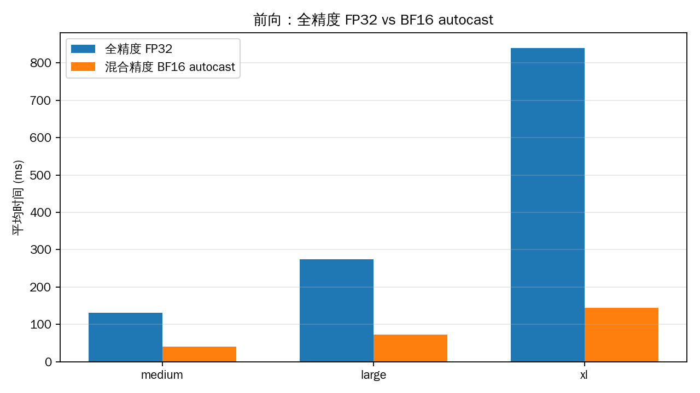
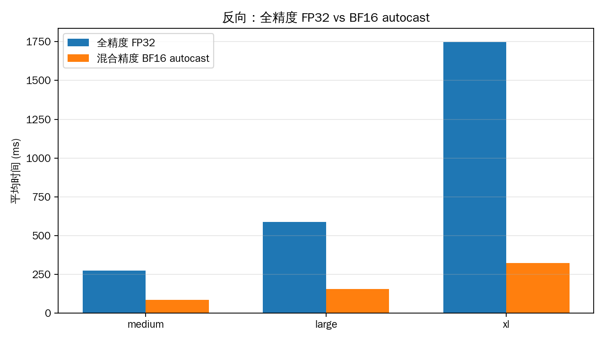
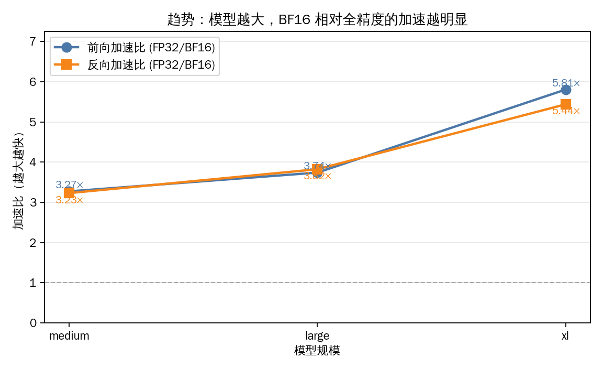

# Mixed Precision

本报告合并 Assignment 2 混精相关两问：`mixed_precision_accumulation` 与 `benchmarking_mixed_precision`。  
代码：`/root/.dev/ml-sys/cs336/assignment2-systems/cs336_systems/mixed_precision/`。

---

## Part A · Mixed-Precision Accumulation

脚本：`mixed_precision_accumulation.py`。  
运行：`uv run --no-sync python -m cs336_systems.mixed_precision.mixed_precision_accumulation`。

理想精确值：$1000 \times 0.01 = 10$。

### 实测输出

| case | 做法 | 打印结果 |
|---|---|---|
| 1 | FP32 累加器 `+=` FP32 加数 | `10.0001` |
| 2 | FP16 累加器 `+=` FP16 加数 | `9.9531`（fp16） |
| 3 | FP32 累加器 `+=` FP16 加数 | `10.0021` |
| 4 | FP32 累加器 `+=`（先把 FP16 转成 FP32） | `10.0021` |

### 人话解读

- **Case 1**：全程 FP32。浮点本身就有舍入，所以不是完美的 `10.0`，而是 `10.0001`，误差极小，可以当「准」的基准。
- **Case 2**：累加器也是 FP16。FP16 尾数位少，一边加一边把误差写回低精度寄存器；加到后面，`0.01` 相对当前总和已经小到容易被「吃掉」或舍得很狠，所以掉到 `9.9531`，**明显偏了**。这就是讲义要你看见的：低精度累加会伤精度。
- **Case 3 / 4**：累加器保持 FP32。Case 3 里 `+=` 会把 FP16 加数提升后再加；Case 4 是你手动 `.type(float32)` 再加——效果一样，都得到 `10.0021`。加数 `0.01` 本身用 FP16 表示就不完美，所以和 Case 1 略有差别，但**远好于 Case 2**。

一句话：**张量可以是低精度，但求和/累加最好放在更高精度里做**；否则误差会在循环里被反复放大、写死。

### Deliverable（2–3 句）

纯 FP32 累加得到约 `10.0001`，接近真值 10；把累加器也改成 FP16 后结果变成约 `9.9531`，误差明显变大。若累加器保持 FP32、只把每次加数用 FP16（或先 cast 回 FP32 再加），结果约 `10.0021`，精度接近 FP32 累加。这说明混合精度里应把 reduction/accumulation 留在较高精度，即使参与运算的张量本身是低精度。

---

## Part B · Benchmarking Mixed Precision

(a)(b) ToyModel + autocast dtype；大模型墙钟对比全精度 FP32 vs BF16 autocast（前向 / 反向，不含优化器）。

### (a) ToyModel 在 autocast 下的数据类型

脚本：`toy_autocast_dtypes.py`。模型参数初始为 FP32；分别在「无 autocast / FP16 autocast / BF16 autocast」下拆步打印。假损失为模型输出的均值（仅用于观察损失与梯度的 dtype）。

| 设定 | 参数（在 autocast 上下文内查看） | 第一层前馈 `ToyModel.fc1` 输出 | LayerNorm `ToyModel.ln` 输出 | 损失 | 第一层前馈参数的梯度 |
|---|---|---|---|---|---|
| 无 autocast（全 FP32） | `float32` | `float32` | `float32` | `float32` | `float32` |
| autocast FP16 | `float32` | `float16` | `float32` | `float16` | `float32` |
| autocast BF16 | `float32` | `bfloat16` | `float32` | `bfloat16` | `float32` |

**Answer (a):** 在 FP16 autocast 下（本机实测）：模型参数仍为 `float32`；第一层前馈输出为 `float16`；LayerNorm 输出为 `float32`；损失为 `float16`；梯度为 `float32`。要点：autocast **不会**把参数本体改成半精度；它改变的是算子输出 / 中间激活的精度。LayerNorm 在 FP16 策略下保持较高精度输出，与矩阵乘不同。

### (b) 为什么 LayerNorm 在 FP16 里被特殊对待？BF16 呢？

**Answer (b):** LayerNorm 要算均值、方差、开方与归一化，对动态范围和舍入更敏感；FP16 指数范围窄，方差过小/过大时容易下溢或溢出，所以 autocast 把 LayerNorm 留在 FP32，本机实测 FP16 下 LayerNorm 输出为 `float32`，而第一层前馈输出已是 `float16`。BF16 指数位与 FP32 同宽、更不易溢出，**数值上**不必再像 FP16 那样「必须」抬高 LayerNorm；但本机 PyTorch 的 BF16 autocast 白名单仍让 LayerNorm 输出为 `float32`（第一层前馈则为 `bfloat16`）——即：BF16 降低了「必须特殊对待」的数值压力，实现上仍可能为稳健而保持 LayerNorm 用 FP32。

### (c) 大模型：全精度 vs BF16 混合精度（前向 / 反向）

**设定：** `BasicsTransformerLM`；本次实测 size ∈ {medium, large, xl}；batch=4；context=512；warmup=5；measure=10；**不含** `optimizer.step()`；BF16 使用 `torch.autocast`，**无** GradScaler。计时复用 `e2e_timing` 的分段墙钟（`cuda.synchronize` + `nullcontext` / `autocast`）。Section 2.1.2 中的 `small` 未单独重跑（趋势已由 medium→xl 覆盖）；`10b` 在本机 80GB 上全精度会 OOM，故省略。

  

  

  

| size | 精度 | forward mean | backward mean | forward speedup | backward speedup |
|---|---|---:|---:|---:|---:|
| medium | FP32 | 130.907 ms | 272.730 ms | — | — |
| medium | BF16 | 39.982 ms | 84.418 ms | 3.27× | 3.23× |
| large | FP32 | 274.270 ms | 587.104 ms | — | — |
| large | BF16 | 73.306 ms | 153.505 ms | 3.74× | 3.82× |
| xl | FP32 | 839.471 ms | 1.7487 s | — | — |
| xl | BF16 | 144.556 ms | 321.432 ms | 5.81× | 5.44× |

**Answer (c):** 相对全精度 FP32，BF16 autocast 在 `medium` 前向 3.27× / 反向 3.23×；`large` 前向 3.74× / 反向 3.82×；`xl` 前向 5.81× / 反向 5.44×。随模型从 medium→large→xl，前向加速比大致 **3.3× → 3.7× → 5.8×**，反向类似 **3.2× → 3.8× → 5.4×**：规模越大、矩阵乘占比越高，BF16 越能吃满 Tensor Core，加速越明显；反向也受益，但还叠激活读写与 autograd 开销，故加速比不必与前向逐点相同。
