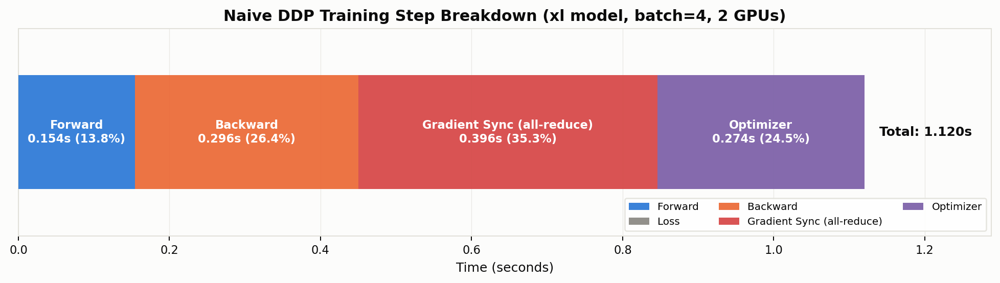
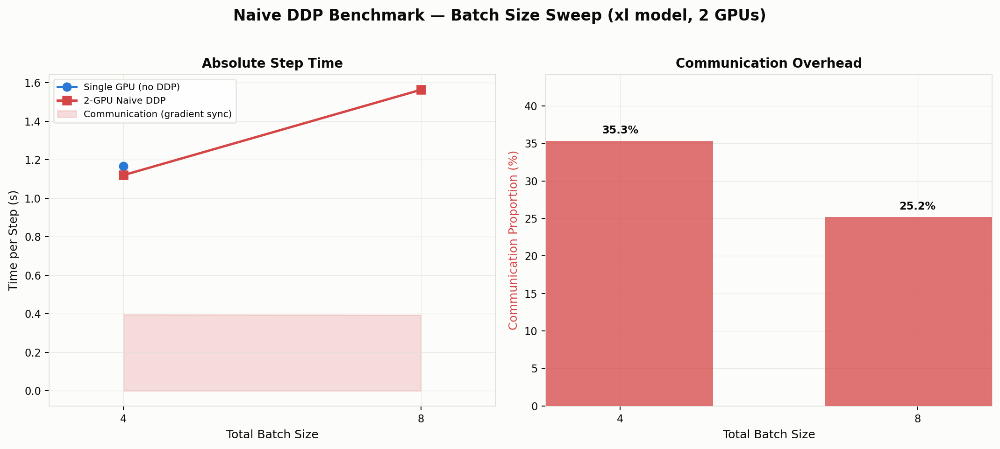
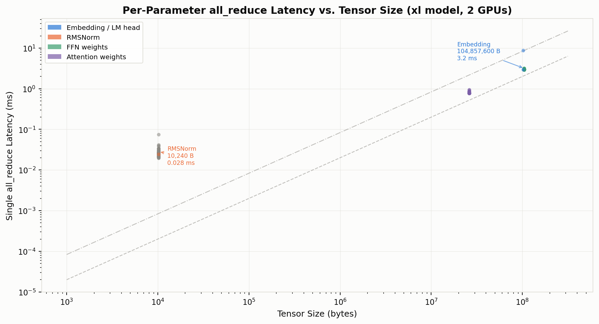

# Naïve DDP Benchmarking

**Problem:** `naive_ddp_benchmarking` (Assignment 2 §5.2)  
**Hardware:** 2× NVIDIA RTX PRO 6000 Blackwell Server Edition (~97 GB HBM each), GPU interconnect: **PHB** (PCIe Host Bridge, no NVLink).  
**Code:** `cs336_systems/distributed/benchmarking/benchmark_naive_ddp.py` · `cs336_systems/distributed/benchmarking/plot_naive_ddp.py`  
**Data:** `artifacts/naive_ddp_benchmark.csv` · `artifacts/naive_ddp_per_param_latency.csv`

---

## 符号表

| 符号 | 含义 | 本实验取值 |
|------|------|-----------|
| B | 总 batch size（跨所有 GPU） | 4, 8（受限于显存） |
| d | GPU 数量 (world size) | 2 |
| N_params | `nn.Parameter` 张量个数 | 291（xl 模型） |
| t_step | 单次训练迭代墙上时间 (s) | — |
| t_sync | 梯度同步（all-reduce）耗时 (s) | — |
| η_comm | 通信时间占比 = t_sync / t_step | — |

---

## 1. 实验在量什么

### 1.1 Naïve DDP 做了什么

分布式数据并行（DDP）将 batch 切分到多张 GPU 上并行训练。Naïve DDP 的核心循环：

```
每个 training step:
  ① forward(x_local)           → 各 GPU 用本地数据前向
  ② loss.backward()             → 各 GPU 算出局部梯度
  ③ finish_gradient_synchronization():
       对 291 个 nn.Parameter 逐一 all_reduce  → 跨 GPU 平均梯度
  ④ optimizer.step()            → 各 GPU 用平均梯度更新参数
```

**"Naïve"的含义：每个 `nn.Parameter` 张量单独发起一次 `all_reduce`。** xl 模型有 291 个 parameter tensors（从 10 KB 的 RMSNorm 到 102 MB 的 embedding），每个 step 发起 291 次独立的 all-reduce 调用。

### 1.2 并行了什么、没并行什么

| 组件 | Naïve DDP | 存储位置 |
|------|-----------|---------|
| **Data**（数据） | ✅ 分片 | 每 GPU B/d 个样本 |
| **Parameters**（参数） | ❌ 复制 | 从 rank 0 broadcast，每卡一份 |
| **Gradients**（梯度） | ❌ 复制 | all-reduce 后每卡一份 |
| **Optimizer States**（优化器状态） | ❌ 复制 | 每卡各自维护 AdamW m, v |

Naïve DDP **只做了数据并行**。参数、梯度、优化器状态都是全量复制。通信开销仅来自梯度同步。

---

## 2. 实验设置

### 2.1 模型

| 参数 | 值 |
|------|-----|
| 架构 | `BasicsTransformerLM`（GPT-2 风格 decoder-only Transformer） |
| 规格 | **xl**（§2.1.2） |
| d_model | 2,560 |
| d_ff | 10,240 |
| num_layers | 32 |
| num_heads | 32 |
| vocab_size | 10,000 |
| context_length | 512 |
| 精度 | float32 |
| 总参数量 | **3,406,809,600（≈3.4B）** |
| Parameter tensor 数量 | **291** |
| 梯度总大小 | 13.63 GB（= 3.4B × 4 bytes） |

> **对比 GPT-2：** 作业 small/medium/large 与 GPT-2 Small/Medium/Large 规格一致。但作业 xl（d=2560, 32 layers, 3.4B）与 GPT-2 XL（d=1600, 48 layers, 1.5B）不同——作业 xl 走"宽而浅"路线，参数量是 GPT-2 XL 的 2.3 倍。

### 2.2 训练超参数

| 参数 | 值 |
|------|-----|
| Optimizer | AdamW（lr=1e-3, weight_decay=0.1） |
| Batch sizes | 4, 8（总 batch size；更大的会 OOM，见 §2.3） |
| Warmup steps | 5（丢弃，不计时） |
| Measurement steps | 10 |
| 数据 | 随机整数 token（`randint(0, vocab_size)`） |
| Seed | 0 |

### 2.3 显存限制

在 fp32 + AdamW 下，xl 模型的显存分解：

| 组件 | 大小 |
|------|------|
| 模型参数 | 13.63 GB |
| AdamW m | 13.63 GB（懒加载，首次 `step()` 时分配） |
| AdamW v | 13.63 GB |
| **持久基线** | **40.89 GB** |
| 前向激活（batch=4） | ~29 GB |
| 前向激活（batch=8） | ~57.8 GB |

- **单卡 batch=4：** 40.9 + 29 ≈ 70 GB ✅
- **单卡 batch=8：** 40.9 + 57.8 ≈ 98.7 GB ❌（超出 97 GB 显存）
- **DDP batch=4（per=2）：** 40.9 + 14.5 ≈ 55 GB ✅
- **DDP batch=8（per=4）：** 40.9 + 29 ≈ 70 GB ✅
- **DDP batch=16（per=8）：** 40.9 + 57.8 ≈ 98.7 GB ❌

因此本实验只在有效配置上运行。

### 2.4 计时方法

每个 training step 切分为 5 个计时段，**每段前后均 `torch.cuda.synchronize(device)`**：

```
  ┌─ forward ─┬─ loss ─┬─ backward ─┬─ gradient_sync ─┬─ optimizer ─┐
  │ model(x)  │ CE(·,y)│ .backward()│ finish_grad_sync│ .step()     │
  └───────────┴────────┴────────────┴─────────────────┴─────────────┘
```

- 计时器：`timeit.default_timer()`
- 计时策略：每个配置在**独立子进程**中运行（`subprocess.run`），进程退出 = OS 回收所有 GPU 内存。驱动主进程不接触 CUDA，确保跨配置零内存污染。

---

## 3. 结果

### 3.1 主结果：Step 时间分解

| 阶段 | 单卡 batch=4 | DDP batch=4 | DDP batch=8 |
|------|-------------|-------------|-------------|
| forward | 0.323s (27.7%) | 0.154s (13.8%) | 0.323s (20.7%) |
| loss | ~0.000s | ~0.000s | ~0.000s |
| backward | 0.571s (48.9%) | 0.296s (26.4%) | 0.574s (36.7%) |
| **gradient sync** | **—** | **0.396s (35.3%)** | **0.393s (25.2%)** |
| optimizer | 0.273s (23.4%) | 0.274s (24.5%) | 0.273s (17.4%) |
| **TOTAL** | **1.167s** | **1.120s** | **1.563s** |
| **加速比 vs 单卡** | — | **1.04×** | — |



**核心发现：**

1. **DDP batch=4：通信占 35.3%。** 单卡 vs DDP 总时间几乎相同（1.167s vs 1.120s）——每 GPU 计算量减半（forward 0.323→0.154s, backward 0.571→0.296s），省下的 ~0.44s 被 0.396s 的通信吃掉了。加速比仅 1.04×。**291 次 all-reduce 的开销完全抵消了并行带来的计算收益。**

2. **梯度同步时间恒定在 ~0.395s，与 batch size 无关。** 因为梯度数据量（13.63 GB）是固定的，不随 batch size 变化。

3. **DDP batch=8：通信占比降至 25.2%。** 计算量翻倍（forward 0.154→0.323s），通信不变，通信占比自然缩小。大 batch 训练能更好地摊销通信开销。

### 3.2 Batch Size 对比

| 指标 | 单卡 bs=4 | DDP bs=4 | DDP bs=8 |
|------|----------|----------|----------|
| 总 step 时间 | 1.167s | 1.120s | 1.563s |
| 通信时间 (t_sync) | 0 | 0.396s | 0.393s |
| 通信占比 (η_comm) | 0% | **35.3%** | **25.2%** |
| 每 GPU 计算时间 (fwd+bwd+opt) | 1.167s | 0.724s | 1.170s |
| 有效 batch size | 4 | 4 | 8 |



### 3.3 附录：Per-Parameter all-reduce 延迟



291 个 parameter tensor 的 all-reduce 延迟散点图。关键观察：

| 张量类型 | 大小 | 延迟 | 特征 |
|---------|------|------|------|
| RMSNorm | 10 KB (2,560 elem) | ~0.01 ms | **延迟主导**：kernel launch + NCCL 协议开销 > 数据传输 |
| Attention 权重 | 26 MB (6.5M elem) | ~2 ms | 带宽利用率中等 |
| FFN / Embedding | 102 MB (25.6M elem) | ~7 ms | 接近带宽峰值（PHB ~12 GB/s） |

RMSNorm 的小张量（64 个）延迟几乎不随大小减小，停在一个 ~0.01 ms 的 latency floor 上。这些"无效延迟"累积起来就是数百微秒——不是数据传不动，是消息发太多。

---

## 4. 分析

### 4.1 为什么通信占比这么高

**不是带宽问题，是消息数量问题。** 通信时间 = 数据传输时间 + 消息开销 × 消息数量。

```
数据传输时间 ≈ 13.63 GB / 12 GB/s (PHB 实测) ≈ 1.14s  （理论下限）
实测 t_sync   = 0.396s

为什么实测比理论小？因为 ring all-reduce 在 N=2 时每 bit 只需传一次（无冗余），
且 NCCL 会利用 GPU Direct RDMA 绕过 host memory。
```

但 0.396s 仍然很大——因为 291 次调用中，每次都有：
- CUDA kernel launch overhead (~5–10 μs × 291 ≈ 1.5–3 ms)
- NCCL 协议握手与同步
- PCIe transaction layer overhead（对小消息尤其致命）

### 4.2 Batch Size 的影响

通信量（13.63 GB）不随 batch size 变化。计算量随 batch size 线性增长。

```
η_comm = t_sync / (t_compute + t_sync) = 0.396 / (t_compute + 0.396)

  batch=4: t_compute=0.724s → η_comm = 35.3%
  batch=8: t_compute=1.170s → η_comm = 25.2%
```

- **小 batch：通信是瓶颈**（35% 的时间在等梯度同步）
- **大 batch：计算摊销通信**（比例下降，但 batch 受限于 GPU 显存）

### 4.3 与后续方案的对比预览

后续作业将实现三种改进：

| 改进 | 问题 | 方法 | 预期 η_comm |
|------|------|------|-------------|
| **Flatten DDP** (§5.3.1) | 291 次 all-reduce → 1 次 | 拼接所有梯度为一个大 tensor | 大幅降低消息开销 |
| **Overlap DDP** (§5.3.2) | 通信在 critical path 上 | backward 过程中异步 all-reduce | 通信被计算隐藏 |
| **FSDP** (§7) | 参数也全量复制 | 参数分片，all-gather + reduce-scatter | 减少显存但改变通信模式 |

---

## 复现

```bash
# 运行 benchmark（全 sweep，约 10 分钟）
uv run python -m cs336_systems.distributed.benchmarking.benchmark_naive_ddp

# 出图
uv run python -m cs336_systems.distributed.benchmarking.plot_naive_ddp
```

**数据文件：**
- `artifacts/naive_ddp_benchmark.csv` — 每 step 分段计时
- `artifacts/naive_ddp_per_param_latency.csv` — 291 个参数的单次 all-reduce 延迟
