# Nsight Systems Profile Report

Assignment 2 `nsys_profile` parts (a) and (b). Headless `nsys profile` + `nsys stats` only (no GUI).

**Matrix:** model sizes `medium`, `xl`; context lengths `{256, 512, 1024}`; batch=4; vocab=10000; warmup=5; measure steps=10.

**Method:** one profiled run per cell with nested NVTX — outer `forward_backward` (forward→loss→backward), inner `forward` (model + `cuda.synchronize`). Warmup uses different NVTX names and is ignored when reading `forward` / `forward_backward` rows. Kernel tables from `nvtx_kern_sum`; forward wall time from `nvtx_pushpop_sum` Avg of `forward`. Call counts reported per single forward (= Kern Inst / 10). Nsight Systems 2024.2.3 CLI (stock 2022.4 on this host cannot decode CUDA 12.4 kernels).

## (a) Forward time: nsys vs Python

<p align="center">
  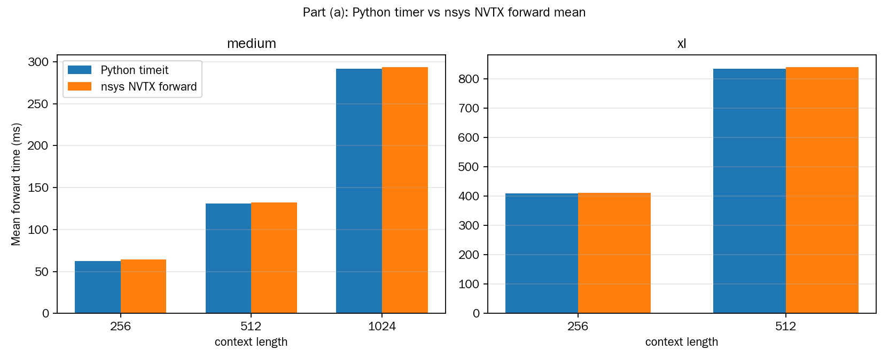
</p>

| size | context | Python forward mean | nsys NVTX forward mean | ratio nsys/python |
|---|---:|---:|---:|---:|
| medium | 256 | 62.734 ms | 64.601 ms | 1.030 |
| medium | 512 | 130.726 ms | 132.241 ms | 1.012 |
| medium | 1024 | 291.309 ms | 293.454 ms | 1.007 |
| xl | 256 | 410.005 ms | 411.400 ms | 1.003 |
| xl | 512 | 834.898 ms | 840.623 ms | 1.007 |
| xl | 1024 | OOM | OOM | — |

**Answer (a):** On `medium` with context 512, nsys NVTX `forward` mean is 132.241 ms versus Python `timeit`+`synchronize` mean 130.726 ms (ratio 1.012). They are the same order of magnitude; nsys is often slightly higher due to profiling overhead and range accounting.

## (b) Top CUDA kernels

### 前 5 名绝对耗时（原先那组图，保留）

每个成功组合一张：横轴为该内核在 NVTX 范围内的**累计时间 (ms)**（10 次 measure step 合计）。总览多面板图如下；其下按组合拆成约 10 张单图（forward / step 各一）。

<p align="center">
  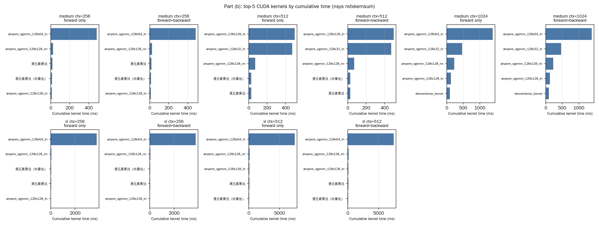
</p>

<p align="center">
  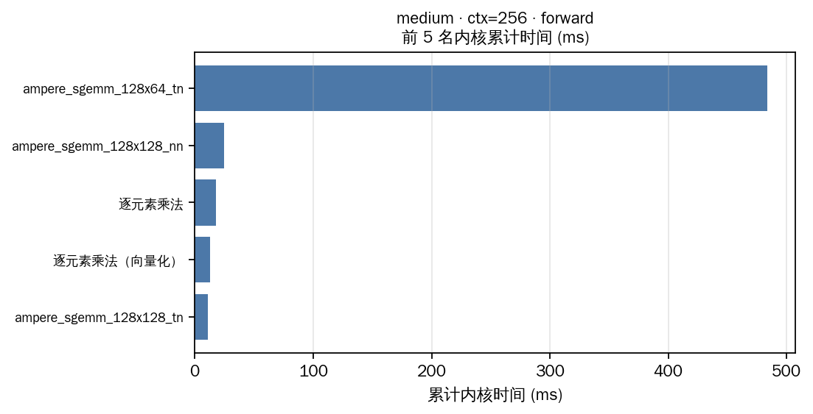
</p>

<p align="center">
  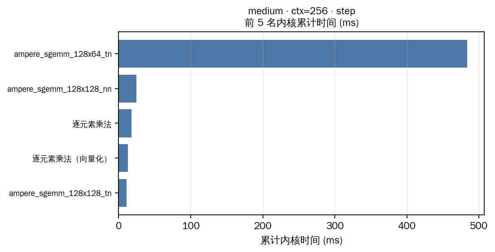
</p>

<p align="center">
  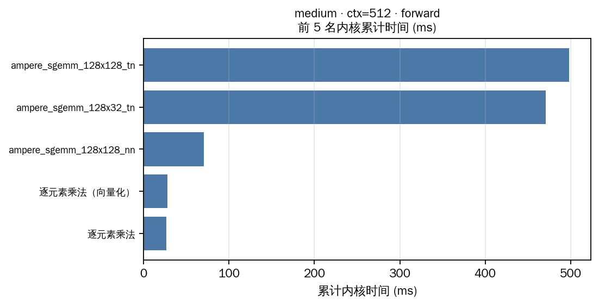
</p>

<p align="center">
  
</p>

<p align="center">
  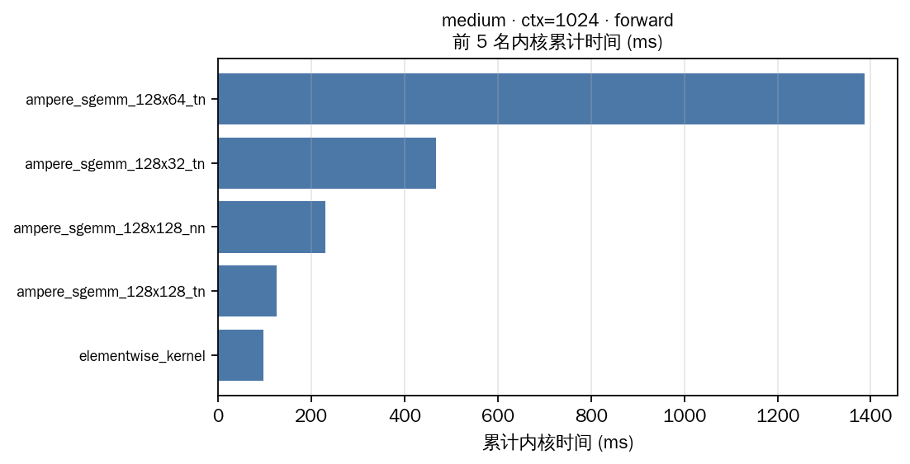
</p>

<p align="center">
  
</p>

<p align="center">
  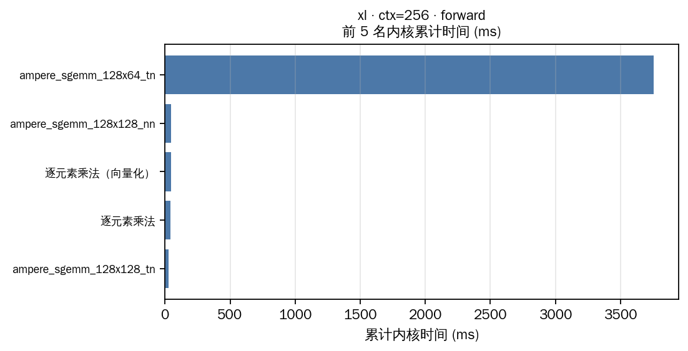
</p>

<p align="center">
  
</p>

<p align="center">
  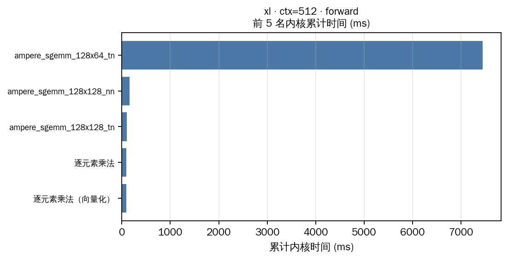
</p>

<p align="center">
  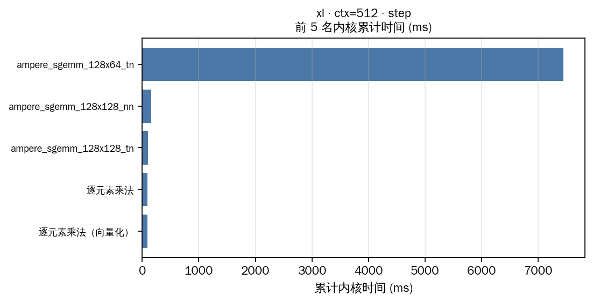
</p>

### 占比饼图（第1 / 第2 / 第3–5合计 / 其余）

百分比分母 = 该 NVTX 范围内**所有 CUDA 内核**的 Total Time 之和（不是只在前五名内部归一化）。总览条形图 + 约 10 张分组合饼图。

<p align="center">
  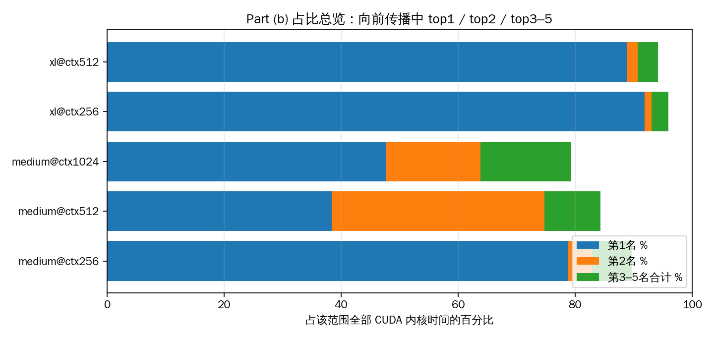
</p>

<p align="center">
  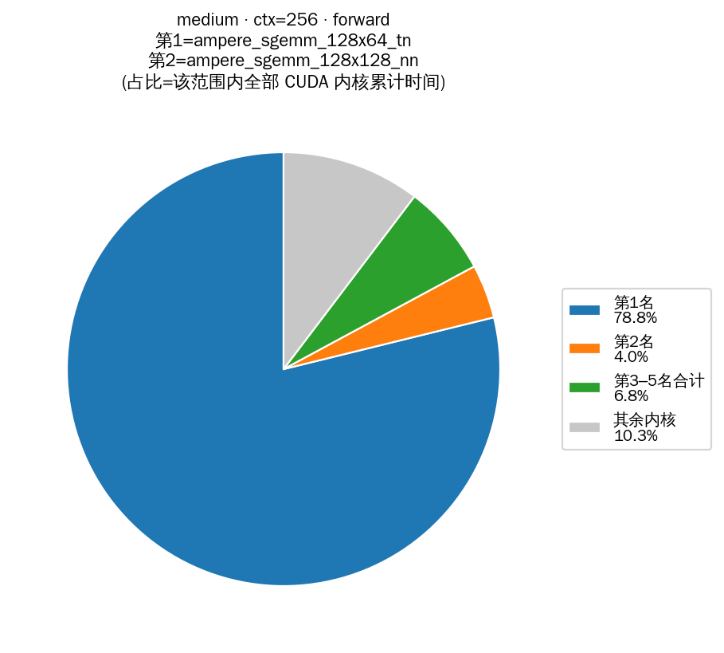
</p>

<p align="center">
  
</p>

<p align="center">
  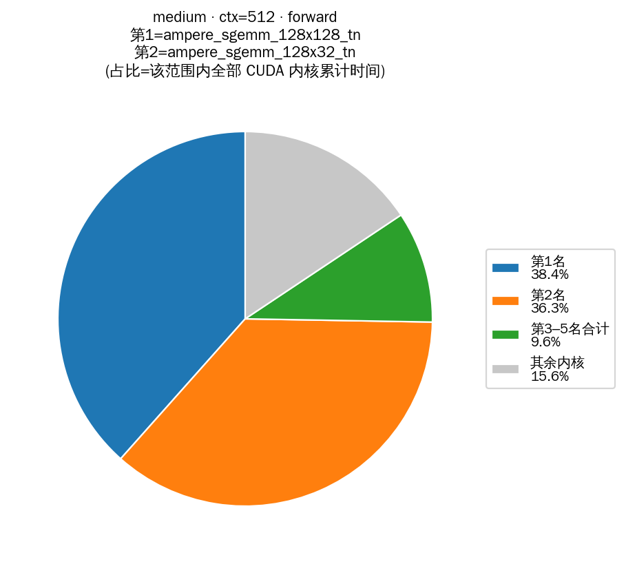
</p>

<p align="center">
  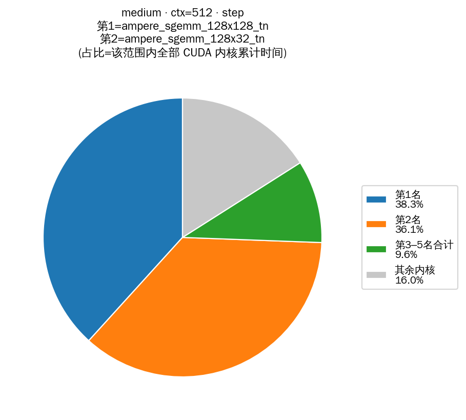
</p>

<p align="center">
  
</p>

<p align="center">
  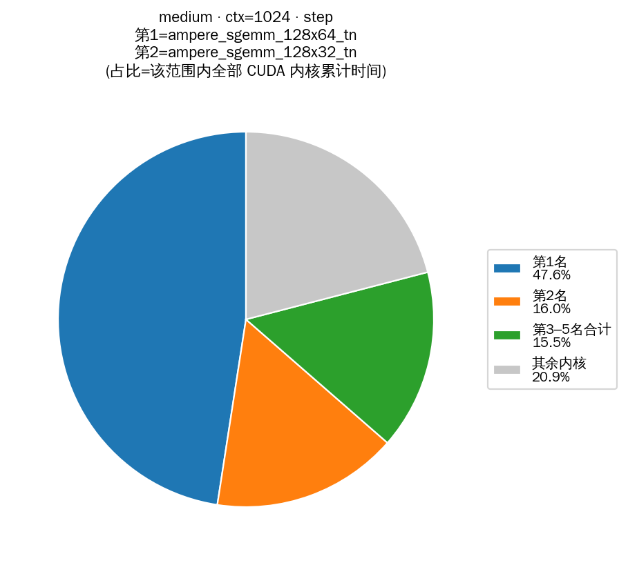
</p>

<p align="center">
  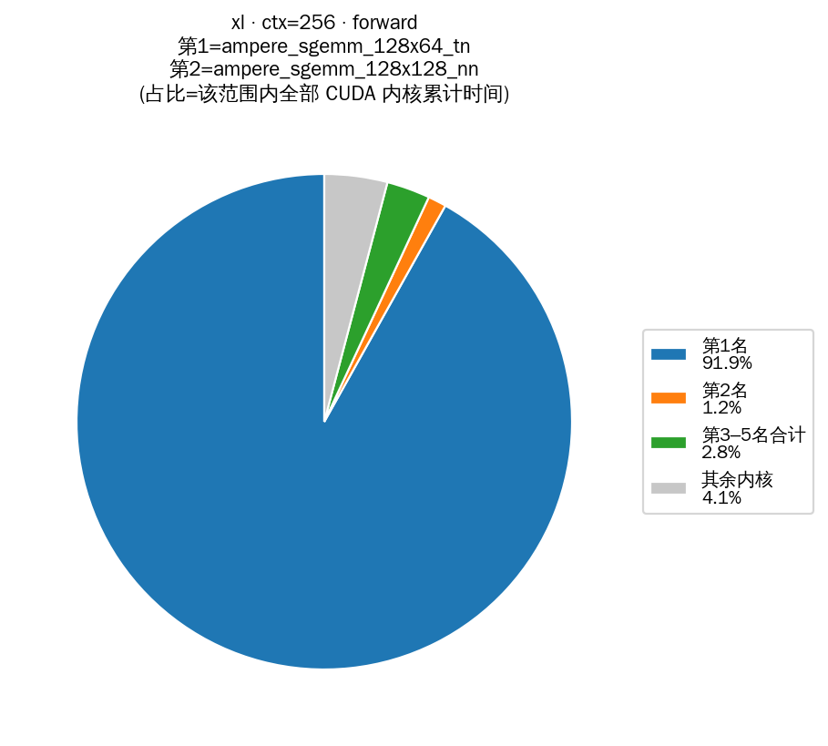
</p>

<p align="center">
  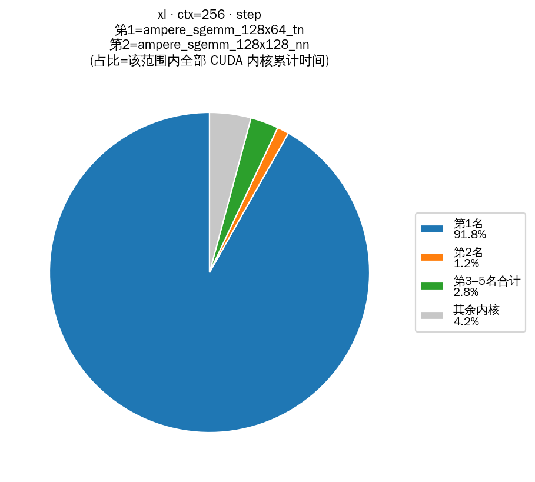
</p>

<p align="center">
  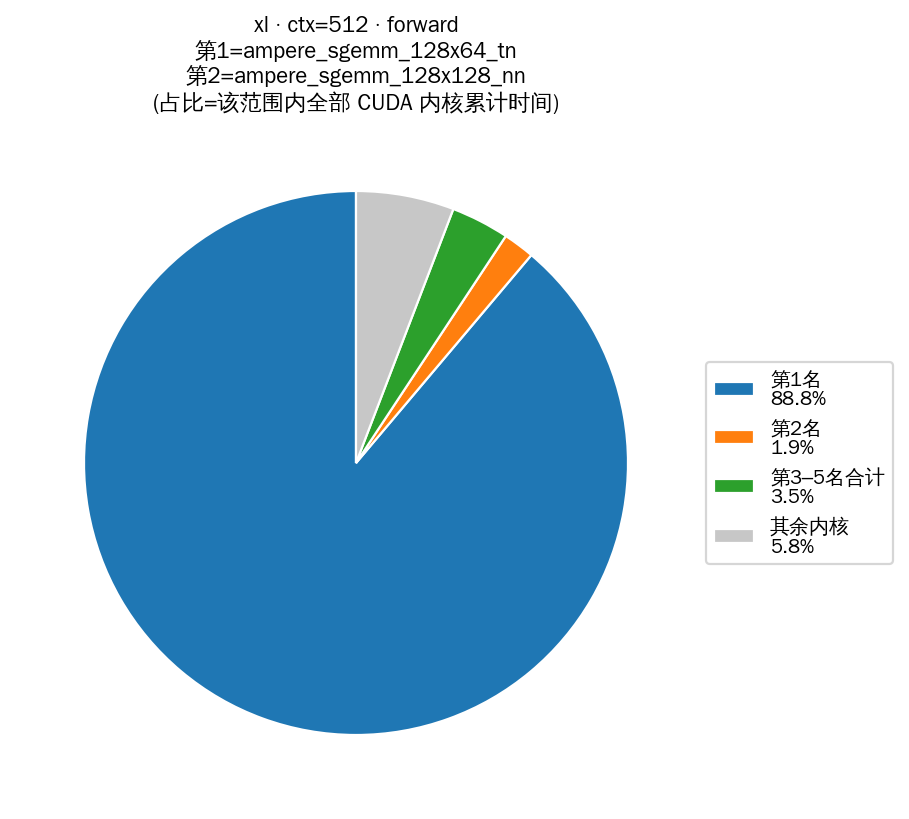
</p>

<p align="center">
  
</p>

| size | context | top kernel (forward) | calls / forward | top kernel (fwd+bwd) | same? |
|---|---:|---|---:|---|---|
| medium | 256 | `ampere_sgemm_128x64_tn` | 169.0 | `ampere_sgemm_128x64_tn` | yes |
| medium | 512 | `ampere_sgemm_128x128_tn` | 144.0 | `ampere_sgemm_128x128_tn` | yes |
| medium | 1024 | `ampere_sgemm_128x64_tn` | 145.0 | `ampere_sgemm_128x64_tn` | yes |
| xl | 256 | `ampere_sgemm_128x64_tn` | 225.0 | `ampere_sgemm_128x64_tn` | yes |
| xl | 512 | `ampere_sgemm_128x64_tn` | 225.0 | `ampere_sgemm_128x64_tn` | yes |
| xl | 1024 | OOM | — | OOM | — |

### 详解：以 `medium`、上下文长度 512 的向前传播为例

先补一点读名字时会撞到的背景（不需要背，扫一眼即可）：

- **Ampere（安培）**：NVIDIA 的一代 GPU 架构代号。你这台 A800 就属于 Ampere 一代。库函数名字里带 `ampere_`，表示这份矩阵乘实现是按 Ampere 硬件切出来的。
- **kernel（内核）**：丢到 GPU 上跑的一小段程序。下面表里每一行就是一种这样的小程序。
- **SGEMM**：Single-precision General Matrix Multiply，也就是 **FP32 的通用矩阵乘** （`C = A×B` 这类）。Transformer 里的线性层、注意力里的大矩阵乘，最后几乎都变成它。
- **名字里的 `128x128` / `128x32`**：矩阵乘不会一口气算整张大矩阵，而是切成小块（tile）计算；这两个数字是切块大小，由 cuBLAS 等库按矩阵形状自动选。
- **后缀 `tn` / `nn`**：描述相乘时两个输入要不要转置。`t` = transpose（转置），`n` = normal（不转置）。例如 `tn` = 左矩阵转置、右矩阵不转置。这只影响数据怎么摆，**本质仍是矩阵乘**。

以「向前」范围内**全部 CUDA 内核时间**为 100%：第1名占 **38.4%**，第2名占 **36.3%**，第3–5名合计占 **9.6%**，其余内核占 **15.6%**。所有名字里带 gemm/sgemm 的矩阵乘合计约 **81.9%**；逐元素类小算子合计约 **14.8%**。

下表仍列出前 5 名的绝对时间（10 次正式测量加总；除以 10 可粗看作单次向前分摊）。

| 排名 | 累计耗时（10 次向前） | 约合每次向前 | 占全部 CUDA 时间 | 每次向前调用次数 | 内核（简称） |
|---:|---:|---:|---:|---:|---|
| 1 | 498.507 ms | 49.851 ms | 38.4% | 144.0 | `ampere_sgemm_128x128_tn` |
| 2 | 470.922 ms | 47.092 ms | 36.3% | 48.0 | `ampere_sgemm_128x32_tn` |
| 3 | 70.496 ms | 7.050 ms | 5.4% | 24.0 | `ampere_sgemm_128x128_nn` |
| 4 | 27.827 ms | 2.783 ms | 2.1% | 48.0 | 逐元素乘法（向量化版） |
| 5 | 26.584 ms | 2.658 ms | 2.0% | 290.0 | 逐元素乘法（普通版） |

**这五个分别在干什么：**

1. **`ampere_sgemm_128x128_tn`**  Ampere 上的 FP32 大矩阵乘，切块 `128×128`，布局 `tn`。对应模型里一类很常见的稠密线性变换 / 投影（把一张激活矩阵乘上一块权重）。**占全部 CUDA 时间的 38.4%，是最大的一块。**

2. **`ampere_sgemm_128x32_tn`**  还是 FP32 矩阵乘，只是切块改成了 `128×32`。库根据矩阵高宽选了另一种切法——多半对应另一类形状的线性层或注意力里的矩阵乘（例如宽度不同的投影）。和第一名是「同一工种、不同刀法」，占 **36.3%**。

3. **`ampere_sgemm_128x128_nn`**  仍然是 FP32 矩阵乘，布局变成 `nn`（两边都不转置）。常见于注意力里「分数矩阵 × 值矩阵」这类两边都不转置的乘。**还是矩阵乘，不是别的算子。**

4. **逐元素乘法（向量化版）**  PyTorch/ATen 生成的「每个元素各自乘一下」的小程序，并做了向量化。典型来源：注意力分数乘 `1/sqrt(d_k)`、和 mask 相关的逐元素乘等。**不是矩阵乘**，算量比 GEMM 小得多。

5. **逐元素乘法（普通版）**  同样是逐元素乘，只是另一种启动配置。一次向前会 launch 很多次（这里约 290 次），但每次都很短，所以累计时间仍排在矩阵乘后面。

**「小算子」具体是谁、占多少？**  在 `medium@512` 向前范围内，非矩阵乘里最显眼的是各类 **逐元素乘法 / elementwise** （合计约 **14.8%**）。其中较靠前的包括：

- `逐元素乘法（向量化）`：约 **2.1%** （27.827 ms / 10 次向前合计）
- `逐元素乘法`：约 **2.0%** （26.584 ms / 10 次向前合计）
- `elementwise_kernel`：约 **1.9%** （24.493 ms / 10 次向前合计）
- `where / 掩码选择`：约 **1.8%** （23.050 ms / 10 次向前合计）
- `逐元素加法`：约 **1.6%** （20.675 ms / 10 次向前合计）
- `逐元素乘法（向量化）`：约 **1.4%** （18.302 ms / 10 次向前合计）

它们调用可以很勤，但每个元素只做一次乘或加减，总浮点运算远小于大矩阵乘，所以单看百分比也压不过头部的 SGEMM。

**谁占用时间最多？为什么？**  第一名 `ampere_sgemm_128x128_tn` 独占约 **38.4%**；前两名矩阵乘合起来约 **74.7%**；所有 GEMM 合计约 **81.9%**。`medium` 有 24 层、隐藏维 1024、前馈维 4096，一层里多次线性投影和注意力矩阵乘，绝大部分算力都堆在这些 GEMM 上。

**加上反向传播之后呢？**  外层「向前+损失+向后」统计里，累计最久的内核仍然是同一个名字：`ampere_sgemm_128x128_tn`。

### 两点启示（做完 A/B 之后）

1. **秒表和 profiler 对得上，才说明你量的是同一件事。** Part (a) 里 Python 掐表和 nsys 的「向前」区间平均耗时只差大约 1% 量级——两边都在同步后看整段向前，结论可以互相印证。若差出一大截，优先怀疑：热机没丢掉、标签包错了范围、或把分析开销误当成模型时间。

2. **优化应先盯矩阵乘：用占比说话，别只看调用次数。** 以 `medium@512` 向前为例：第1名 SGEMM 占全部 CUDA 时间的 **38.4%**，第2名再占 **36.3%**，第3–5名合计 **9.6%**；所有矩阵乘合计约 **81.9%**。相对地，逐元素乘法等小算子合计约 **14.8%**——哪怕 launch 上百次，也远小于头部 GEMM。所以后面做混合精度、FlashAttention、更快的 matmul，针对的都是这七八成时间的大头；别被「调用很勤」的小内核带偏优先级。

---

## (c) Non-matmul kernels in the forward pass

<p align="center">
  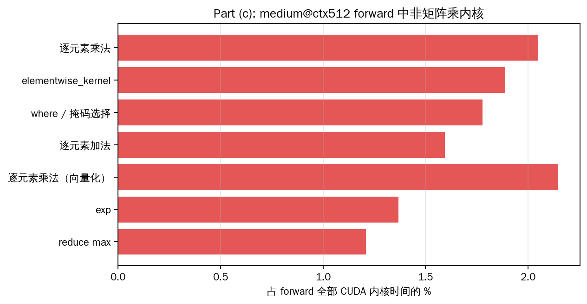
</p>

**Answer (c):** On `medium` context 512, besides GEMMs (≈81.9% of forward CUDA time), non-trivial time goes to elementwise kernels (≈14.8%, mainly `MulFunctor` / binary mul) and other ATen helpers such as `逐元素乘法（向量化）` (2.1%), `逐元素乘法` (2.0%), `elementwise_kernel` (1.9%).

## (d) Full training step vs forward-only: matmul fraction

<p align="center">
  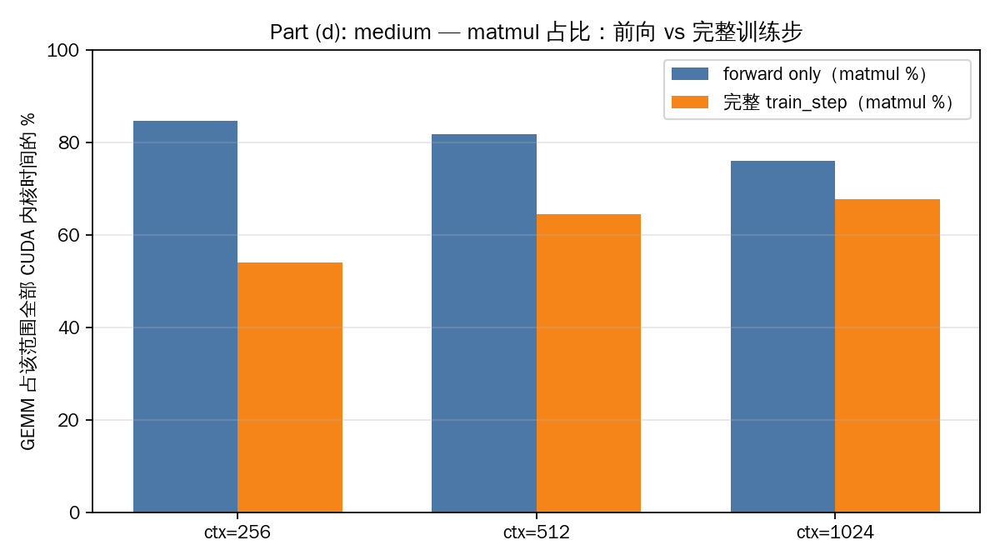
</p>

| size | context | GEMM % (forward) | GEMM % (train_step) | other % (forward) | other % (train) | train_step mean |
|---|---:|---:|---:|---:|---:|---:|
| medium | 256 | 84.8% | 54.1% | 15.2% | 45.9% | 238.014 ms |
| medium | 512 | 81.9% | 64.5% | 18.1% | 35.5% | 450.400 ms |
| medium | 1024 | 76.1% | 67.8% | 23.9% | 32.2% | 956.148 ms |

**Answer (d):** On `medium` context 512, GEMM's share of CUDA kernel time drops from 81.9% in the nested `forward` range to 64.5% over the full `train_step` (Δ -17.4 pp), because backward plus AdamW add substantial non-GEMM (and some GEMM) work; other kernels rise to 35.5% of train-step CUDA time.

## (e) Softmax vs matmul inside self-attention (forward)

左图：NVTX 实测累计时间（线性轴）；右图：同一次 forward 的解析 FLOPs×10 步（**同样线性轴**）。右边 softmax 柱几乎贴地，左边两根柱却差不多高——这就是本题要你看见的反差。

<p align="center">
  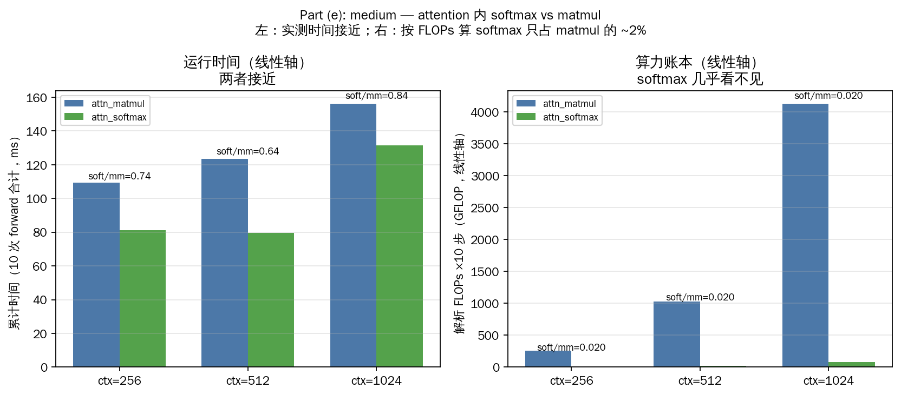
</p>

| size | context | attn_matmul total | attn_softmax total | time ratio soft/mm | FLOPs matmul (1 fwd) | FLOPs softmax (1 fwd) | FLOPs ratio soft/mm |
|---|---:|---:|---:|---:|---:|---:|---:|
| medium | 256 | 109.394 ms | 81.092 ms | 0.741 | 2.58e+10 | 5.03e+08 | 0.0195 |
| medium | 512 | 123.647 ms | 79.680 ms | 0.644 | 1.03e+11 | 2.01e+09 | 0.0195 |
| medium | 1024 | 156.062 ms | 131.533 ms | 0.843 | 4.12e+11 | 8.05e+09 | 0.0195 |

### 详解：以 `medium`、上下文 512 为例

**我们到底在比什么。**  只比 self-attention 里 `scaled_dot_product_attention` 这一段，不把 Q/K/V 线性投影算进去：NVTX `attn_matmul` = `QKᵀ` + `AV` 两次 einsum；`attn_softmax` = 自定义 `softmax`（max / sub / exp / sum / div）。上表时间为 **10 次正式 forward** 的 NVTX Total；FLOPs 是 **单次 forward、全部 24 层** 的解析估计。

**实测时间。**  `attn_matmul` 累计 **123.6 ms**，`attn_softmax` 累计 **79.7 ms**，比值 soft/mm = **0.64**（softmax 已经吃到 matmul 六成多的时间）。

#### FLOPs 账本：矩阵乘与 Softmax 分别怎么数

形状（本格 `medium` @ S=512）：**B=4，H=16，S=512，d_k=d_v=64，L=24**。  
惯例：`(m×k)·(k×n)` 计 **2·m·k·n** 次浮点（乘+加各算一次）。`exp` 按 ML 文献计 **1 FLOP/元素**（硬件上更贵）。因果 `where` 掩码不计入算术 FLOPs。只数 SDPA 内部，**不含** Q/K/V 线性投影。

**1）矩阵乘侧（对应 NVTX `attn_matmul`）——每一层**

| 步骤 | 在算什么 | 每层 FLOPs |
|---|---|---|
| **QKᵀ** | 每个 head：`(S×d_k)·(d_k×S)→(S×S)`，共 B·H 个 head | `2·B·H·S²·d_k` = `2·4·16·512²·64` = **2.15×10⁹** |
| **缩放** | `scores / √d_k`，对 B·H·S·S 个元素各除一次 | `B·H·S²` = **1.68×10⁷**（相对 GEMM 很小） |
| **AV** | 每个 head：`(S×S)·(S×d_v)→(S×d_v)` | `2·B·H·S²·d_v` = **2.15×10⁹** |
| **一层小计** | QKᵀ + 缩放 + AV | ≈ **4.31×10⁹** |
| **L=24 层（一次 forward）** | ×24 | ≈ **1.035×10¹¹** |

表里写的 matmul ≈ **1.03×10¹¹** 用的是主阶式 `4·B·H·S²·d_k·L`（**只计两次 GEMM、不含缩放**）：  
`4·4·16·512²·64·24 ≈ 1.03×10¹¹`。加缩放后几乎不变，soft/mm 比值不受影响。

**2）Softmax 侧（对应 NVTX `attn_softmax`）——对照源码逐步数**

```python
# cs336_basics.nn_utils.softmax，沿最后一维（key 维，长度 S）
rescaled = x - max(x)       # max + 逐元素减
exps = exp(rescaled)        # 逐元素 exp
return exps / sum(exps)     # sum + 逐元素除
```

分数张量形状 `(B, H, S, S)`：共有 **B·H·S = 4·16·512 = 32768** 行；每一行是长度 **S=512** 的向量：

| 步骤 | 运算 | 每行次数 |
|---|---|---:|
| max | 找最大值 | S−1 = 511 |
| 减 max | 元素减 | S = 512 |
| exp | 逐元素 exp | S = 512（各计 1 FLOP） |
| sum | 求和 | S−1 = 511 |
| 除法 | 归一化 | S = 512 |
| **一行合计** | | **5S−2 = 2558** |

一层：`B·H·S·(5S−2) ≈ 5·B·H·S²` = **8.39×10⁷**；  
**L=24 层一次 forward** ≈ **2.01×10⁹**（与表中 softmax FLOPs 一致）。

**3）比值**  
soft/mm ≈ `2.01×10⁹ / 1.03×10¹¹ ≈ 0.0195`。  
主阶近似：`(5·B·H·S²) / (4·B·H·S²·d_k) = 5/(4·d_k) = 5/(4·64) ≈ 0.0195`。  
也就是说：**softmax 的 FLOPs 大约只有 attention 内 matmul 的 2%**，差在那个 `d_k=64` 上——GEMM 每个输出要吃掉 `d_k` 次乘加，softmax 对 `S×S` 矩阵每个元素只做常数次标量运算。

**反差有多大。**  若运行时间真按 FLOPs 成比例，softmax 相对 matmul 的 123.6 ms 应只占约 **2.4 ms**（123.6×0.0195）；实测却是 **79.7 ms**，大约是「按 FLOPs 预言」的 **33×**。一句话：算力账上 softmax 只有 matmul 的 ~2.0%，墙上时钟却到了 ~64%。

**为什么时间远比 FLOPs 接近？**  1）**算术强度**：`QKᵀ`/`AV` 每个输出元素要吃掉 `d_k` 次乘加，还能靠 tensor core / 大 tile GEMM 把算力吃满；softmax 对 `S×S` 注意力矩阵做 max/exp/sum/div，几乎是 **读一次、写一次**，算得少、搬得多，容易卡在 HBM 带宽。2）**内核形态**：matmul 往往并成少数大 SGEMM；softmax 路径是一串短 elementwise / reduce，**launch 次数多、每次工作量小**，GPU 利用率更差。3）**随序列长度**：两边时间都随 `S` 涨，但上表三个 context 的 soft/mm 时间比始终在 0.64–0.84，而 FLOPs 比固定 ≈0.02——反差不随「多算一点 matmul」自动消失。

**Answer (e):** On `medium` ctx 512, attention softmax takes 79.680 ms vs matmul 123.647 ms (time ratio 0.64), but analytical FLOPs give soft/mm ≈ 0.0195; softmax runs ~33× longer than a FLOP-proportional prediction from the matmul time, because it is bandwidth- and launch-bound rather than compute-bound.

## 符号表

下文按报告里出现过的符号整理（人话版）。`medium` 预设下部分量有具体数值，便于对照。

| 符号 | 含义 |
|---|---|
| **B** | batch size，一批里有几条序列。本报告固定 **B = 4**。 |
| **S** | sequence / context length，一条序列的 token 数（上下文长度）。本报告取 256 / 512 / 1024。 |
| **L** | Transformer 层数（`num_layers`）。`medium` 为 **L = 24**。 |
| **H** | attention head 数（`num_heads`）。`medium` 为 **H = 16**。 |
| **d_model** | 模型隐藏维度（残差流宽度）。`medium` 为 **1024**。 |
| **d_k** | 每个 head 的 key/query 维度，通常 `d_k = d_model / H`。`medium` 为 **64**。 |
| **d_v** | 每个 head 的 value 维度；本实现里 **d_v = d_k**。 |
| **Q** | Query 张量（查询），形状大致 `(…, H, S, d_k)`。 |
| **K** | Key 张量（键），形状与 Q 对齐。 |
| **V** | Value 张量（值），形状大致 `(…, H, S, d_v)`。 |
| **A** / 注意力权重 | `softmax(QKᵀ / √d_k)` 得到的概率矩阵，形状 `(…, H, S, S)`，再与 V 相乘。 |
| **QKᵀ** | Query 与 Key 的矩阵乘，得到注意力分数（logits），再除以 `√d_k`。 |
| **AV** | 注意力权重与 Value 的矩阵乘，得到每个 head 的输出。 |
| **√d_k** / `1/√d_k` | 缩放因子，防止点积过大导致 softmax 饱和。 |
| **S²** | 序列长度的平方；注意力分数矩阵每个 head 是 `S×S`，故时间和显存常随 `S²` 涨。 |
| **FLOPs** | floating-point operations，浮点运算次数（算力账本，不是墙上时间）。 |
| **GFLOP** | 10⁹ 次浮点运算；图里右轴把 10 次 forward 的 FLOPs 换成 GFLOP 便于画柱。 |
| **GEMM / SGEMM** | 通用矩阵乘 / FP32 通用矩阵乘（Single-precision GEMM）。 |
| **NVTX** | NVIDIA Tools Extension：在代码里打时间范围标签，供 nsys 聚合。 |
| **attn_matmul** | 本报告给 `QKᵀ` + `AV` 打的 NVTX 名。 |
| **attn_softmax** | 本报告给 attention 内 softmax 打的 NVTX 名。 |
| **train_step** | 完整训练一步的 NVTX：`zero_grad` → forward → loss → backward → AdamW。 |
| **forward** | 仅模型前向（含 `cuda.synchronize`）的 NVTX。 |
| **HBM** | GPU 高带宽显存；带宽受限时，算得少也可能很慢。 |
| **tile / 128×128** | GEMM 把大矩阵切成小块计算；名字里的数字是切块大小。 |
| **tn / nn** | cuBLAS 布局：`t`=转置，`n`=不转置；描述左右矩阵要不要转置。 |

常用关系（本报告 `medium`）：`d_k = d_model / H`；attention matmul FLOPs 每层约 `4·B·H·S²·d_k`；softmax 约 `5·B·H·S²`；故 soft/mm ≈ `5/(4·d_k)`。

